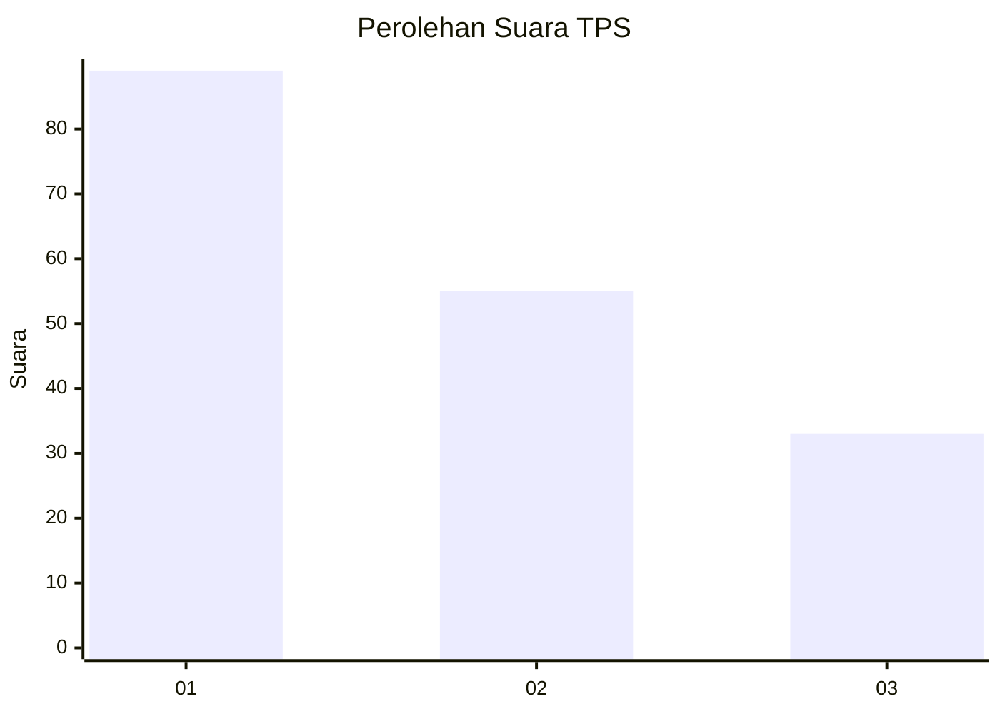
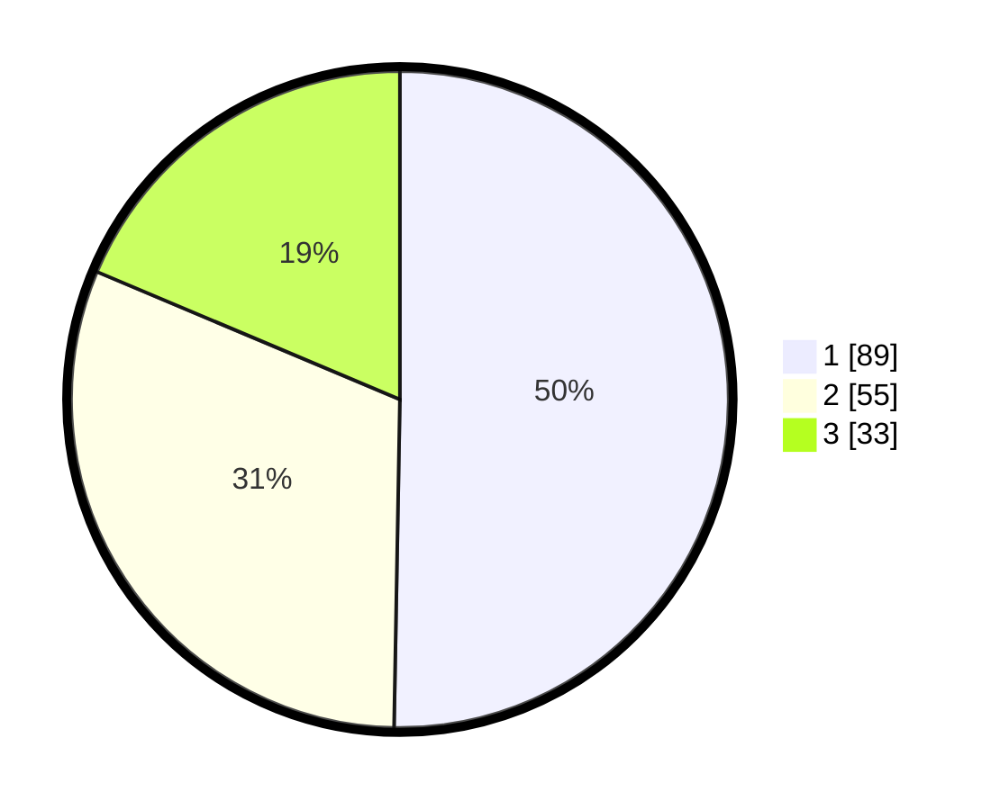

# Hasil

## Grafik

## Tabel

| No. | Nama Paslon    | Suara | Suara (raw) | Persentase |
|:--- |:-------------- | -----:| -----------:| ----------:|
| 1   | ANIES MUHAIMIN | 89    | [89][p-1]   | 50,28      |
| 2   | PRABOWO GIBRAN | 55    | [55][p-2]   | 31,07      |
| 3   | GANJAR MAHFUD  | 33    | [33][p-3]   | 18,64      |

[p-1]: https://github.com/gigit-pemilu/pemilu-2024-32-jawa-barat/blob/main/pilpres/hitung-suara/sub/32-jawa-barat/sub/08-kuningan/sub/28-cibeureum/sub/2001-cimara/sub/002-tps/sub/paslon-1.txt
[p-2]: https://github.com/gigit-pemilu/pemilu-2024-32-jawa-barat/blob/main/pilpres/hitung-suara/sub/32-jawa-barat/sub/08-kuningan/sub/28-cibeureum/sub/2001-cimara/sub/002-tps/sub/paslon-2.txt
[p-3]: https://github.com/gigit-pemilu/pemilu-2024-32-jawa-barat/blob/main/pilpres/hitung-suara/sub/32-jawa-barat/sub/08-kuningan/sub/28-cibeureum/sub/2001-cimara/sub/002-tps/sub/paslon-3.txt

## Foto C Plano

https://sirekap-obj-formc.kpu.go.id/150f/pemilu/ppwp/32/08/28/20/01/3208282001002-20240215-001802--19c729e1-0761-468c-a09a-f7d0d7e085f0.jpg

https://sirekap-obj-formc.kpu.go.id/150f/pemilu/ppwp/32/08/28/20/01/3208282001002-20240215-001820--62591caa-63c1-4dad-99c6-71f9fc68b091.jpg

https://sirekap-obj-formc.kpu.go.id/150f/pemilu/ppwp/32/08/28/20/01/3208282001002-20240215-001837--d2a74e05-0c7d-47d4-b20e-4d8082b04b0c.jpg

## Metadata

| Key        | Value               |
| ---------- | ------------------- |
| Time Stamp | 2024-02-16 09:00:28 |

