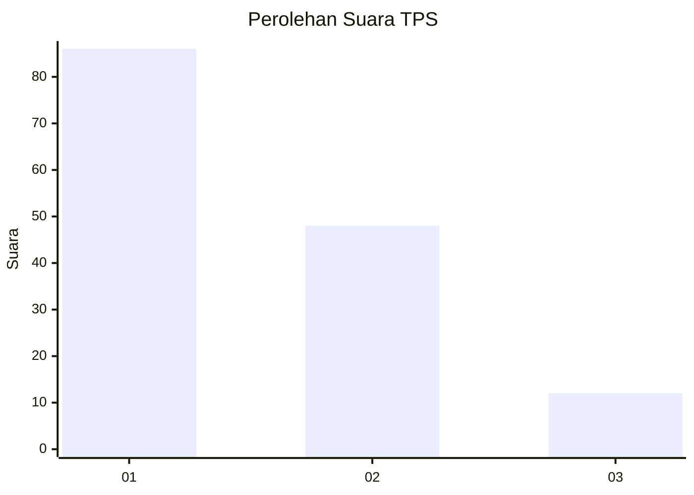
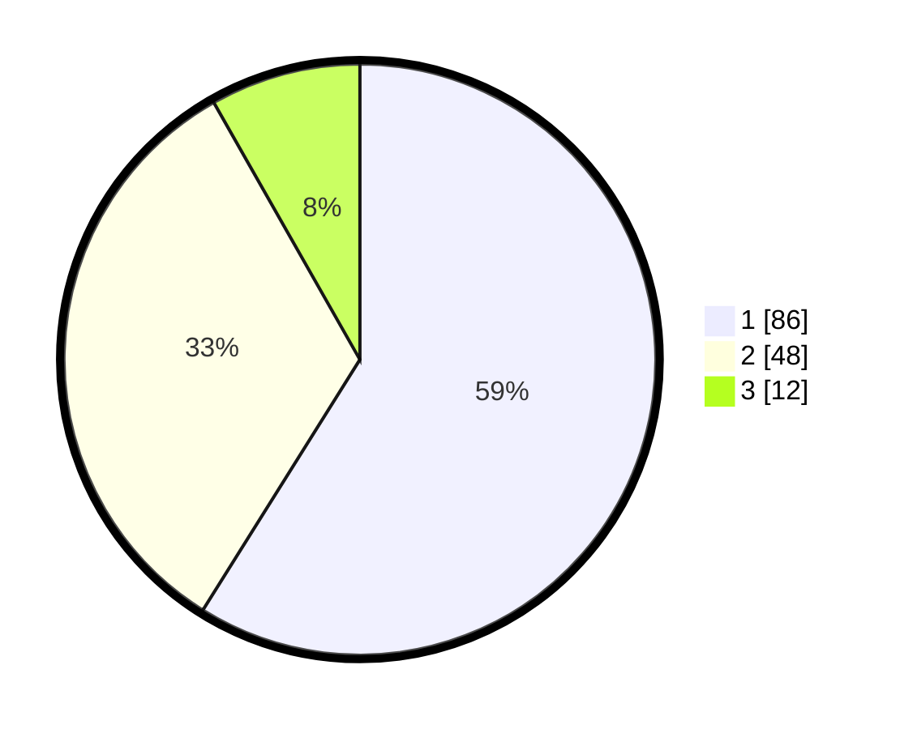

# Hasil

## Grafik

## Tabel

| No. | Nama Paslon    | Suara | Suara (raw) | Persentase |
|:--- |:-------------- | -----:| -----------:| ----------:|
| 1   | ANIES MUHAIMIN | 86    | [86][p-1]   | 58,90      |
| 2   | PRABOWO GIBRAN | 48    | [48][p-2]   | 32,88      |
| 3   | GANJAR MAHFUD  | 12    | [12][p-3]   | 8,22       |

[p-1]: https://github.com/gigit-pemilu/pemilu-2024/blob/main/pilpres/hitung-suara/sub/32-jawa-barat/sub/08-kuningan/sub/28-cibeureum/sub/2001-cimara/sub/003-tps/sub/paslon-1.txt
[p-2]: https://github.com/gigit-pemilu/pemilu-2024/blob/main/pilpres/hitung-suara/sub/32-jawa-barat/sub/08-kuningan/sub/28-cibeureum/sub/2001-cimara/sub/003-tps/sub/paslon-2.txt
[p-3]: https://github.com/gigit-pemilu/pemilu-2024/blob/main/pilpres/hitung-suara/sub/32-jawa-barat/sub/08-kuningan/sub/28-cibeureum/sub/2001-cimara/sub/003-tps/sub/paslon-3.txt

## Foto C Plano

https://sirekap-obj-formc.kpu.go.id/1520/pemilu/ppwp/32/08/28/20/01/3208282001003-20240214-205303--88920670-5607-4988-8407-7368d61ac1db.jpg

https://sirekap-obj-formc.kpu.go.id/1520/pemilu/ppwp/32/08/28/20/01/3208282001003-20240214-205308--d030c81e-ba6c-4098-a287-abefca9f477d.jpg

https://sirekap-obj-formc.kpu.go.id/1520/pemilu/ppwp/32/08/28/20/01/3208282001003-20240214-220154--dafa83b6-ed53-435c-be2b-a35433886a1d.jpg

## Metadata

| Key        | Value               |
| ---------- | ------------------- |
| Time Stamp | 2024-02-15 02:10:27 |

