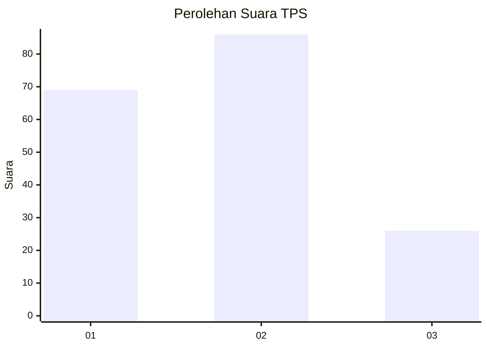
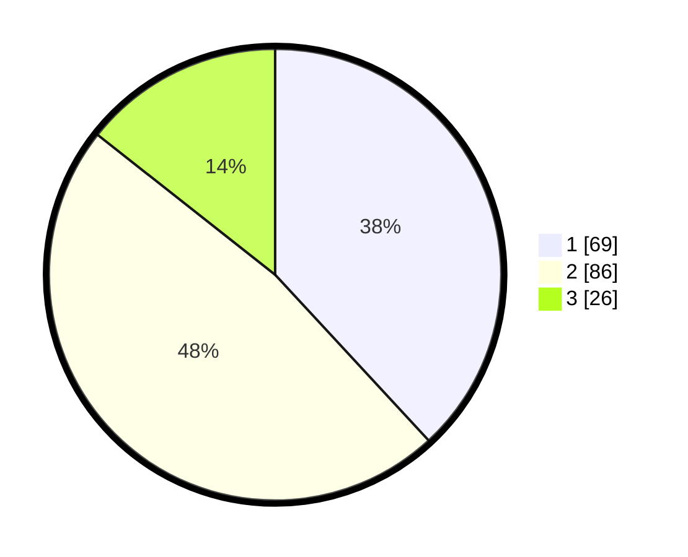

# Hasil

## Grafik

## Tabel

| No. | Nama Paslon    | Suara | Suara (raw) | Persentase |
|:--- |:-------------- | -----:| -----------:| ----------:|
| 1   | ANIES MUHAIMIN | 69    | [69][p-1]   | 38,12      |
| 2   | PRABOWO GIBRAN | 86    | [86][p-2]   | 47,51      |
| 3   | GANJAR MAHFUD  | 26    | [26][p-3]   | 14,36      |

[p-1]: https://github.com/gigit-pemilu/pemilu-2024-32-jawa-barat/blob/main/pilpres/hitung-suara/sub/32-jawa-barat/sub/08-kuningan/sub/29-karang-kancana/sub/2001-karangkancana/sub/006-tps/sub/paslon-1.txt
[p-2]: https://github.com/gigit-pemilu/pemilu-2024-32-jawa-barat/blob/main/pilpres/hitung-suara/sub/32-jawa-barat/sub/08-kuningan/sub/29-karang-kancana/sub/2001-karangkancana/sub/006-tps/sub/paslon-2.txt
[p-3]: https://github.com/gigit-pemilu/pemilu-2024-32-jawa-barat/blob/main/pilpres/hitung-suara/sub/32-jawa-barat/sub/08-kuningan/sub/29-karang-kancana/sub/2001-karangkancana/sub/006-tps/sub/paslon-3.txt

## Foto C Plano

https://sirekap-obj-formc.kpu.go.id/75c6/pemilu/ppwp/32/08/29/20/01/3208292001006-20240215-191723--f50c4fab-4e9d-4bcb-a592-145ce21ada37.jpg

https://sirekap-obj-formc.kpu.go.id/75c6/pemilu/ppwp/32/08/29/20/01/3208292001006-20240215-032259--0ba11519-ed11-469a-89a9-48faf74ab01a.jpg

https://sirekap-obj-formc.kpu.go.id/75c6/pemilu/ppwp/32/08/29/20/01/3208292001006-20240215-032650--ba0e43cf-df8a-4605-bf7f-59f73457592d.jpg

## Metadata

| Key        | Value               |
| ---------- | ------------------- |
| Time Stamp | 2024-02-20 09:00:00 |

