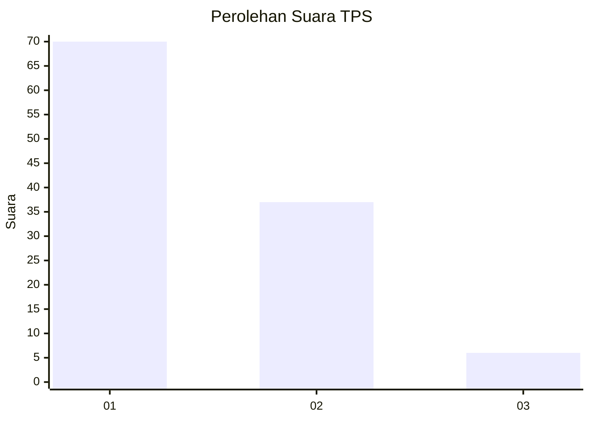
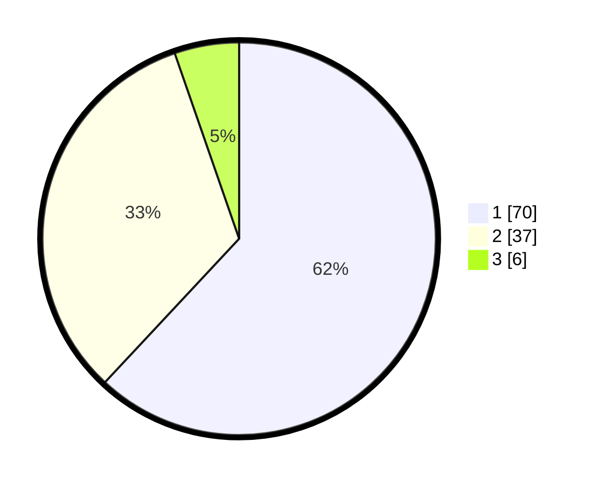

# Hasil

## Grafik

## Tabel

| No. | Nama Paslon    | Suara | Suara (raw) | Persentase |
|:--- |:-------------- | -----:| -----------:| ----------:|
| 1   | ANIES MUHAIMIN | 70    | [70][p-1]   | 61,95      |
| 2   | PRABOWO GIBRAN | 37    | [37][p-2]   | 32,74      |
| 3   | GANJAR MAHFUD  | 6     | [6][p-3]    | 5,31       |

[p-1]: https://github.com/gigit-pemilu/pemilu-2024-32-jawa-barat/blob/main/pilpres/hitung-suara/sub/32-jawa-barat/sub/08-kuningan/sub/29-karang-kancana/sub/2003-segong/sub/004-tps/sub/paslon-1.txt
[p-2]: https://github.com/gigit-pemilu/pemilu-2024-32-jawa-barat/blob/main/pilpres/hitung-suara/sub/32-jawa-barat/sub/08-kuningan/sub/29-karang-kancana/sub/2003-segong/sub/004-tps/sub/paslon-2.txt
[p-3]: https://github.com/gigit-pemilu/pemilu-2024-32-jawa-barat/blob/main/pilpres/hitung-suara/sub/32-jawa-barat/sub/08-kuningan/sub/29-karang-kancana/sub/2003-segong/sub/004-tps/sub/paslon-3.txt

## Foto C Plano

https://sirekap-obj-formc.kpu.go.id/acae/pemilu/ppwp/32/08/29/20/03/3208292003004-20240214-194056--3e4724f5-de56-4081-80da-5426717b591f.jpg

https://sirekap-obj-formc.kpu.go.id/acae/pemilu/ppwp/32/08/29/20/03/3208292003004-20240214-155713--c27fcf1c-d679-4424-9f62-da3c8934a33c.jpg

https://sirekap-obj-formc.kpu.go.id/acae/pemilu/ppwp/32/08/29/20/03/3208292003004-20240215-001348--e08638be-e581-4d67-82dd-a4f35d153bc2.jpg

## Metadata

| Key        | Value               |
| ---------- | ------------------- |
| Time Stamp | 2024-02-15 00:41:44 |

