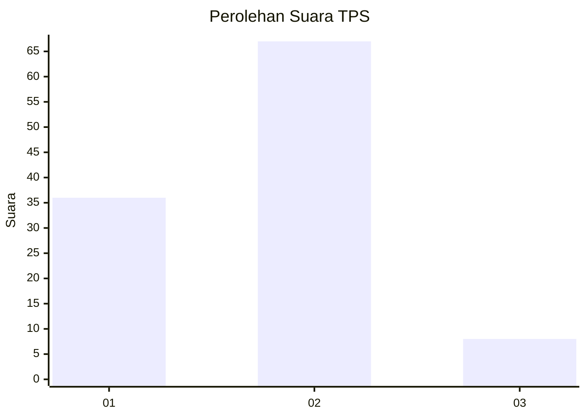
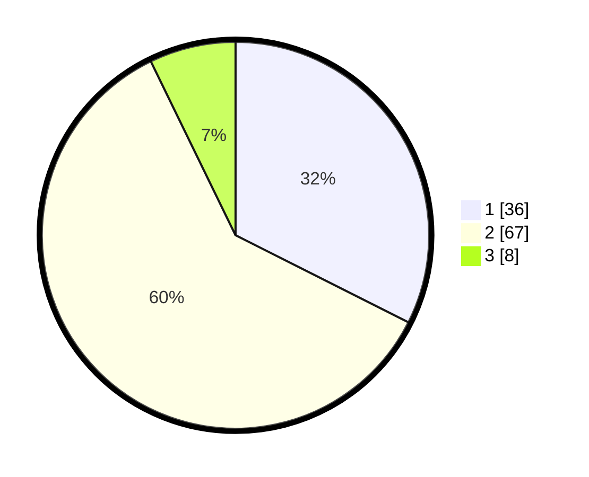

# Hasil

## Grafik

## Tabel

| No. | Nama Paslon    | Suara | Suara (raw) | Persentase |
|:--- |:-------------- | -----:| -----------:| ----------:|
| 1   | ANIES MUHAIMIN | 36    | [36][p-1]   | 32,43      |
| 2   | PRABOWO GIBRAN | 67    | [67][p-2]   | 60,36      |
| 3   | GANJAR MAHFUD  | 8     | [8][p-3]    | 7,21       |

[p-1]: https://github.com/gigit-pemilu/pemilu-2024/blob/main/pilpres/hitung-suara/sub/32-jawa-barat/sub/08-kuningan/sub/30-maleber/sub/2001-garahaji/sub/002-tps/sub/paslon-1.txt
[p-2]: https://github.com/gigit-pemilu/pemilu-2024/blob/main/pilpres/hitung-suara/sub/32-jawa-barat/sub/08-kuningan/sub/30-maleber/sub/2001-garahaji/sub/002-tps/sub/paslon-2.txt
[p-3]: https://github.com/gigit-pemilu/pemilu-2024/blob/main/pilpres/hitung-suara/sub/32-jawa-barat/sub/08-kuningan/sub/30-maleber/sub/2001-garahaji/sub/002-tps/sub/paslon-3.txt

## Foto C Plano

https://sirekap-obj-formc.kpu.go.id/dc44/pemilu/ppwp/32/08/30/20/01/3208302001002-20240214-232312--c4972a2d-89ad-408f-98c7-1279dfe86de7.jpg

https://sirekap-obj-formc.kpu.go.id/dc44/pemilu/ppwp/32/08/30/20/01/3208302001002-20240214-232349--37001087-7c9e-46a6-93cc-06f639257388.jpg

https://sirekap-obj-formc.kpu.go.id/dc44/pemilu/ppwp/32/08/30/20/01/3208302001002-20240214-232425--3cc66e1a-46a8-477c-a04b-fce3f96ab6ad.jpg

## Metadata

| Key        | Value               |
| ---------- | ------------------- |
| Time Stamp | 2024-02-19 11:00:00 |

