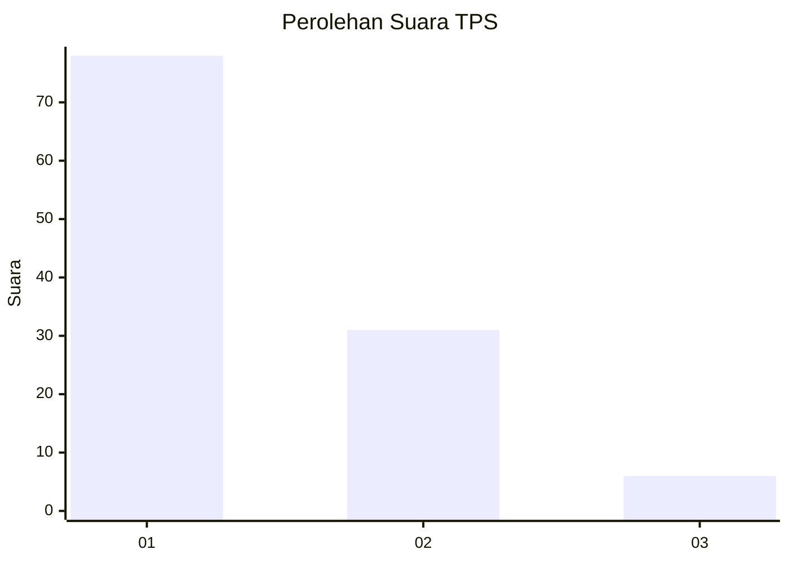
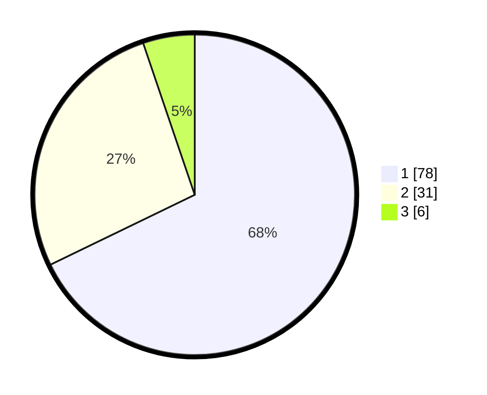

# Hasil

## Grafik

## Tabel

| No. | Nama Paslon    | Suara | Suara (raw) | Persentase |
|:--- |:-------------- | -----:| -----------:| ----------:|
| 1   | ANIES MUHAIMIN | 78    | [78][p-1]   | 67,83      |
| 2   | PRABOWO GIBRAN | 31    | [31][p-2]   | 26,96      |
| 3   | GANJAR MAHFUD  | 6     | [6][p-3]    | 5,22       |

[p-1]: https://github.com/gigit-pemilu/pemilu-2024-32-jawa-barat/blob/main/pilpres/hitung-suara/sub/32-jawa-barat/sub/08-kuningan/sub/30-maleber/sub/2002-galaherang/sub/002-tps/sub/paslon-1.txt
[p-2]: https://github.com/gigit-pemilu/pemilu-2024-32-jawa-barat/blob/main/pilpres/hitung-suara/sub/32-jawa-barat/sub/08-kuningan/sub/30-maleber/sub/2002-galaherang/sub/002-tps/sub/paslon-2.txt
[p-3]: https://github.com/gigit-pemilu/pemilu-2024-32-jawa-barat/blob/main/pilpres/hitung-suara/sub/32-jawa-barat/sub/08-kuningan/sub/30-maleber/sub/2002-galaherang/sub/002-tps/sub/paslon-3.txt

## Foto C Plano

https://sirekap-obj-formc.kpu.go.id/d6ee/pemilu/ppwp/32/08/30/20/02/3208302002002-20240215-021850--284b39c8-ce1e-4fc7-b266-205c8b892983.jpg

https://sirekap-obj-formc.kpu.go.id/d6ee/pemilu/ppwp/32/08/30/20/02/3208302002002-20240215-022105--f62643a1-9f09-4e22-acca-9dff41cae29c.jpg

https://sirekap-obj-formc.kpu.go.id/d6ee/pemilu/ppwp/32/08/30/20/02/3208302002002-20240215-022310--52addcc2-b779-4a31-93dd-854df748011e.jpg

## Metadata

| Key        | Value               |
| ---------- | ------------------- |
| Time Stamp | 2024-02-17 19:00:04 |

