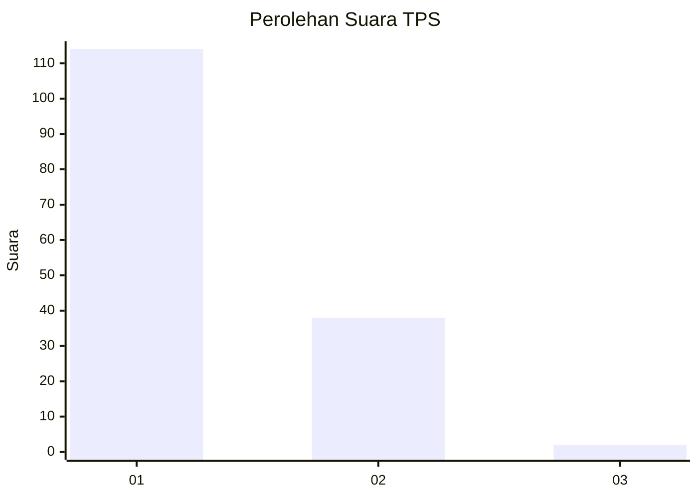
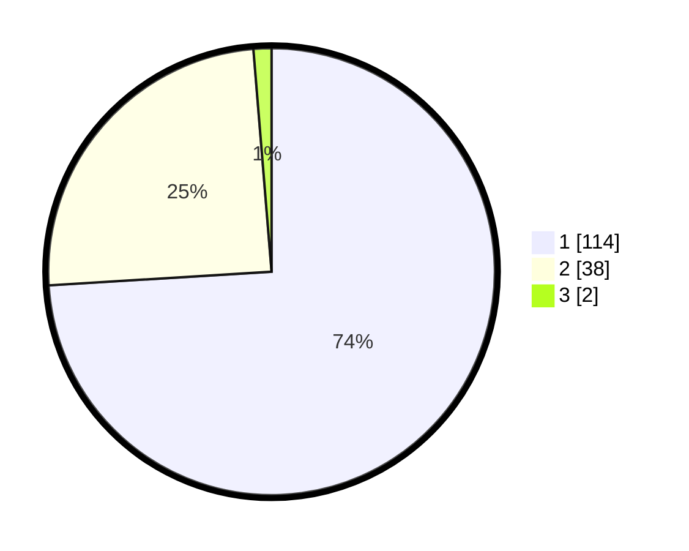

# Hasil

## Grafik

## Tabel

| No. | Nama Paslon    | Suara | Suara (raw) | Persentase |
|:--- |:-------------- | -----:| -----------:| ----------:|
| 1   | ANIES MUHAIMIN | 114   | [114][p-1]  | 74,03      |
| 2   | PRABOWO GIBRAN | 38    | [38][p-2]   | 24,68      |
| 3   | GANJAR MAHFUD  | 2     | [2][p-3]    | 1,30       |

[p-1]: https://github.com/gigit-pemilu/pemilu-2024/blob/main/pilpres/hitung-suara/sub/32-jawa-barat/sub/08-kuningan/sub/30-maleber/sub/2002-galaherang/sub/008-tps/sub/paslon-1.txt
[p-2]: https://github.com/gigit-pemilu/pemilu-2024/blob/main/pilpres/hitung-suara/sub/32-jawa-barat/sub/08-kuningan/sub/30-maleber/sub/2002-galaherang/sub/008-tps/sub/paslon-2.txt
[p-3]: https://github.com/gigit-pemilu/pemilu-2024/blob/main/pilpres/hitung-suara/sub/32-jawa-barat/sub/08-kuningan/sub/30-maleber/sub/2002-galaherang/sub/008-tps/sub/paslon-3.txt

## Foto C Plano

https://sirekap-obj-formc.kpu.go.id/6be0/pemilu/ppwp/32/08/30/20/02/3208302002008-20240215-030501--01c75503-ee4a-40ea-8a4a-c171bc6f9c69.jpg

https://sirekap-obj-formc.kpu.go.id/6be0/pemilu/ppwp/32/08/30/20/02/3208302002008-20240215-030631--69c5cd17-b79b-4b55-9171-54950ee670b2.jpg

https://sirekap-obj-formc.kpu.go.id/6be0/pemilu/ppwp/32/08/30/20/02/3208302002008-20240215-030718--3e49ccdf-dbf8-4d3e-8ffe-67cee847e3f1.jpg

## Metadata

| Key        | Value               |
| ---------- | ------------------- |
| Time Stamp | 2024-02-17 19:00:04 |

