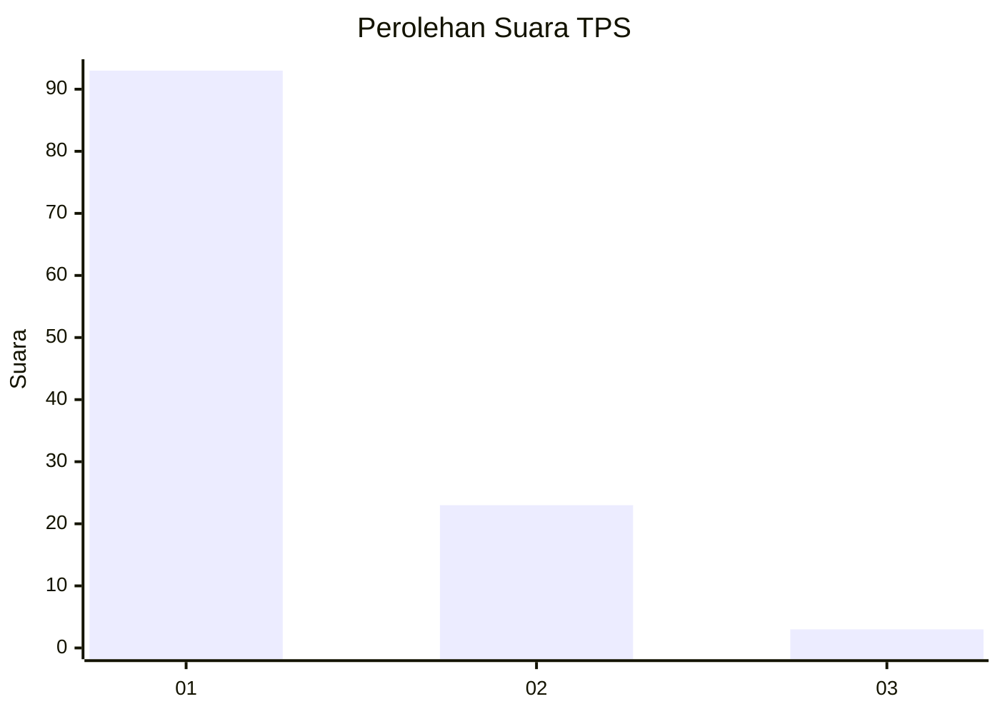
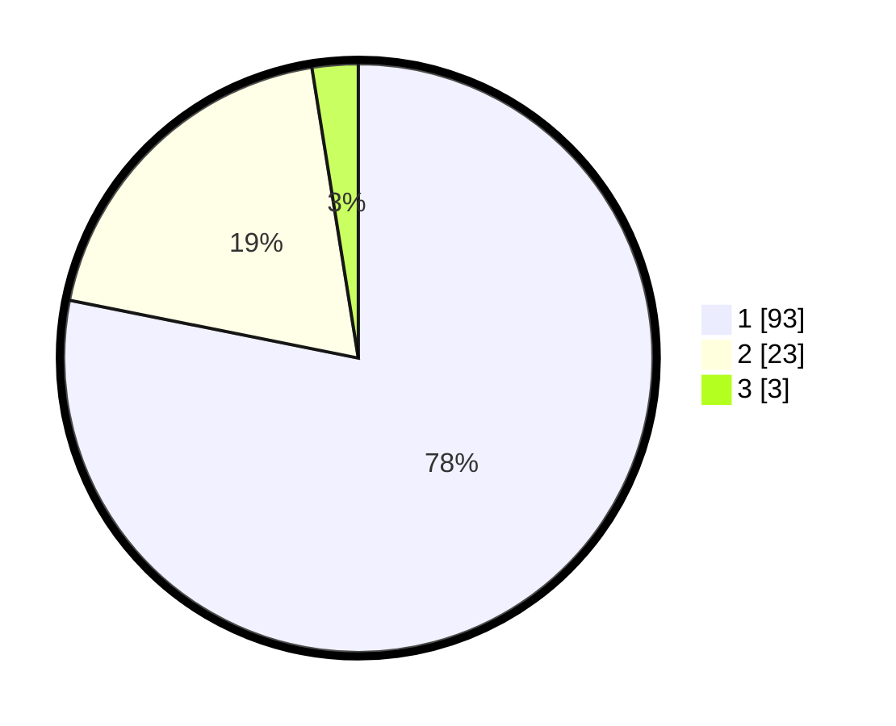

# Hasil

## Grafik

## Tabel

| No. | Nama Paslon    | Suara | Suara (raw) | Persentase |
|:--- |:-------------- | -----:| -----------:| ----------:|
| 1   | ANIES MUHAIMIN | 93    | [93][p-1]   | 78,15      |
| 2   | PRABOWO GIBRAN | 23    | [23][p-2]   | 19,33      |
| 3   | GANJAR MAHFUD  | 3     | [3][p-3]    | 2,52       |

[p-1]: https://github.com/gigit-pemilu/pemilu-2024-32-jawa-barat/blob/main/pilpres/hitung-suara/sub/32-jawa-barat/sub/08-kuningan/sub/30-maleber/sub/2004-maleber/sub/001-tps/sub/paslon-1.txt
[p-2]: https://github.com/gigit-pemilu/pemilu-2024-32-jawa-barat/blob/main/pilpres/hitung-suara/sub/32-jawa-barat/sub/08-kuningan/sub/30-maleber/sub/2004-maleber/sub/001-tps/sub/paslon-2.txt
[p-3]: https://github.com/gigit-pemilu/pemilu-2024-32-jawa-barat/blob/main/pilpres/hitung-suara/sub/32-jawa-barat/sub/08-kuningan/sub/30-maleber/sub/2004-maleber/sub/001-tps/sub/paslon-3.txt

## Foto C Plano

https://sirekap-obj-formc.kpu.go.id/693f/pemilu/ppwp/32/08/30/20/04/3208302004001-20240214-141840--189306aa-7f39-4949-83e3-04e7dda1c5ec.jpg

https://sirekap-obj-formc.kpu.go.id/693f/pemilu/ppwp/32/08/30/20/04/3208302004001-20240214-141848--fa5d0362-685d-49ac-b7b8-4d41c44a108d.jpg

https://sirekap-obj-formc.kpu.go.id/693f/pemilu/ppwp/32/08/30/20/04/3208302004001-20240214-141852--137c6d91-0331-4719-b84f-bb526a3ecec3.jpg

## Metadata

| Key        | Value               |
| ---------- | ------------------- |
| Time Stamp | 2024-02-14 21:46:01 |

