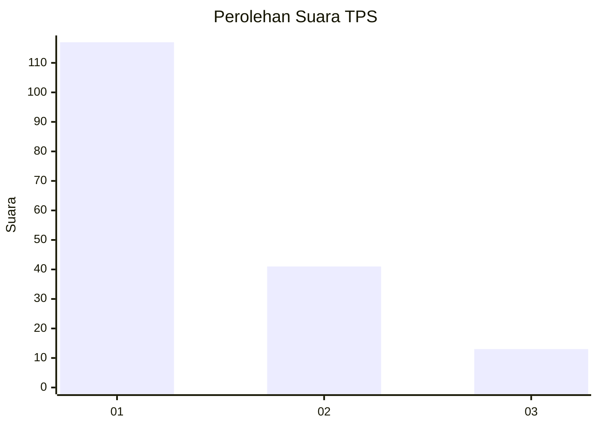
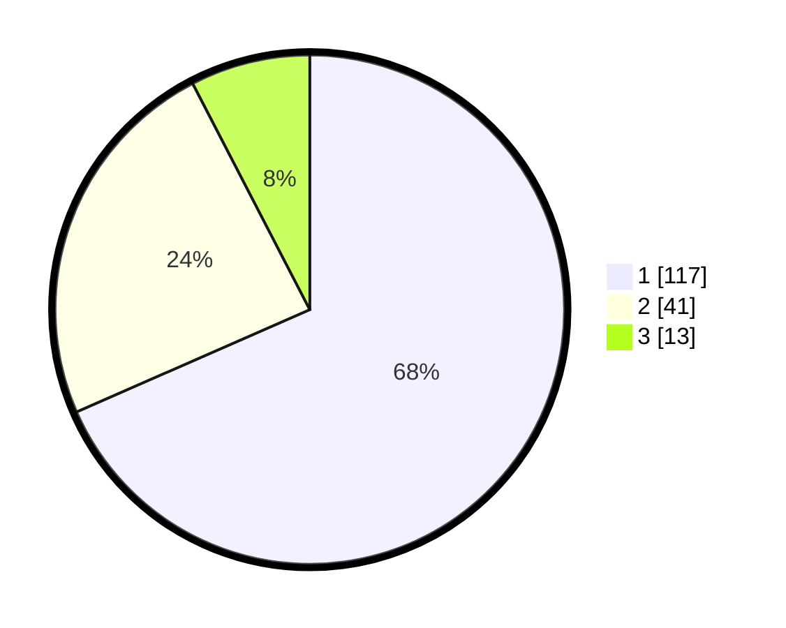

# Hasil

## Grafik

## Tabel

| No. | Nama Paslon    | Suara | Suara (raw) | Persentase |
|:--- |:-------------- | -----:| -----------:| ----------:|
| 1   | ANIES MUHAIMIN | 117   | [117][p-1]  | 68,42      |
| 2   | PRABOWO GIBRAN | 41    | [41][p-2]   | 23,98      |
| 3   | GANJAR MAHFUD  | 13    | [13][p-3]   | 7,60       |

[p-1]: https://github.com/gigit-pemilu/pemilu-2024-32-jawa-barat/blob/main/pilpres/hitung-suara/sub/32-jawa-barat/sub/08-kuningan/sub/30-maleber/sub/2004-maleber/sub/002-tps/sub/paslon-1.txt
[p-2]: https://github.com/gigit-pemilu/pemilu-2024-32-jawa-barat/blob/main/pilpres/hitung-suara/sub/32-jawa-barat/sub/08-kuningan/sub/30-maleber/sub/2004-maleber/sub/002-tps/sub/paslon-2.txt
[p-3]: https://github.com/gigit-pemilu/pemilu-2024-32-jawa-barat/blob/main/pilpres/hitung-suara/sub/32-jawa-barat/sub/08-kuningan/sub/30-maleber/sub/2004-maleber/sub/002-tps/sub/paslon-3.txt

## Foto C Plano

https://sirekap-obj-formc.kpu.go.id/0cf0/pemilu/ppwp/32/08/30/20/04/3208302004002-20240214-233616--42390552-1241-434e-8e9c-d18e5629d868.jpg

https://sirekap-obj-formc.kpu.go.id/0cf0/pemilu/ppwp/32/08/30/20/04/3208302004002-20240214-233729--6a080898-5f7a-4840-9cf7-ad4ffc1719dc.jpg

https://sirekap-obj-formc.kpu.go.id/0cf0/pemilu/ppwp/32/08/30/20/04/3208302004002-20240214-233935--02c605ad-67e0-4866-831d-95947af4bccf.jpg

## Metadata

| Key        | Value               |
| ---------- | ------------------- |
| Time Stamp | 2024-02-15 23:29:50 |

