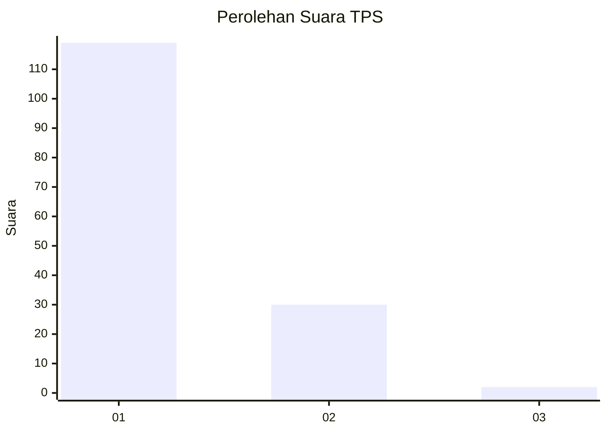
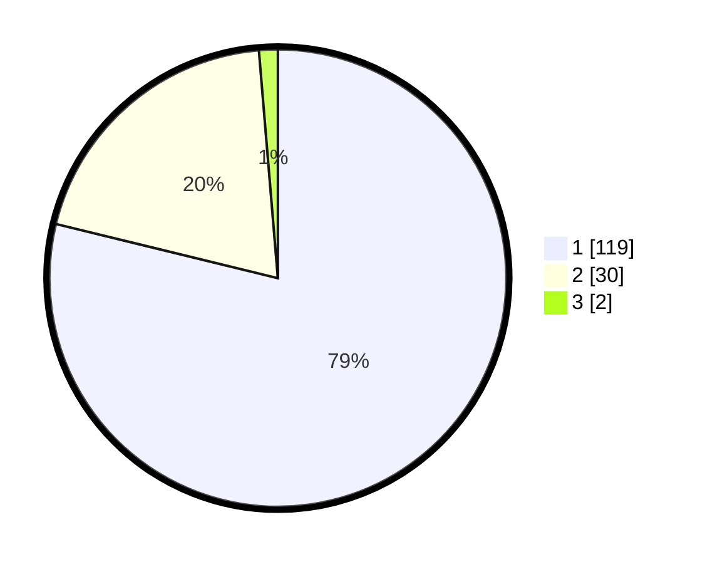

# Hasil

## Grafik

## Tabel

| No. | Nama Paslon    | Suara | Suara (raw) | Persentase |
|:--- |:-------------- | -----:| -----------:| ----------:|
| 1   | ANIES MUHAIMIN | 119   | [119][p-1]  | 78,81      |
| 2   | PRABOWO GIBRAN | 30    | [30][p-2]   | 19,87      |
| 3   | GANJAR MAHFUD  | 2     | [2][p-3]    | 1,32       |

[p-1]: https://github.com/gigit-pemilu/pemilu-2024/blob/main/pilpres/hitung-suara/sub/32-jawa-barat/sub/08-kuningan/sub/30-maleber/sub/2004-maleber/sub/005-tps/sub/paslon-1.txt
[p-2]: https://github.com/gigit-pemilu/pemilu-2024/blob/main/pilpres/hitung-suara/sub/32-jawa-barat/sub/08-kuningan/sub/30-maleber/sub/2004-maleber/sub/005-tps/sub/paslon-2.txt
[p-3]: https://github.com/gigit-pemilu/pemilu-2024/blob/main/pilpres/hitung-suara/sub/32-jawa-barat/sub/08-kuningan/sub/30-maleber/sub/2004-maleber/sub/005-tps/sub/paslon-3.txt

## Foto C Plano

https://sirekap-obj-formc.kpu.go.id/caaa/pemilu/ppwp/32/08/30/20/04/3208302004005-20240215-205110--9d382316-e94e-478d-8b23-b06127167816.jpg

https://sirekap-obj-formc.kpu.go.id/caaa/pemilu/ppwp/32/08/30/20/04/3208302004005-20240214-141711--fea9e775-31d7-43e6-89c0-51e9ca3a12e9.jpg

https://sirekap-obj-formc.kpu.go.id/caaa/pemilu/ppwp/32/08/30/20/04/3208302004005-20240214-141835--332e1bed-e6ca-4ce4-a385-d7c19a8ee164.jpg

## Metadata

| Key        | Value               |
| ---------- | ------------------- |
| Time Stamp | 2024-02-17 19:00:04 |

