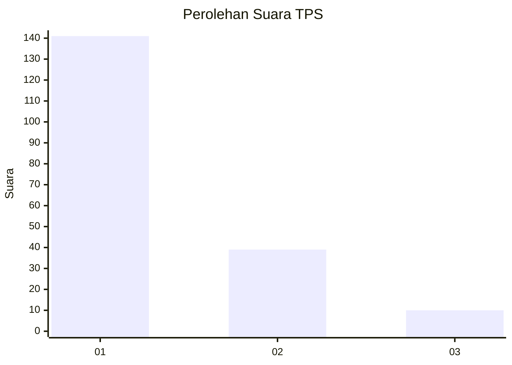
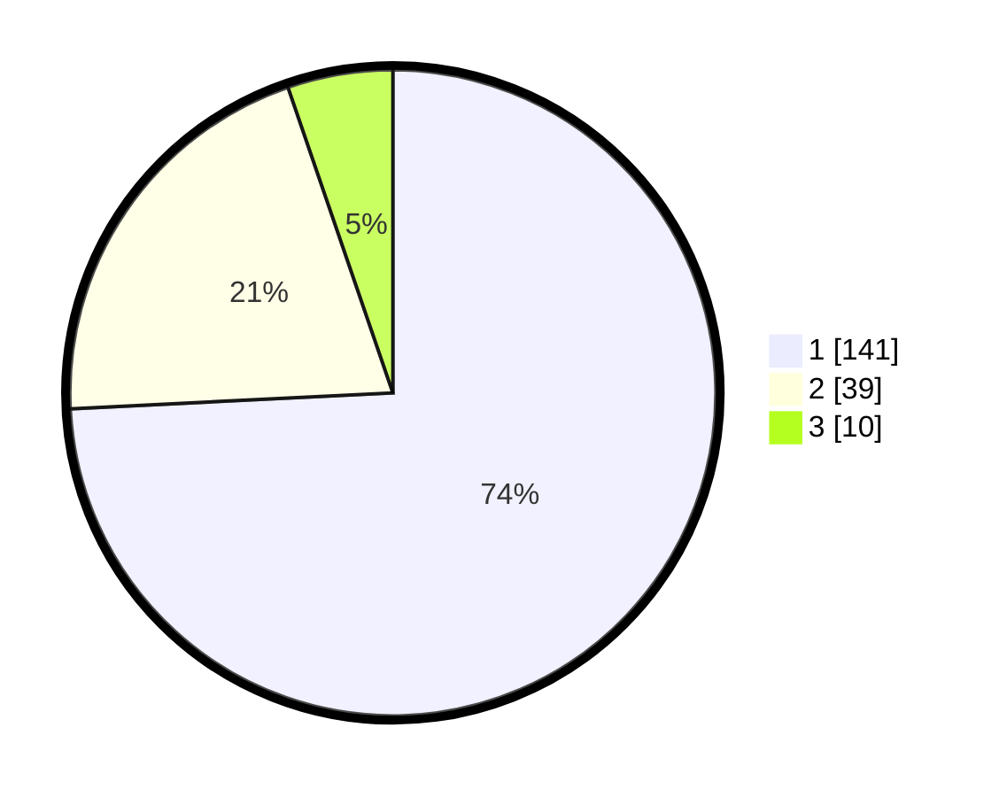

# Hasil

## Grafik

## Tabel

| No. | Nama Paslon    | Suara | Suara (raw) | Persentase |
|:--- |:-------------- | -----:| -----------:| ----------:|
| 1   | ANIES MUHAIMIN | 141   | [141][p-1]  | 74,21      |
| 2   | PRABOWO GIBRAN | 39    | [39][p-2]   | 20,53      |
| 3   | GANJAR MAHFUD  | 10    | [10][p-3]   | 5,26       |

[p-1]: https://github.com/gigit-pemilu/pemilu-2024-32-jawa-barat/blob/main/pilpres/hitung-suara/sub/32-jawa-barat/sub/08-kuningan/sub/30-maleber/sub/2004-maleber/sub/008-tps/sub/paslon-1.txt
[p-2]: https://github.com/gigit-pemilu/pemilu-2024-32-jawa-barat/blob/main/pilpres/hitung-suara/sub/32-jawa-barat/sub/08-kuningan/sub/30-maleber/sub/2004-maleber/sub/008-tps/sub/paslon-2.txt
[p-3]: https://github.com/gigit-pemilu/pemilu-2024-32-jawa-barat/blob/main/pilpres/hitung-suara/sub/32-jawa-barat/sub/08-kuningan/sub/30-maleber/sub/2004-maleber/sub/008-tps/sub/paslon-3.txt

## Foto C Plano

https://sirekap-obj-formc.kpu.go.id/846b/pemilu/ppwp/32/08/30/20/04/3208302004008-20240214-141244--e62e845d-9fd4-447b-8577-1b2dba4b0ae7.jpg

https://sirekap-obj-formc.kpu.go.id/846b/pemilu/ppwp/32/08/30/20/04/3208302004008-20240214-141307--fa52605b-7248-49b9-a0e1-b035cb96decd.jpg

https://sirekap-obj-formc.kpu.go.id/846b/pemilu/ppwp/32/08/30/20/04/3208302004008-20240214-141224--a9027031-b3d6-4d50-98af-47508cc89a51.jpg

## Metadata

| Key        | Value               |
| ---------- | ------------------- |
| Time Stamp | 2024-02-14 21:46:01 |

