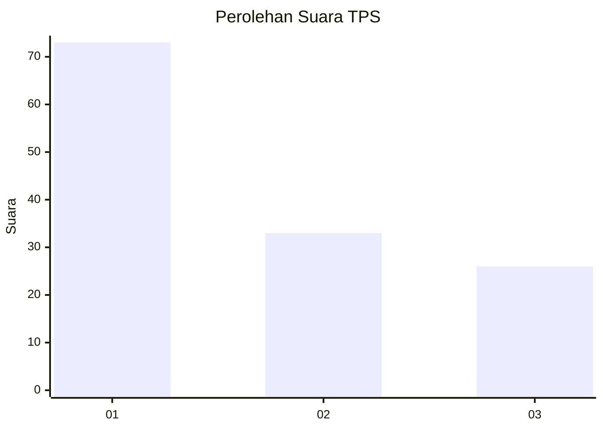
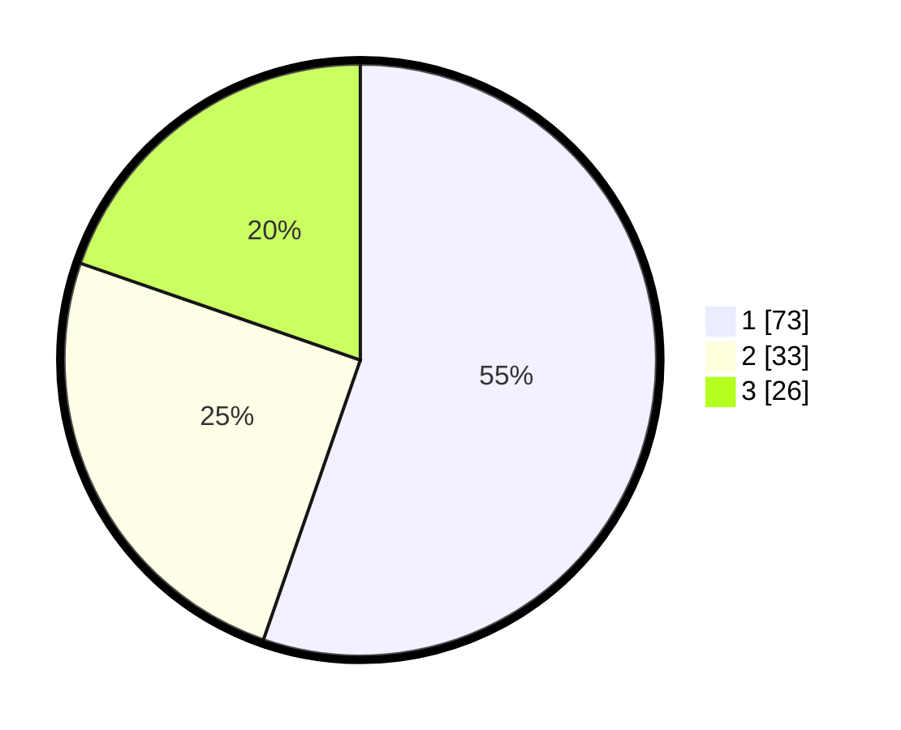

# Hasil

## Grafik

## Tabel

| No. | Nama Paslon    | Suara | Suara (raw) | Persentase |
|:--- |:-------------- | -----:| -----------:| ----------:|
| 1   | ANIES MUHAIMIN | 73    | [73][p-1]   | 55,30      |
| 2   | PRABOWO GIBRAN | 33    | [33][p-2]   | 25,00      |
| 3   | GANJAR MAHFUD  | 26    | [26][p-3]   | 19,70      |

[p-1]: https://github.com/gigit-pemilu/pemilu-2024-32-jawa-barat/blob/main/pilpres/hitung-suara/sub/32-jawa-barat/sub/08-kuningan/sub/30-maleber/sub/2005-parakan/sub/003-tps/sub/paslon-1.txt
[p-2]: https://github.com/gigit-pemilu/pemilu-2024-32-jawa-barat/blob/main/pilpres/hitung-suara/sub/32-jawa-barat/sub/08-kuningan/sub/30-maleber/sub/2005-parakan/sub/003-tps/sub/paslon-2.txt
[p-3]: https://github.com/gigit-pemilu/pemilu-2024-32-jawa-barat/blob/main/pilpres/hitung-suara/sub/32-jawa-barat/sub/08-kuningan/sub/30-maleber/sub/2005-parakan/sub/003-tps/sub/paslon-3.txt

## Foto C Plano

https://sirekap-obj-formc.kpu.go.id/37b7/pemilu/ppwp/32/08/30/20/05/3208302005003-20240214-213240--b575672e-9671-451a-808a-30f570fbaf34.jpg

https://sirekap-obj-formc.kpu.go.id/37b7/pemilu/ppwp/32/08/30/20/05/3208302005003-20240214-213441--8d468f43-3fb3-4afc-97d5-20d6aa226fbe.jpg

https://sirekap-obj-formc.kpu.go.id/37b7/pemilu/ppwp/32/08/30/20/05/3208302005003-20240214-213703--145f0c75-80fe-495c-8f1d-7acec2763449.jpg

## Metadata

| Key        | Value               |
| ---------- | ------------------- |
| Time Stamp | 2024-02-17 19:00:04 |

