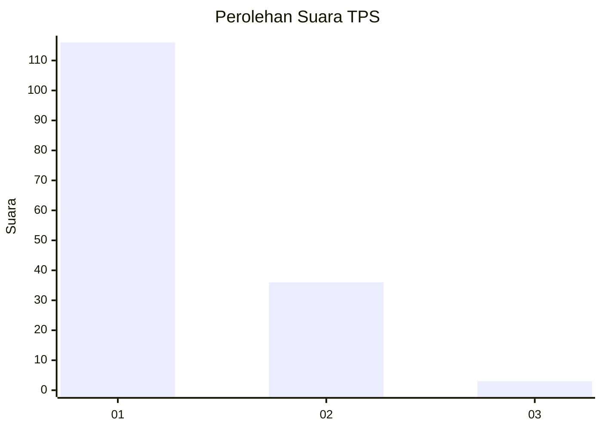
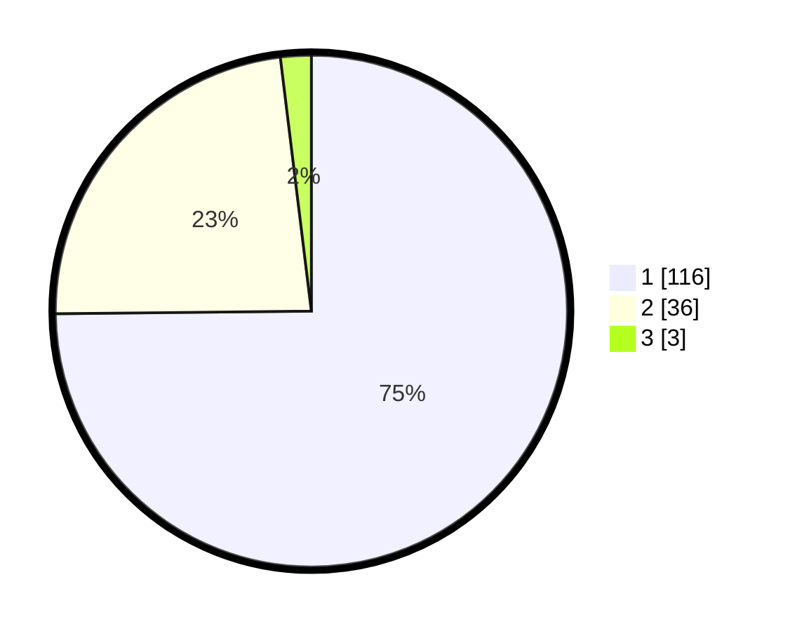

# Hasil

## Grafik

## Tabel

| No. | Nama Paslon    | Suara | Suara (raw) | Persentase |
|:--- |:-------------- | -----:| -----------:| ----------:|
| 1   | ANIES MUHAIMIN | 116   | [116][p-1]  | 74,84      |
| 2   | PRABOWO GIBRAN | 36    | [36][p-2]   | 23,23      |
| 3   | GANJAR MAHFUD  | 3     | [3][p-3]    | 1,94       |

[p-1]: https://github.com/gigit-pemilu/pemilu-2024/blob/main/pilpres/hitung-suara/sub/32-jawa-barat/sub/08-kuningan/sub/30-maleber/sub/2006-kutaraja/sub/009-tps/sub/paslon-1.txt
[p-2]: https://github.com/gigit-pemilu/pemilu-2024/blob/main/pilpres/hitung-suara/sub/32-jawa-barat/sub/08-kuningan/sub/30-maleber/sub/2006-kutaraja/sub/009-tps/sub/paslon-2.txt
[p-3]: https://github.com/gigit-pemilu/pemilu-2024/blob/main/pilpres/hitung-suara/sub/32-jawa-barat/sub/08-kuningan/sub/30-maleber/sub/2006-kutaraja/sub/009-tps/sub/paslon-3.txt

## Foto C Plano

https://sirekap-obj-formc.kpu.go.id/4725/pemilu/ppwp/32/08/30/20/06/3208302006009-20240214-235844--2dc7fd4c-a97c-4be4-85d1-5425bd85a992.jpg

https://sirekap-obj-formc.kpu.go.id/4725/pemilu/ppwp/32/08/30/20/06/3208302006009-20240215-000237--e136756c-725f-4b76-9b30-9e450aeb57c0.jpg

https://sirekap-obj-formc.kpu.go.id/4725/pemilu/ppwp/32/08/30/20/06/3208302006009-20240214-194119--5ae5b1d7-47e5-4f8a-b6c5-e7f69033e5b5.jpg

## Metadata

| Key        | Value               |
| ---------- | ------------------- |
| Time Stamp | 2024-02-17 19:00:04 |

