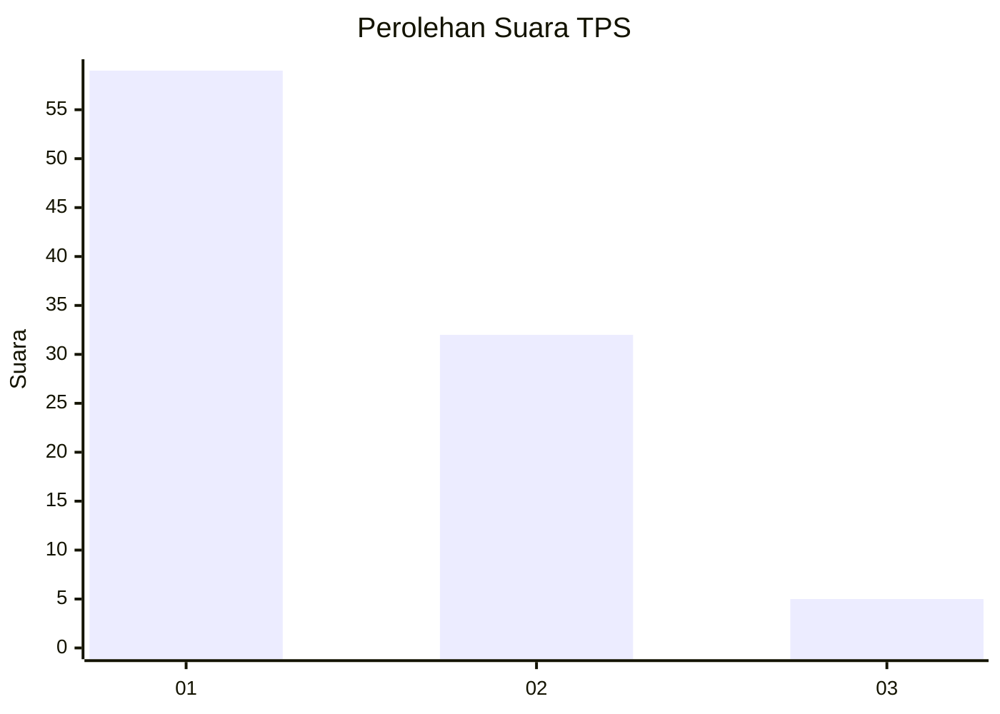
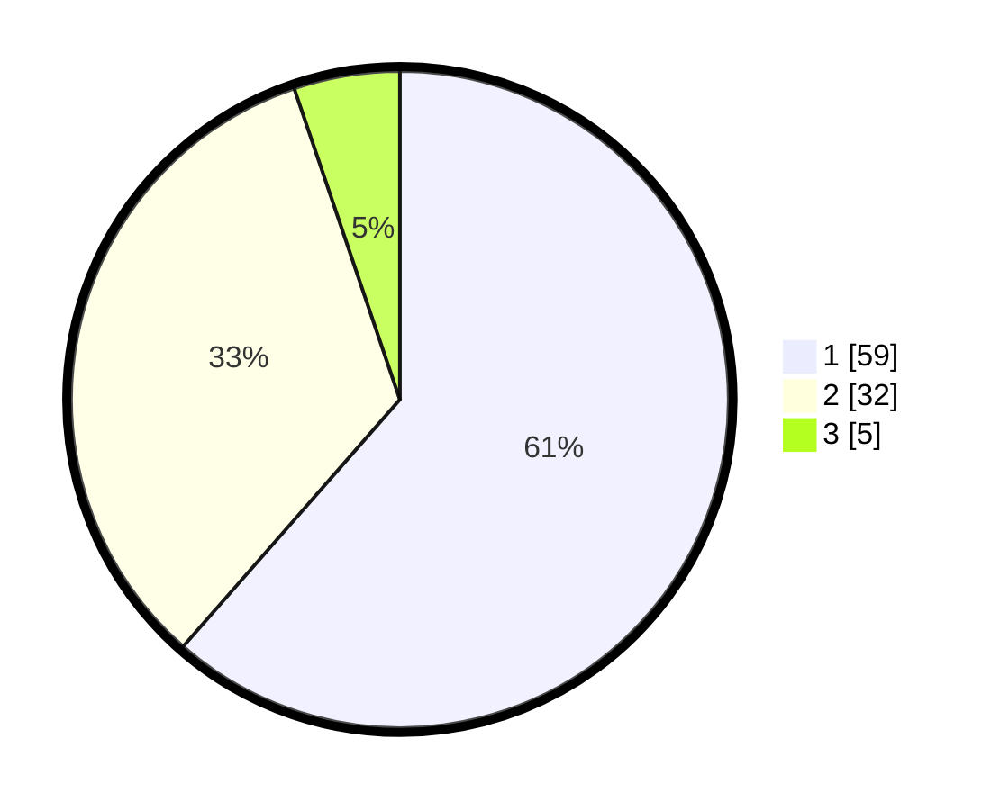

# Hasil

## Grafik

## Tabel

| No. | Nama Paslon    | Suara | Suara (raw) | Persentase |
|:--- |:-------------- | -----:| -----------:| ----------:|
| 1   | ANIES MUHAIMIN | 59    | [59][p-1]   | 61,46      |
| 2   | PRABOWO GIBRAN | 32    | [32][p-2]   | 33,33      |
| 3   | GANJAR MAHFUD  | 5     | [5][p-3]    | 5,21       |

[p-1]: https://github.com/gigit-pemilu/pemilu-2024/blob/main/pilpres/hitung-suara/sub/32-jawa-barat/sub/08-kuningan/sub/30-maleber/sub/2007-ciporang/sub/006-tps/sub/paslon-1.txt
[p-2]: https://github.com/gigit-pemilu/pemilu-2024/blob/main/pilpres/hitung-suara/sub/32-jawa-barat/sub/08-kuningan/sub/30-maleber/sub/2007-ciporang/sub/006-tps/sub/paslon-2.txt
[p-3]: https://github.com/gigit-pemilu/pemilu-2024/blob/main/pilpres/hitung-suara/sub/32-jawa-barat/sub/08-kuningan/sub/30-maleber/sub/2007-ciporang/sub/006-tps/sub/paslon-3.txt

## Foto C Plano

https://sirekap-obj-formc.kpu.go.id/7441/pemilu/ppwp/32/08/30/20/07/3208302007006-20240215-005753--f8324c8b-9b3b-452e-828f-81a6ae3ed5dd.jpg

https://sirekap-obj-formc.kpu.go.id/7441/pemilu/ppwp/32/08/30/20/07/3208302007006-20240215-005805--faf26487-40f5-4689-9f6d-a971e9410ee5.jpg

https://sirekap-obj-formc.kpu.go.id/7441/pemilu/ppwp/32/08/30/20/07/3208302007006-20240215-005818--e2ed4079-847d-4182-8d9a-b861e999d1f5.jpg

## Metadata

| Key        | Value               |
| ---------- | ------------------- |
| Time Stamp | 2024-02-15 23:29:50 |

