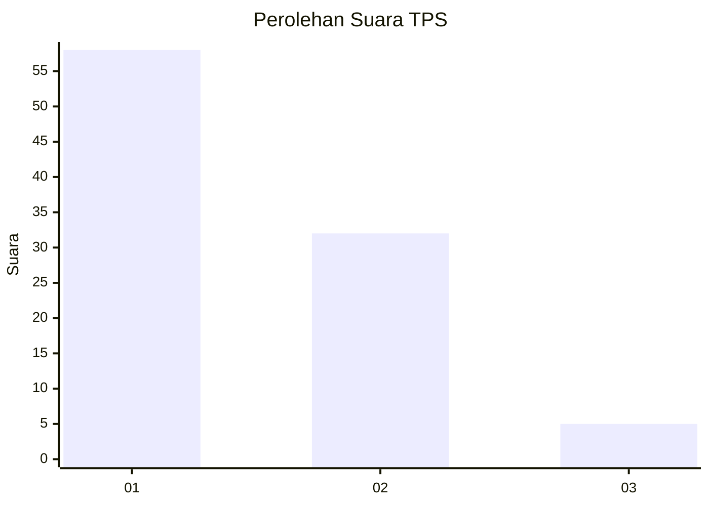
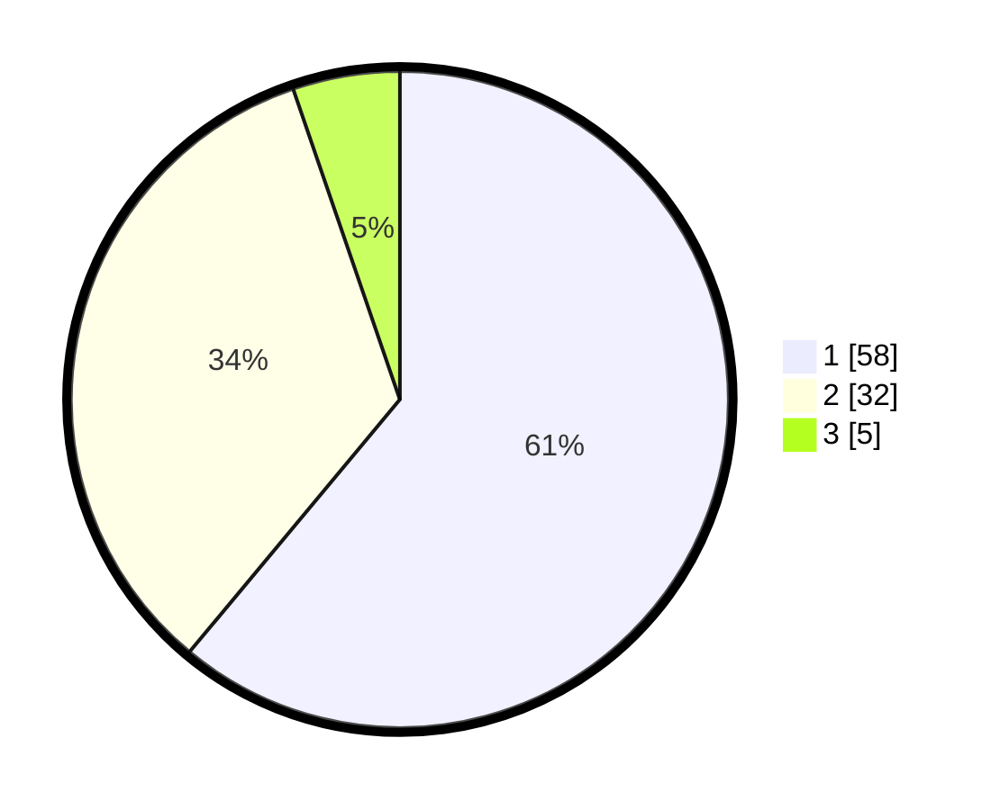

# Hasil

## Grafik

## Tabel

| No. | Nama Paslon    | Suara | Suara (raw) | Persentase |
|:--- |:-------------- | -----:| -----------:| ----------:|
| 1   | ANIES MUHAIMIN | 58    | [58][p-1]   | 61,05      |
| 2   | PRABOWO GIBRAN | 32    | [32][p-2]   | 33,68      |
| 3   | GANJAR MAHFUD  | 5     | [5][p-3]    | 5,26       |

[p-1]: https://github.com/gigit-pemilu/pemilu-2024-32-jawa-barat/blob/main/pilpres/hitung-suara/sub/32-jawa-barat/sub/08-kuningan/sub/30-maleber/sub/2009-karangtengah/sub/004-tps/sub/paslon-1.txt
[p-2]: https://github.com/gigit-pemilu/pemilu-2024-32-jawa-barat/blob/main/pilpres/hitung-suara/sub/32-jawa-barat/sub/08-kuningan/sub/30-maleber/sub/2009-karangtengah/sub/004-tps/sub/paslon-2.txt
[p-3]: https://github.com/gigit-pemilu/pemilu-2024-32-jawa-barat/blob/main/pilpres/hitung-suara/sub/32-jawa-barat/sub/08-kuningan/sub/30-maleber/sub/2009-karangtengah/sub/004-tps/sub/paslon-3.txt

## Foto C Plano

https://sirekap-obj-formc.kpu.go.id/960d/pemilu/ppwp/32/08/30/20/09/3208302009004-20240214-190009--1029a179-6e86-4105-b7c5-a9c422f2924f.jpg

https://sirekap-obj-formc.kpu.go.id/960d/pemilu/ppwp/32/08/30/20/09/3208302009004-20240214-190022--f134046d-4930-419d-a92c-5707e13a192c.jpg

https://sirekap-obj-formc.kpu.go.id/960d/pemilu/ppwp/32/08/30/20/09/3208302009004-20240214-190032--e1d33fca-c475-4e0d-8d5f-1ac4d58b3794.jpg

## Metadata

| Key        | Value               |
| ---------- | ------------------- |
| Time Stamp | 2024-02-17 19:30:00 |

