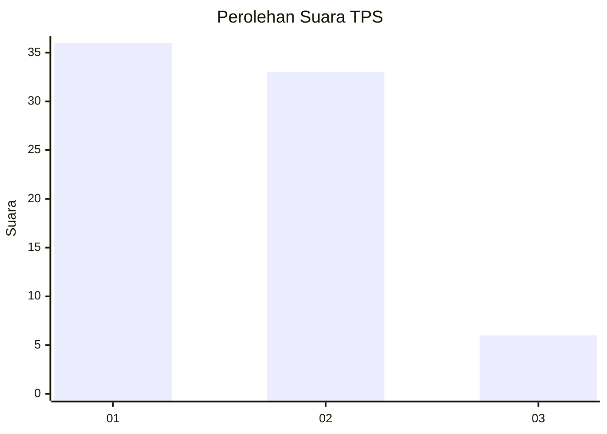
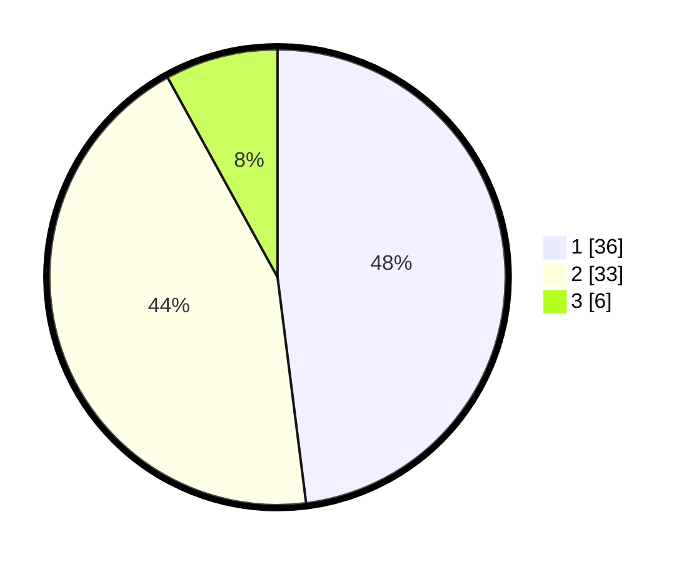

# Hasil

## Grafik

## Tabel

| No. | Nama Paslon    | Suara | Suara (raw) | Persentase |
|:--- |:-------------- | -----:| -----------:| ----------:|
| 1   | ANIES MUHAIMIN | 36    | [36][p-1]   | 48,00      |
| 2   | PRABOWO GIBRAN | 33    | [33][p-2]   | 44,00      |
| 3   | GANJAR MAHFUD  | 6     | [6][p-3]    | 8,00       |

[p-1]: https://github.com/gigit-pemilu/pemilu-2024-32-jawa-barat/blob/main/pilpres/hitung-suara/sub/32-jawa-barat/sub/08-kuningan/sub/30-maleber/sub/2010-mekarsari/sub/005-tps/sub/paslon-1.txt
[p-2]: https://github.com/gigit-pemilu/pemilu-2024-32-jawa-barat/blob/main/pilpres/hitung-suara/sub/32-jawa-barat/sub/08-kuningan/sub/30-maleber/sub/2010-mekarsari/sub/005-tps/sub/paslon-2.txt
[p-3]: https://github.com/gigit-pemilu/pemilu-2024-32-jawa-barat/blob/main/pilpres/hitung-suara/sub/32-jawa-barat/sub/08-kuningan/sub/30-maleber/sub/2010-mekarsari/sub/005-tps/sub/paslon-3.txt

## Foto C Plano

https://sirekap-obj-formc.kpu.go.id/5c62/pemilu/ppwp/32/08/30/20/10/3208302010005-20240215-173951--e7b8b90b-f772-48b7-ba85-6ae5c498468c.jpg

https://sirekap-obj-formc.kpu.go.id/5c62/pemilu/ppwp/32/08/30/20/10/3208302010005-20240215-172109--88df3cf5-10d1-4228-a3c4-51f177cf654d.jpg

https://sirekap-obj-formc.kpu.go.id/5c62/pemilu/ppwp/32/08/30/20/10/3208302010005-20240215-164353--aa363acf-28a6-492d-b0f5-62431d12f8d6.jpg

## Metadata

| Key        | Value               |
| ---------- | ------------------- |
| Time Stamp | 2024-02-15 23:29:50 |

