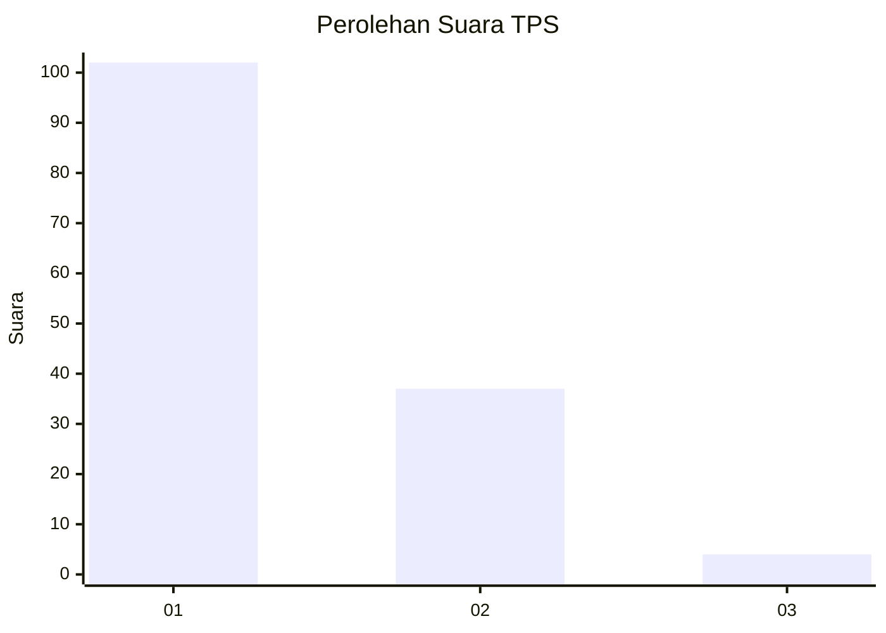
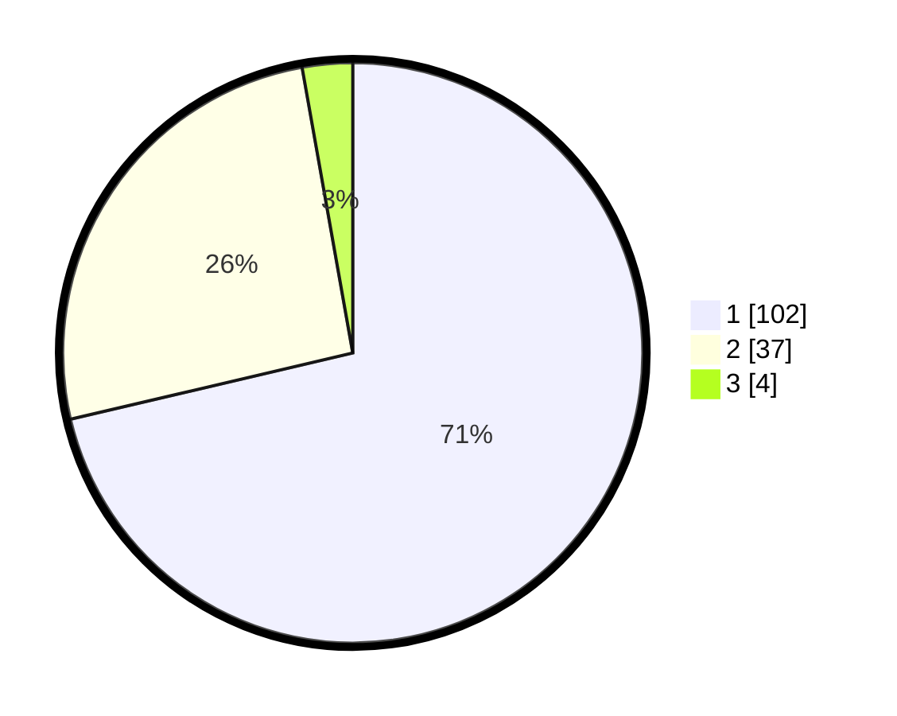

# Hasil

## Grafik

## Tabel

| No. | Nama Paslon    | Suara | Suara (raw) | Persentase |
|:--- |:-------------- | -----:| -----------:| ----------:|
| 1   | ANIES MUHAIMIN | 102   | [102][p-1]  | 71,33      |
| 2   | PRABOWO GIBRAN | 37    | [37][p-2]   | 25,87      |
| 3   | GANJAR MAHFUD  | 4     | [4][p-3]    | 2,80       |

[p-1]: https://github.com/gigit-pemilu/pemilu-2024/blob/main/pilpres/hitung-suara/sub/32-jawa-barat/sub/08-kuningan/sub/30-maleber/sub/2013-kutamandarakan/sub/003-tps/sub/paslon-1.txt
[p-2]: https://github.com/gigit-pemilu/pemilu-2024/blob/main/pilpres/hitung-suara/sub/32-jawa-barat/sub/08-kuningan/sub/30-maleber/sub/2013-kutamandarakan/sub/003-tps/sub/paslon-2.txt
[p-3]: https://github.com/gigit-pemilu/pemilu-2024/blob/main/pilpres/hitung-suara/sub/32-jawa-barat/sub/08-kuningan/sub/30-maleber/sub/2013-kutamandarakan/sub/003-tps/sub/paslon-3.txt

## Foto C Plano

https://sirekap-obj-formc.kpu.go.id/af6f/pemilu/ppwp/32/08/30/20/13/3208302013003-20240214-141532--28bc157d-6b86-4cd8-8b3e-ffd022dd8bde.jpg

https://sirekap-obj-formc.kpu.go.id/af6f/pemilu/ppwp/32/08/30/20/13/3208302013003-20240214-141557--b297d299-7ba4-471a-b232-1d41a3622de5.jpg

https://sirekap-obj-formc.kpu.go.id/af6f/pemilu/ppwp/32/08/30/20/13/3208302013003-20240214-141831--635f6b33-a8a8-4c67-8746-eea471cb543c.jpg

## Metadata

| Key        | Value               |
| ---------- | ------------------- |
| Time Stamp | 2024-02-17 19:30:00 |

