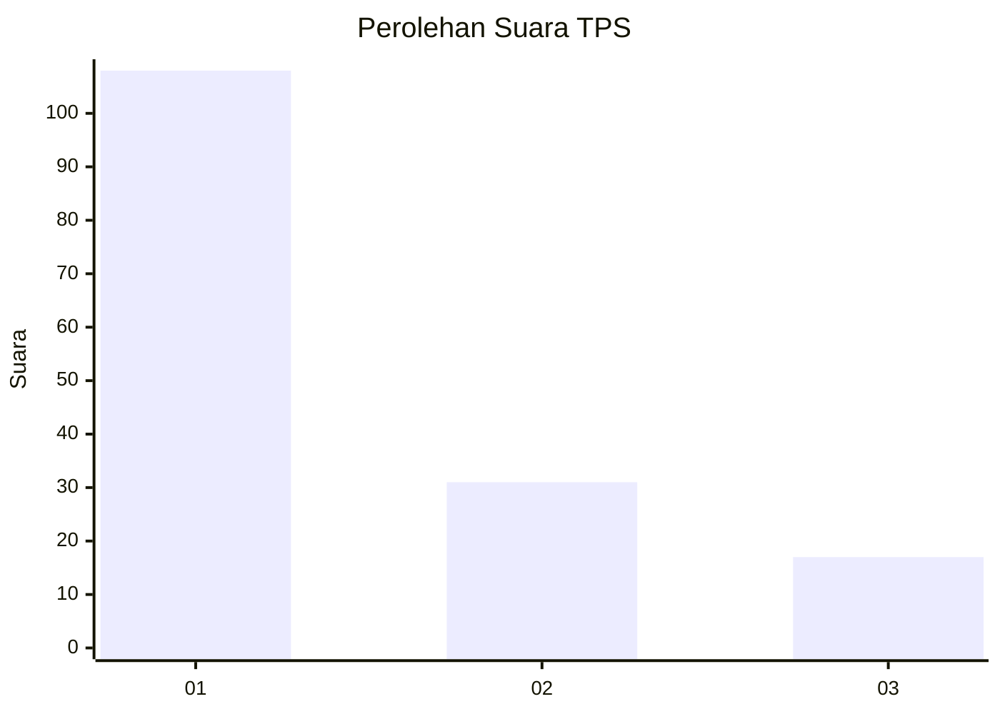
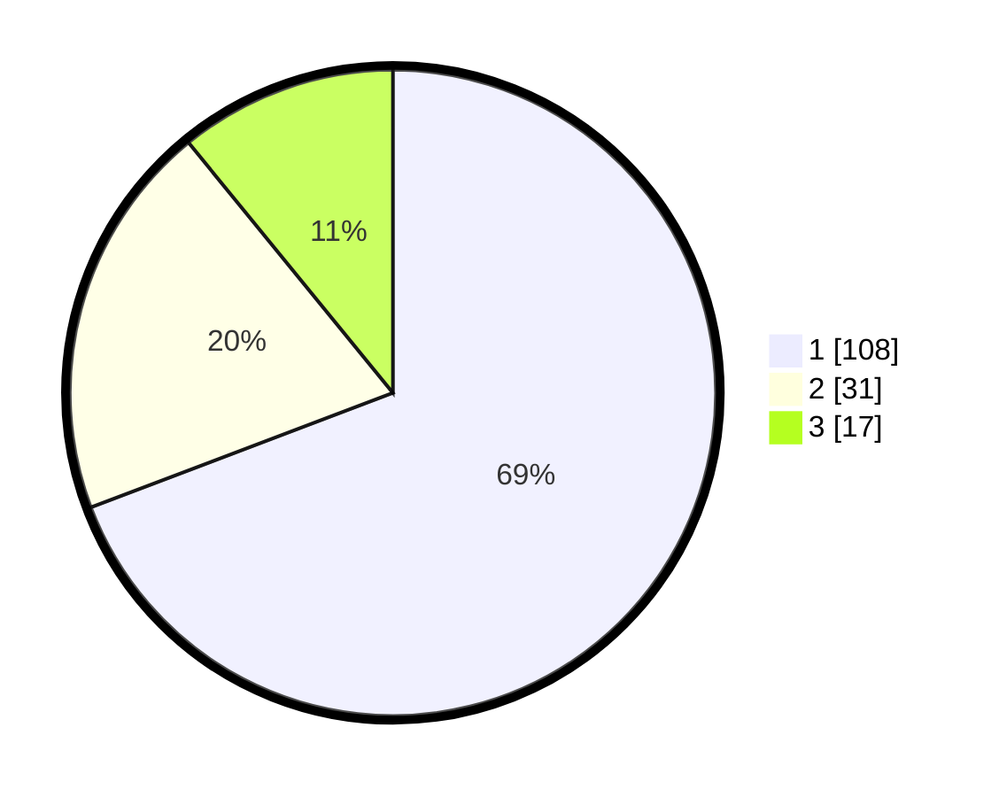

# Hasil

## Grafik

## Tabel

| No. | Nama Paslon    | Suara | Suara (raw) | Persentase |
|:--- |:-------------- | -----:| -----------:| ----------:|
| 1   | ANIES MUHAIMIN | 108   | [108][p-1]  | 69,23      |
| 2   | PRABOWO GIBRAN | 31    | [31][p-2]   | 19,87      |
| 3   | GANJAR MAHFUD  | 17    | [17][p-3]   | 10,90      |

[p-1]: https://github.com/gigit-pemilu/pemilu-2024-32-jawa-barat/blob/main/pilpres/hitung-suara/sub/32-jawa-barat/sub/08-kuningan/sub/30-maleber/sub/2015-giriwaringin/sub/003-tps/sub/paslon-1.txt
[p-2]: https://github.com/gigit-pemilu/pemilu-2024-32-jawa-barat/blob/main/pilpres/hitung-suara/sub/32-jawa-barat/sub/08-kuningan/sub/30-maleber/sub/2015-giriwaringin/sub/003-tps/sub/paslon-2.txt
[p-3]: https://github.com/gigit-pemilu/pemilu-2024-32-jawa-barat/blob/main/pilpres/hitung-suara/sub/32-jawa-barat/sub/08-kuningan/sub/30-maleber/sub/2015-giriwaringin/sub/003-tps/sub/paslon-3.txt

## Foto C Plano

https://sirekap-obj-formc.kpu.go.id/c999/pemilu/ppwp/32/08/30/20/15/3208302015003-20240216-200222--87c2dc9e-f7cd-4628-89a4-e177a71970e7.jpg

https://sirekap-obj-formc.kpu.go.id/c999/pemilu/ppwp/32/08/30/20/15/3208302015003-20240216-171532--60e932da-16a7-4111-aacd-285e87e59134.jpg

https://sirekap-obj-formc.kpu.go.id/c999/pemilu/ppwp/32/08/30/20/15/3208302015003-20240216-171058--e8985adf-d5c0-4107-8a3d-c71e08ec562d.jpg

## Metadata

| Key        | Value               |
| ---------- | ------------------- |
| Time Stamp | 2024-02-19 06:16:00 |

