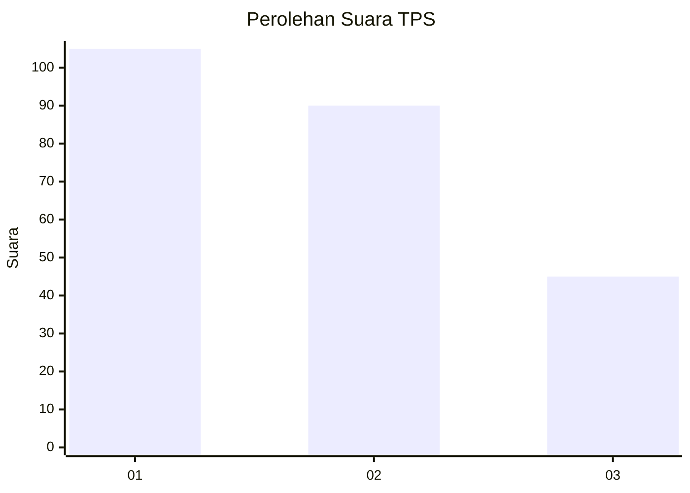
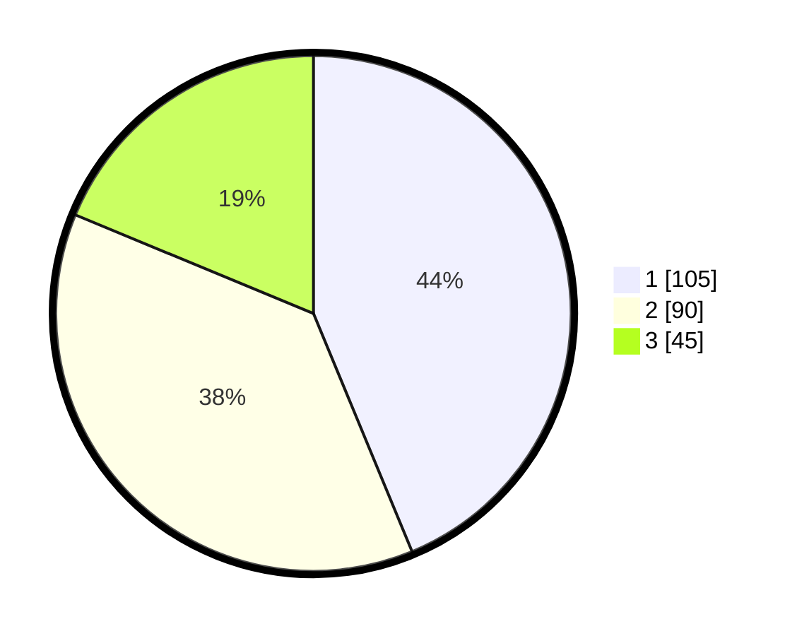

# Hasil

## Grafik

## Tabel

| No. | Nama Paslon    | Suara | Suara (raw) | Persentase |
|:--- |:-------------- | -----:| -----------:| ----------:|
| 1   | ANIES MUHAIMIN | 105   | [105][p-1]  | 43,75      |
| 2   | PRABOWO GIBRAN | 90    | [90][p-2]   | 37,50      |
| 3   | GANJAR MAHFUD  | 45    | [45][p-3]   | 18,75      |

[p-1]: https://github.com/gigit-pemilu/pemilu-2024/blob/main/pilpres/hitung-suara/sub/32-jawa-barat/sub/08-kuningan/sub/31-sindangagung/sub/2011-taraju/sub/011-tps/sub/paslon-1.txt
[p-2]: https://github.com/gigit-pemilu/pemilu-2024/blob/main/pilpres/hitung-suara/sub/32-jawa-barat/sub/08-kuningan/sub/31-sindangagung/sub/2011-taraju/sub/011-tps/sub/paslon-2.txt
[p-3]: https://github.com/gigit-pemilu/pemilu-2024/blob/main/pilpres/hitung-suara/sub/32-jawa-barat/sub/08-kuningan/sub/31-sindangagung/sub/2011-taraju/sub/011-tps/sub/paslon-3.txt

## Foto C Plano

https://sirekap-obj-formc.kpu.go.id/0625/pemilu/ppwp/32/08/31/20/11/3208312011011-20240214-213156--70cf701c-46a2-4cf8-ab1d-5fa0e95be5b1.jpg

https://sirekap-obj-formc.kpu.go.id/0625/pemilu/ppwp/32/08/31/20/11/3208312011011-20240214-202352--12232b82-f8bf-4ff0-9830-b59605104cc0.jpg

https://sirekap-obj-formc.kpu.go.id/0625/pemilu/ppwp/32/08/31/20/11/3208312011011-20240214-202456--d5dc34ea-af2a-4fa1-9306-dd17ffcae7d2.jpg

## Metadata

| Key        | Value               |
| ---------- | ------------------- |
| Time Stamp | 2024-02-17 16:00:02 |

