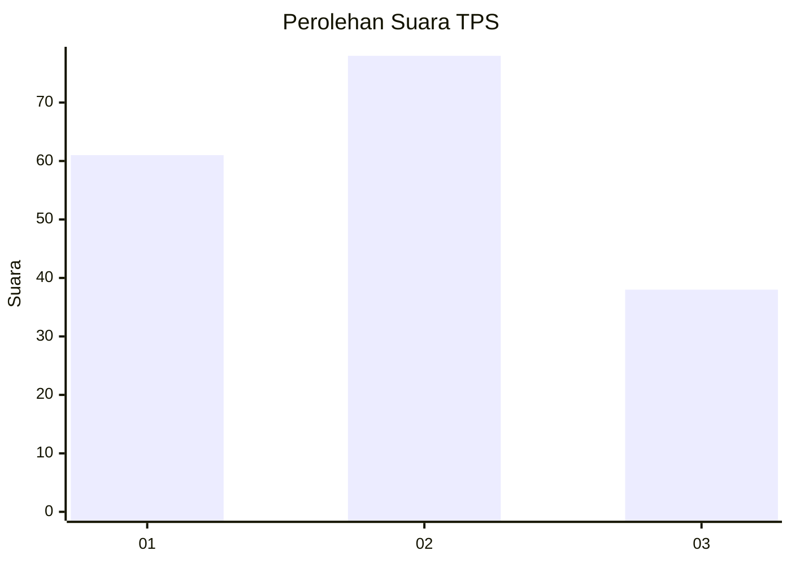
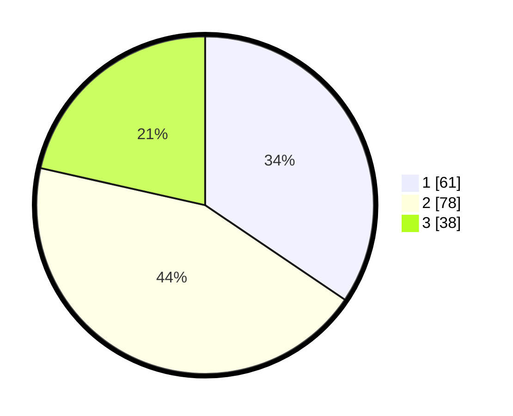

# Hasil

## Grafik

## Tabel

| No. | Nama Paslon    | Suara | Suara (raw) | Persentase |
|:--- |:-------------- | -----:| -----------:| ----------:|
| 1   | ANIES MUHAIMIN | 61    | [61][p-1]   | 34,46      |
| 2   | PRABOWO GIBRAN | 78    | [78][p-2]   | 44,07      |
| 3   | GANJAR MAHFUD  | 38    | [38][p-3]   | 21,47      |

[p-1]: https://github.com/gigit-pemilu/pemilu-2024-32-jawa-barat/blob/main/pilpres/hitung-suara/sub/32-jawa-barat/sub/08-kuningan/sub/32-cigandamekar/sub/2001-bunigeulis/sub/003-tps/sub/paslon-1.txt
[p-2]: https://github.com/gigit-pemilu/pemilu-2024-32-jawa-barat/blob/main/pilpres/hitung-suara/sub/32-jawa-barat/sub/08-kuningan/sub/32-cigandamekar/sub/2001-bunigeulis/sub/003-tps/sub/paslon-2.txt
[p-3]: https://github.com/gigit-pemilu/pemilu-2024-32-jawa-barat/blob/main/pilpres/hitung-suara/sub/32-jawa-barat/sub/08-kuningan/sub/32-cigandamekar/sub/2001-bunigeulis/sub/003-tps/sub/paslon-3.txt

## Foto C Plano

https://sirekap-obj-formc.kpu.go.id/44aa/pemilu/ppwp/32/08/32/20/01/3208322001003-20240223-172812--4a30be76-9c5f-4ef6-bd0f-573fdb76019b.jpg

https://sirekap-obj-formc.kpu.go.id/44aa/pemilu/ppwp/32/08/32/20/01/3208322001003-20240214-225625--dbecb4bc-8502-4231-8b5a-a4e42215650b.jpg

https://sirekap-obj-formc.kpu.go.id/44aa/pemilu/ppwp/32/08/32/20/01/3208322001003-20240223-172825--ed879af6-aede-49ee-9afd-b31116f35191.jpg

## Metadata

| Key        | Value               |
| ---------- | ------------------- |
| Time Stamp | 2024-02-24 22:31:28 |

