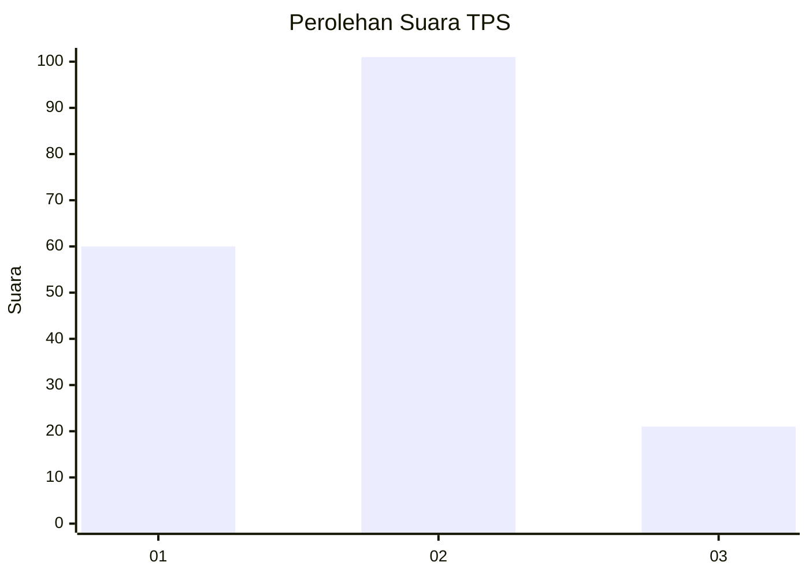
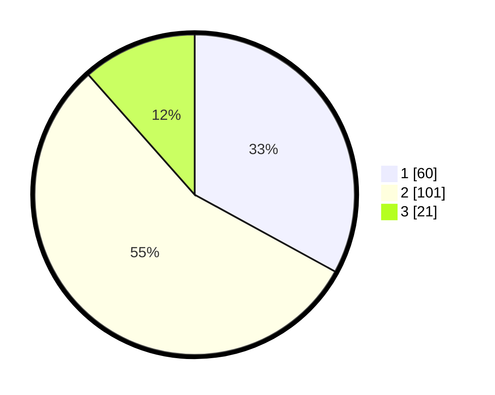

# Hasil

## Grafik

## Tabel

| No. | Nama Paslon    | Suara | Suara (raw) | Persentase |
|:--- |:-------------- | -----:| -----------:| ----------:|
| 1   | ANIES MUHAIMIN | 60    | [60][p-1]   | 32,97      |
| 2   | PRABOWO GIBRAN | 101   | [101][p-2]  | 55,49      |
| 3   | GANJAR MAHFUD  | 21    | [21][p-3]   | 11,54      |

[p-1]: https://github.com/gigit-pemilu/pemilu-2024-32-jawa-barat/blob/main/pilpres/hitung-suara/sub/32-jawa-barat/sub/09-cirebon/sub/01-waled/sub/2008-waled-desa/sub/002-tps/sub/paslon-1.txt
[p-2]: https://github.com/gigit-pemilu/pemilu-2024-32-jawa-barat/blob/main/pilpres/hitung-suara/sub/32-jawa-barat/sub/09-cirebon/sub/01-waled/sub/2008-waled-desa/sub/002-tps/sub/paslon-2.txt
[p-3]: https://github.com/gigit-pemilu/pemilu-2024-32-jawa-barat/blob/main/pilpres/hitung-suara/sub/32-jawa-barat/sub/09-cirebon/sub/01-waled/sub/2008-waled-desa/sub/002-tps/sub/paslon-3.txt

## Foto C Plano

https://sirekap-obj-formc.kpu.go.id/b260/pemilu/ppwp/32/09/01/20/08/3209012008002-20240215-170212--1ac4e5ca-eb65-4623-8940-7f573f8fe591.jpg

https://sirekap-obj-formc.kpu.go.id/b260/pemilu/ppwp/32/09/01/20/08/3209012008002-20240215-170605--324d33e0-48f2-45fb-bcb7-11c72cc769c3.jpg

https://sirekap-obj-formc.kpu.go.id/b260/pemilu/ppwp/32/09/01/20/08/3209012008002-20240215-170854--f2845dcd-4cf6-46c5-90ea-db318fbc2928.jpg

## Metadata

| Key        | Value               |
| ---------- | ------------------- |
| Time Stamp | 2024-02-19 06:16:00 |

