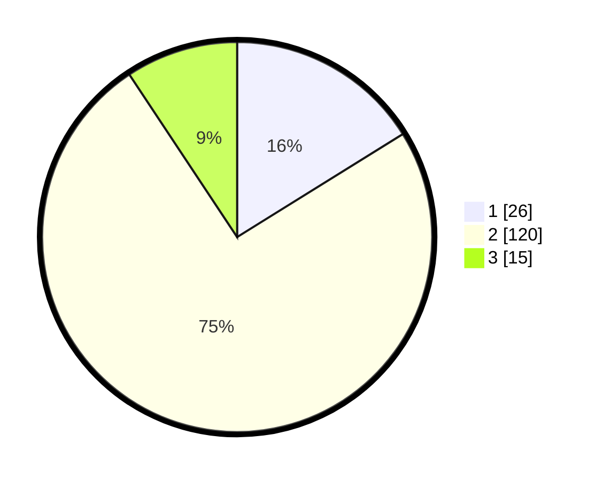

# Hasil

## Grafik

## Tabel

| No. | Nama Paslon    | Suara | Suara (raw) | Persentase |
|:--- |:-------------- | -----:| -----------:| ----------:|
| 1   | ANIES MUHAIMIN | 26    | [26][p-1]   | 16,15      |
| 2   | PRABOWO GIBRAN | 120   | [120][p-2]  | 74,53      |
| 3   | GANJAR MAHFUD  | 15    | [15][p-3]   | 9,32       |

[p-1]: https://github.com/gigit-pemilu/pemilu-2024/blob/main/pilpres/hitung-suara/sub/32-jawa-barat/sub/09-cirebon/sub/01-waled/sub/2011-waled-asem/sub/003-tps/sub/paslon-1.txt
[p-2]: https://github.com/gigit-pemilu/pemilu-2024/blob/main/pilpres/hitung-suara/sub/32-jawa-barat/sub/09-cirebon/sub/01-waled/sub/2011-waled-asem/sub/003-tps/sub/paslon-2.txt
[p-3]: https://github.com/gigit-pemilu/pemilu-2024/blob/main/pilpres/hitung-suara/sub/32-jawa-barat/sub/09-cirebon/sub/01-waled/sub/2011-waled-asem/sub/003-tps/sub/paslon-3.txt

## Foto C Plano

https://sirekap-obj-formc.kpu.go.id/cd32/pemilu/ppwp/32/09/01/20/11/3209012011003-20240214-222449--549df181-f3e4-442d-8e22-0fbcd9f92ecc.jpg

https://sirekap-obj-formc.kpu.go.id/cd32/pemilu/ppwp/32/09/01/20/11/3209012011003-20240214-222707--010cfbf3-ee36-4bbe-8824-78eb08d96850.jpg

https://sirekap-obj-formc.kpu.go.id/cd32/pemilu/ppwp/32/09/01/20/11/3209012011003-20240214-222858--300f2ffc-b1f0-4060-8573-c1bf99a8a370.jpg

## Metadata

| Key        | Value               |
| ---------- | ------------------- |
| Time Stamp | 2024-02-19 06:16:00 |

