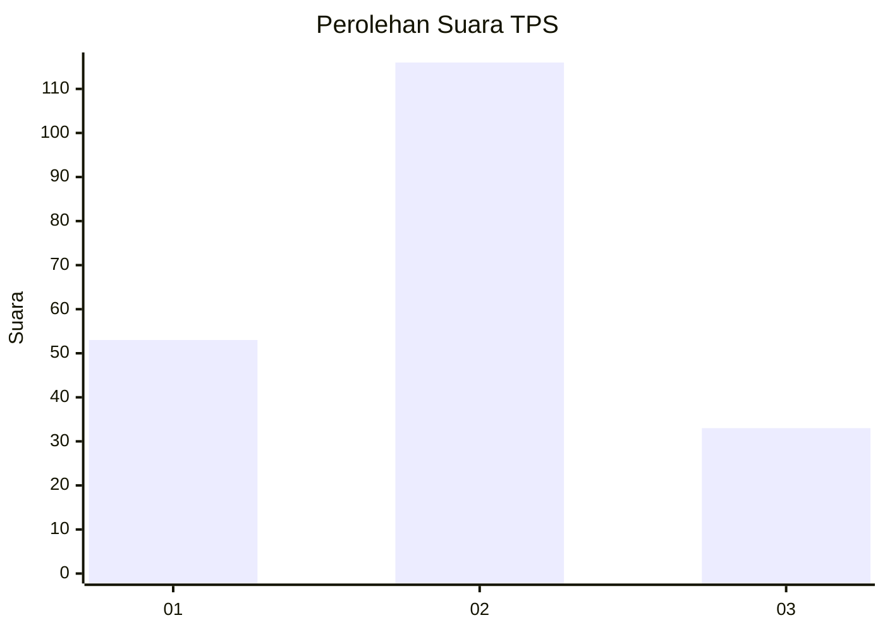

# Hasil

## Grafik

## Tabel

| No. | Nama Paslon    | Suara | Suara (raw) | Persentase |
|:--- |:-------------- | -----:| -----------:| ----------:|
| 1   | ANIES MUHAIMIN | 53    | [53][p-1]   | 26,24      |
| 2   | PRABOWO GIBRAN | 116   | [116][p-2]  | 57,43      |
| 3   | GANJAR MAHFUD  | 33    | [33][p-3]   | 16,34      |

[p-1]: https://github.com/gigit-pemilu/pemilu-2024/blob/main/pilpres/hitung-suara/sub/32-jawa-barat/sub/09-cirebon/sub/04-pabedilan/sub/2001-pabedilan-kidul/sub/004-tps/sub/paslon-1.txt
[p-2]: https://github.com/gigit-pemilu/pemilu-2024/blob/main/pilpres/hitung-suara/sub/32-jawa-barat/sub/09-cirebon/sub/04-pabedilan/sub/2001-pabedilan-kidul/sub/004-tps/sub/paslon-2.txt
[p-3]: https://github.com/gigit-pemilu/pemilu-2024/blob/main/pilpres/hitung-suara/sub/32-jawa-barat/sub/09-cirebon/sub/04-pabedilan/sub/2001-pabedilan-kidul/sub/004-tps/sub/paslon-3.txt

## Foto C Plano

https://sirekap-obj-formc.kpu.go.id/b3cf/pemilu/ppwp/32/09/04/20/01/3209042001004-20240215-075324--862a4705-c63a-4d23-9931-543515496c8d.jpg

https://sirekap-obj-formc.kpu.go.id/b3cf/pemilu/ppwp/32/09/04/20/01/3209042001004-20240215-023317--96cc2e24-5263-4eee-92be-70b736fab90f.jpg

https://sirekap-obj-formc.kpu.go.id/b3cf/pemilu/ppwp/32/09/04/20/01/3209042001004-20240215-023323--29b830c7-6b7c-4d26-a1c0-f0899627d73d.jpg

## Metadata

| Key        | Value               |
| ---------- | ------------------- |
| Time Stamp | 2024-02-20 17:00:00 |

