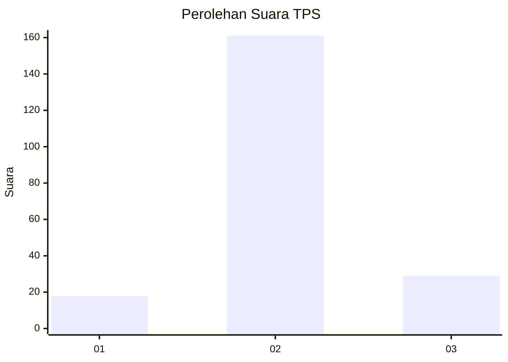
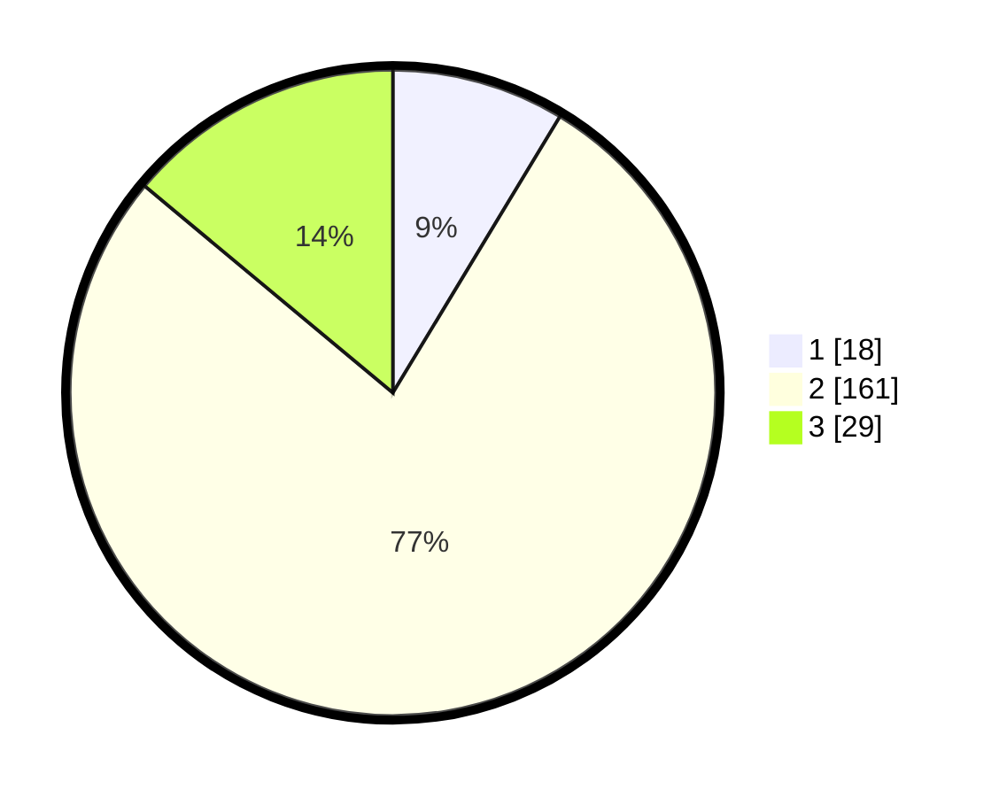

# Hasil

## Grafik

## Tabel

| No. | Nama Paslon    | Suara | Suara (raw) | Persentase |
|:--- |:-------------- | -----:| -----------:| ----------:|
| 1   | ANIES MUHAIMIN | 18    | [18][p-1]   | 8,65       |
| 2   | PRABOWO GIBRAN | 161   | [161][p-2]  | 77,40      |
| 3   | GANJAR MAHFUD  | 29    | [29][p-3]   | 13,94      |

[p-1]: https://github.com/gigit-pemilu/pemilu-2024/blob/main/pilpres/hitung-suara/sub/32-jawa-barat/sub/09-cirebon/sub/04-pabedilan/sub/2001-pabedilan-kidul/sub/007-tps/sub/paslon-1.txt
[p-2]: https://github.com/gigit-pemilu/pemilu-2024/blob/main/pilpres/hitung-suara/sub/32-jawa-barat/sub/09-cirebon/sub/04-pabedilan/sub/2001-pabedilan-kidul/sub/007-tps/sub/paslon-2.txt
[p-3]: https://github.com/gigit-pemilu/pemilu-2024/blob/main/pilpres/hitung-suara/sub/32-jawa-barat/sub/09-cirebon/sub/04-pabedilan/sub/2001-pabedilan-kidul/sub/007-tps/sub/paslon-3.txt

## Foto C Plano

https://sirekap-obj-formc.kpu.go.id/0227/pemilu/ppwp/32/09/04/20/01/3209042001007-20240219-124906--23482456-bd77-490c-ac36-5a727d1c5bcf.jpg

https://sirekap-obj-formc.kpu.go.id/0227/pemilu/ppwp/32/09/04/20/01/3209042001007-20240219-125045--f172ca87-aeb6-4323-b715-3ae6406f9842.jpg

https://sirekap-obj-formc.kpu.go.id/0227/pemilu/ppwp/32/09/04/20/01/3209042001007-20240219-125151--c079ee62-4dcf-4cd8-a010-351bf3249fd6.jpg

## Metadata

| Key        | Value               |
| ---------- | ------------------- |
| Time Stamp | 2024-02-20 17:00:00 |

