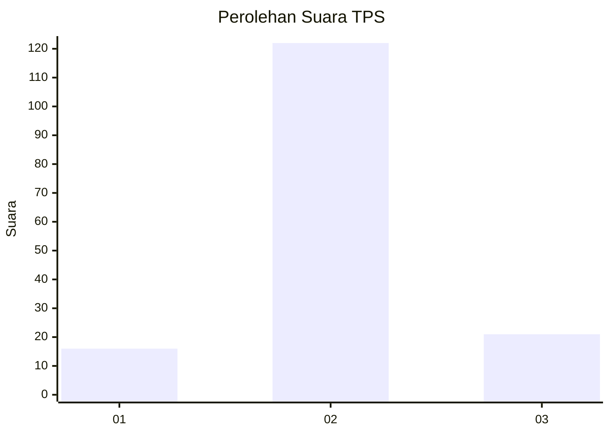
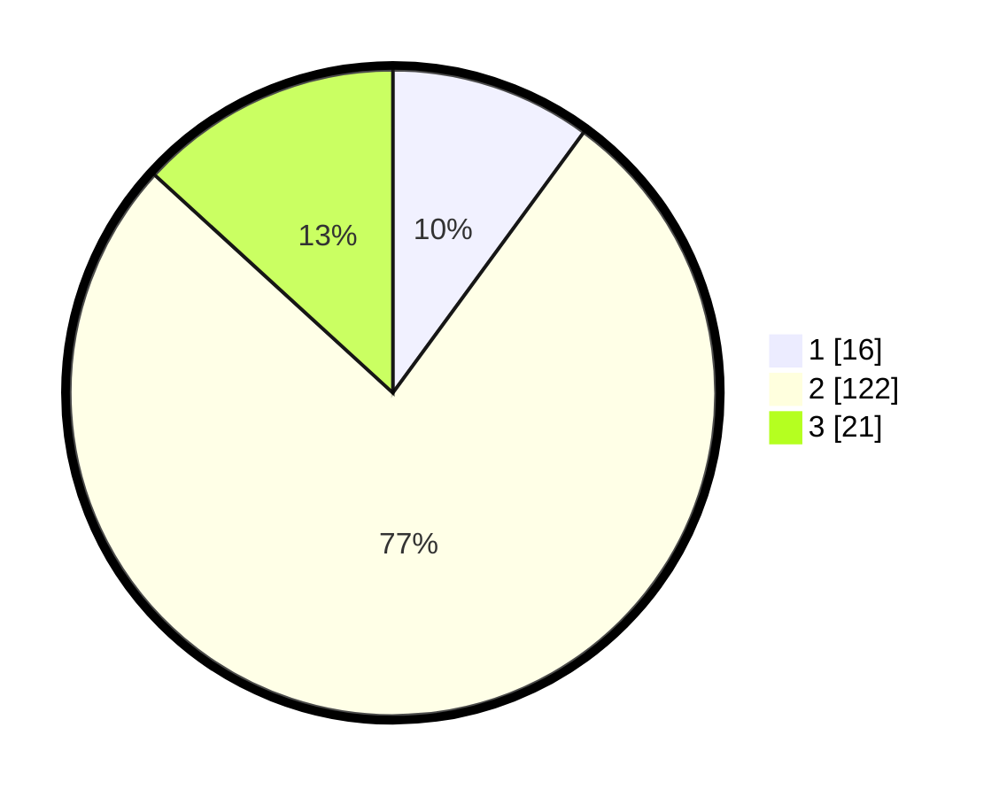

# Hasil

## Grafik

## Tabel

| No. | Nama Paslon    | Suara | Suara (raw) | Persentase |
|:--- |:-------------- | -----:| -----------:| ----------:|
| 1   | ANIES MUHAIMIN | 16    | [16][p-1]   | 10,06      |
| 2   | PRABOWO GIBRAN | 122   | [122][p-2]  | 76,73      |
| 3   | GANJAR MAHFUD  | 21    | [21][p-3]   | 13,21      |

[p-1]: https://github.com/gigit-pemilu/pemilu-2024-32-jawa-barat/blob/main/pilpres/hitung-suara/sub/32-jawa-barat/sub/09-cirebon/sub/05-babakan/sub/2001-cangkuang/sub/005-tps/sub/paslon-1.txt
[p-2]: https://github.com/gigit-pemilu/pemilu-2024-32-jawa-barat/blob/main/pilpres/hitung-suara/sub/32-jawa-barat/sub/09-cirebon/sub/05-babakan/sub/2001-cangkuang/sub/005-tps/sub/paslon-2.txt
[p-3]: https://github.com/gigit-pemilu/pemilu-2024-32-jawa-barat/blob/main/pilpres/hitung-suara/sub/32-jawa-barat/sub/09-cirebon/sub/05-babakan/sub/2001-cangkuang/sub/005-tps/sub/paslon-3.txt

## Foto C Plano

https://sirekap-obj-formc.kpu.go.id/9f02/pemilu/ppwp/32/09/05/20/01/3209052001005-20240215-052636--65c2b20e-b044-47c7-9303-c4eeb2aa6d3d.jpg

https://sirekap-obj-formc.kpu.go.id/9f02/pemilu/ppwp/32/09/05/20/01/3209052001005-20240215-001153--6c4f02bd-cb45-415f-a8fc-7d1b65c0ff40.jpg

https://sirekap-obj-formc.kpu.go.id/9f02/pemilu/ppwp/32/09/05/20/01/3209052001005-20240215-001328--e4b4b769-f43f-4524-a2c3-0191de6362bf.jpg

## Metadata

| Key        | Value               |
| ---------- | ------------------- |
| Time Stamp | 2024-02-16 13:30:32 |

