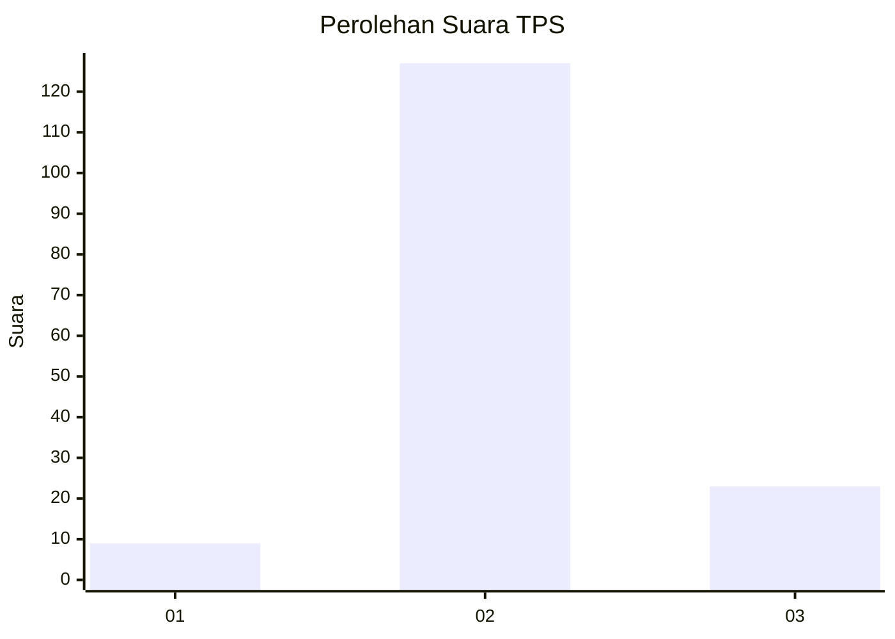

# Hasil

## Grafik

## Tabel

| No. | Nama Paslon    | Suara | Suara (raw) | Persentase |
|:--- |:-------------- | -----:| -----------:| ----------:|
| 1   | ANIES MUHAIMIN | 9     | [9][p-1]    | 5,66       |
| 2   | PRABOWO GIBRAN | 127   | [127][p-2]  | 79,87      |
| 3   | GANJAR MAHFUD  | 23    | [23][p-3]   | 14,47      |

[p-1]: https://github.com/gigit-pemilu/pemilu-2024/blob/main/pilpres/hitung-suara/sub/32-jawa-barat/sub/09-cirebon/sub/05-babakan/sub/2001-cangkuang/sub/007-tps/sub/paslon-1.txt
[p-2]: https://github.com/gigit-pemilu/pemilu-2024/blob/main/pilpres/hitung-suara/sub/32-jawa-barat/sub/09-cirebon/sub/05-babakan/sub/2001-cangkuang/sub/007-tps/sub/paslon-2.txt
[p-3]: https://github.com/gigit-pemilu/pemilu-2024/blob/main/pilpres/hitung-suara/sub/32-jawa-barat/sub/09-cirebon/sub/05-babakan/sub/2001-cangkuang/sub/007-tps/sub/paslon-3.txt

## Foto C Plano

https://sirekap-obj-formc.kpu.go.id/47cb/pemilu/ppwp/32/09/05/20/01/3209052001007-20240214-201533--599920b9-f866-4beb-b24e-2d879fa486eb.jpg

https://sirekap-obj-formc.kpu.go.id/47cb/pemilu/ppwp/32/09/05/20/01/3209052001007-20240214-201854--2ddbeb16-7436-48a7-847b-03ea0bb1c6f0.jpg

https://sirekap-obj-formc.kpu.go.id/47cb/pemilu/ppwp/32/09/05/20/01/3209052001007-20240214-202014--daf12588-41bc-4797-bb91-ab0d06a9baff.jpg

## Metadata

| Key        | Value               |
| ---------- | ------------------- |
| Time Stamp | 2024-02-16 21:01:00 |

