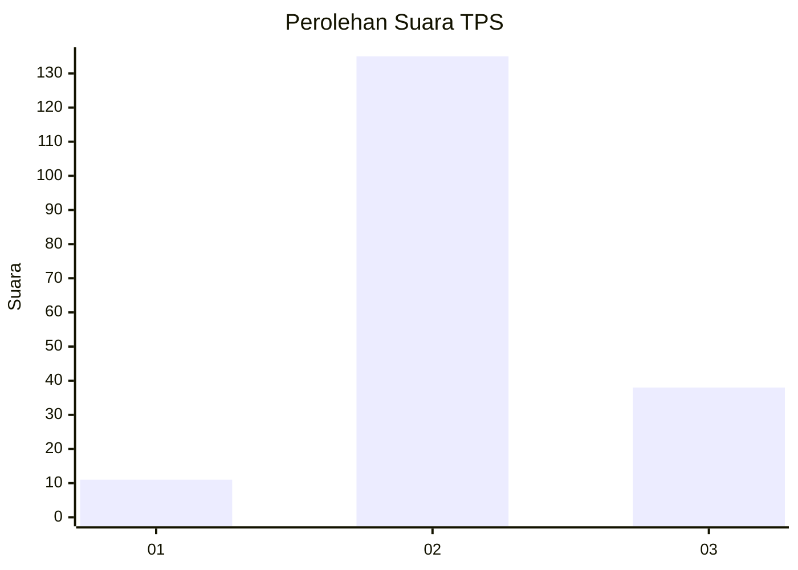

# Hasil

## Grafik

## Tabel

| No. | Nama Paslon    | Suara | Suara (raw) | Persentase |
|:--- |:-------------- | -----:| -----------:| ----------:|
| 1   | ANIES MUHAIMIN | 11    | [11][p-1]   | 5,98       |
| 2   | PRABOWO GIBRAN | 135   | [135][p-2]  | 73,37      |
| 3   | GANJAR MAHFUD  | 38    | [38][p-3]   | 20,65      |

[p-1]: https://github.com/gigit-pemilu/pemilu-2024/blob/main/pilpres/hitung-suara/sub/32-jawa-barat/sub/09-cirebon/sub/05-babakan/sub/2004-gembongan-mekar/sub/012-tps/sub/paslon-1.txt
[p-2]: https://github.com/gigit-pemilu/pemilu-2024/blob/main/pilpres/hitung-suara/sub/32-jawa-barat/sub/09-cirebon/sub/05-babakan/sub/2004-gembongan-mekar/sub/012-tps/sub/paslon-2.txt
[p-3]: https://github.com/gigit-pemilu/pemilu-2024/blob/main/pilpres/hitung-suara/sub/32-jawa-barat/sub/09-cirebon/sub/05-babakan/sub/2004-gembongan-mekar/sub/012-tps/sub/paslon-3.txt

## Foto C Plano

https://sirekap-obj-formc.kpu.go.id/3415/pemilu/ppwp/32/09/05/20/04/3209052004012-20240214-221708--b350fa74-7240-4d62-a2ac-4b5bc80d13d5.jpg

https://sirekap-obj-formc.kpu.go.id/3415/pemilu/ppwp/32/09/05/20/04/3209052004012-20240214-222655--cb9bb36a-0e2a-47d8-974d-780d1539ca02.jpg

https://sirekap-obj-formc.kpu.go.id/3415/pemilu/ppwp/32/09/05/20/04/3209052004012-20240214-222851--02e8eb1d-9703-42a5-b4cd-bd053b6a08f2.jpg

## Metadata

| Key        | Value               |
| ---------- | ------------------- |
| Time Stamp | 2024-02-16 21:01:00 |

