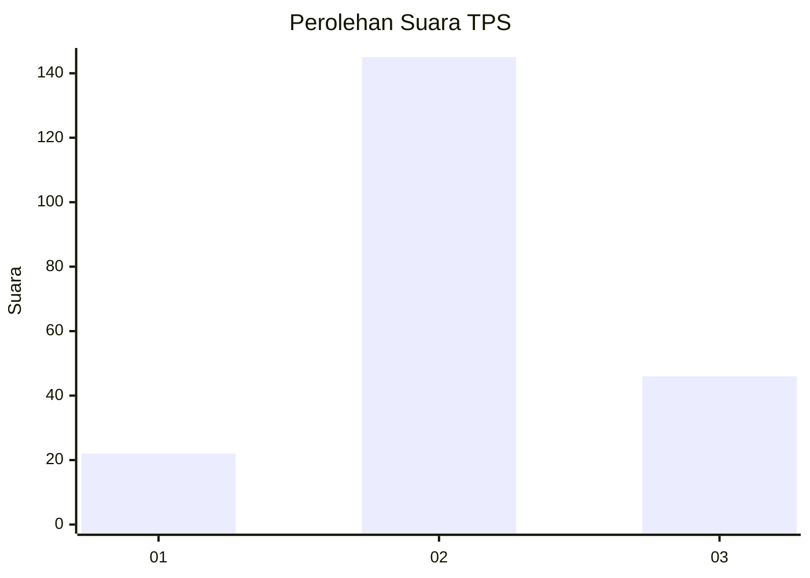
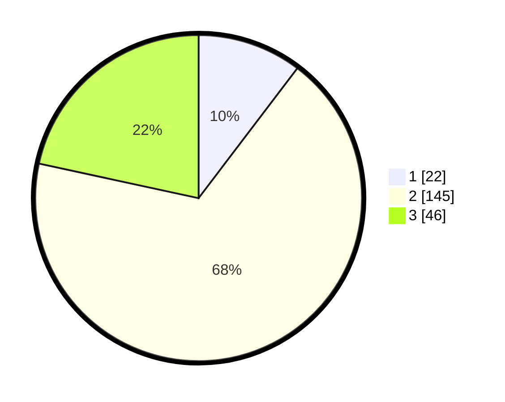

# Hasil

## Grafik

## Tabel

| No. | Nama Paslon    | Suara | Suara (raw) | Persentase |
|:--- |:-------------- | -----:| -----------:| ----------:|
| 1   | ANIES MUHAIMIN | 22    | [22][p-1]   | 10,33      |
| 2   | PRABOWO GIBRAN | 145   | [145][p-2]  | 68,08      |
| 3   | GANJAR MAHFUD  | 46    | [46][p-3]   | 21,60      |

[p-1]: https://github.com/gigit-pemilu/pemilu-2024/blob/main/pilpres/hitung-suara/sub/32-jawa-barat/sub/09-cirebon/sub/05-babakan/sub/2013-pakusamben/sub/004-tps/sub/paslon-1.txt
[p-2]: https://github.com/gigit-pemilu/pemilu-2024/blob/main/pilpres/hitung-suara/sub/32-jawa-barat/sub/09-cirebon/sub/05-babakan/sub/2013-pakusamben/sub/004-tps/sub/paslon-2.txt
[p-3]: https://github.com/gigit-pemilu/pemilu-2024/blob/main/pilpres/hitung-suara/sub/32-jawa-barat/sub/09-cirebon/sub/05-babakan/sub/2013-pakusamben/sub/004-tps/sub/paslon-3.txt

## Foto C Plano

https://sirekap-obj-formc.kpu.go.id/0a5f/pemilu/ppwp/32/09/05/20/13/3209052013004-20240215-010558--8e66e324-f9ff-4149-af25-0f4d0ff056c6.jpg

https://sirekap-obj-formc.kpu.go.id/0a5f/pemilu/ppwp/32/09/05/20/13/3209052013004-20240215-005722--ec9cb23e-916b-4146-9a9f-62d6b2f2889c.jpg

https://sirekap-obj-formc.kpu.go.id/0a5f/pemilu/ppwp/32/09/05/20/13/3209052013004-20240215-011813--4b345af1-638d-485c-8f3b-ff1fa7d42dab.jpg

## Metadata

| Key        | Value               |
| ---------- | ------------------- |
| Time Stamp | 2024-02-16 21:01:00 |

