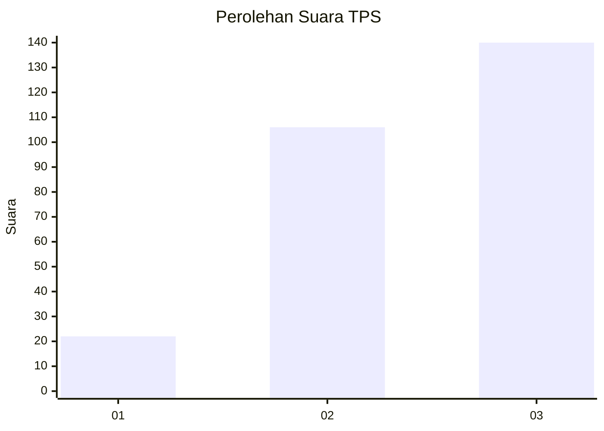
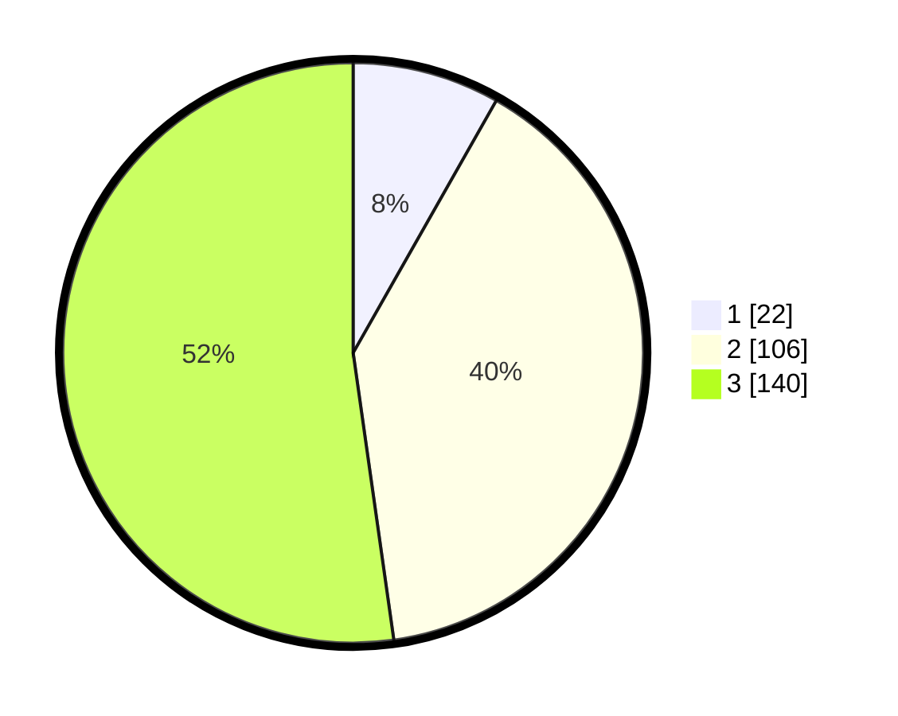

# Hasil

## Grafik

## Tabel

| No. | Nama Paslon    | Suara | Suara (raw) | Persentase |
|:--- |:-------------- | -----:| -----------:| ----------:|
| 1   | ANIES MUHAIMIN | 22    | [22][p-1]   | 8,21       |
| 2   | PRABOWO GIBRAN | 106   | [106][p-2]  | 39,55      |
| 3   | GANJAR MAHFUD  | 140   | [140][p-3]  | 52,24      |

[p-1]: https://github.com/gigit-pemilu/pemilu-2024-32-jawa-barat/blob/main/pilpres/hitung-suara/sub/32-jawa-barat/sub/09-cirebon/sub/05-babakan/sub/2014-karangwangun/sub/003-tps/sub/paslon-1.txt
[p-2]: https://github.com/gigit-pemilu/pemilu-2024-32-jawa-barat/blob/main/pilpres/hitung-suara/sub/32-jawa-barat/sub/09-cirebon/sub/05-babakan/sub/2014-karangwangun/sub/003-tps/sub/paslon-2.txt
[p-3]: https://github.com/gigit-pemilu/pemilu-2024-32-jawa-barat/blob/main/pilpres/hitung-suara/sub/32-jawa-barat/sub/09-cirebon/sub/05-babakan/sub/2014-karangwangun/sub/003-tps/sub/paslon-3.txt

## Foto C Plano

https://sirekap-obj-formc.kpu.go.id/2de5/pemilu/ppwp/32/09/05/20/14/3209052014003-20240215-034303--6d290d57-68b4-4559-93fb-82dbf4b5c6c3.jpg

https://sirekap-obj-formc.kpu.go.id/2de5/pemilu/ppwp/32/09/05/20/14/3209052014003-20240215-034312--0f4915f8-be3b-46ae-a9a1-2e6873006812.jpg

https://sirekap-obj-formc.kpu.go.id/2de5/pemilu/ppwp/32/09/05/20/14/3209052014003-20240215-034320--3f2093cb-7536-40fd-9f96-9456f0c8d1aa.jpg

## Metadata

| Key        | Value               |
| ---------- | ------------------- |
| Time Stamp | 2024-02-16 21:01:00 |

