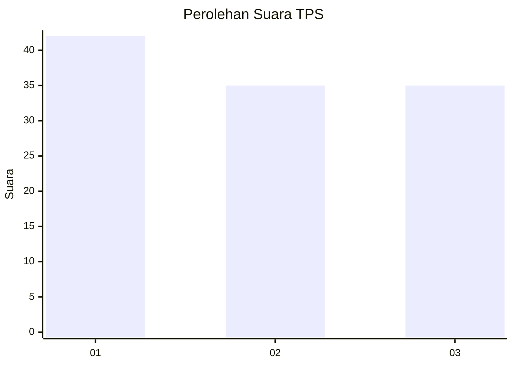
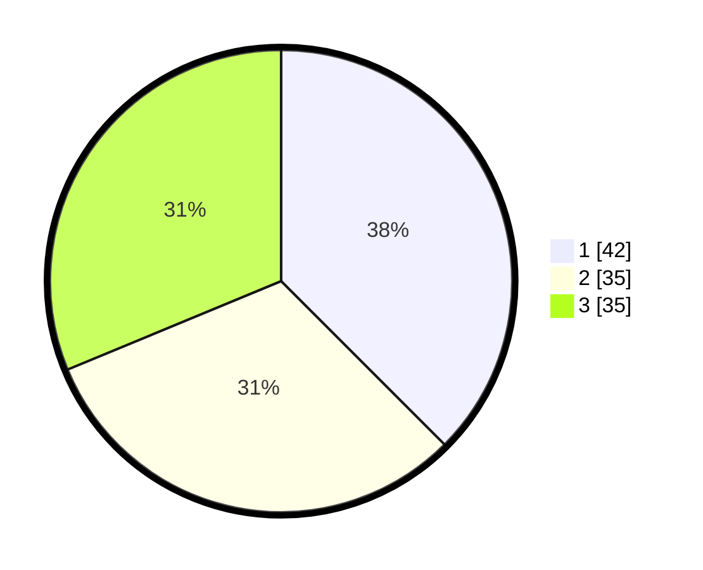

# Hasil

## Grafik

## Tabel

| No. | Nama Paslon    | Suara | Suara (raw) | Persentase |
|:--- |:-------------- | -----:| -----------:| ----------:|
| 1   | ANIES MUHAIMIN | 42    | [42][p-1]   | 37,50      |
| 2   | PRABOWO GIBRAN | 35    | [35][p-2]   | 31,25      |
| 3   | GANJAR MAHFUD  | 35    | [35][p-3]   | 31,25      |

[p-1]: https://github.com/gigit-pemilu/pemilu-2024-32-jawa-barat/blob/main/pilpres/hitung-suara/sub/32-jawa-barat/sub/09-cirebon/sub/06-karangsembung/sub/2017-karangsembung/sub/008-tps/sub/paslon-1.txt
[p-2]: https://github.com/gigit-pemilu/pemilu-2024-32-jawa-barat/blob/main/pilpres/hitung-suara/sub/32-jawa-barat/sub/09-cirebon/sub/06-karangsembung/sub/2017-karangsembung/sub/008-tps/sub/paslon-2.txt
[p-3]: https://github.com/gigit-pemilu/pemilu-2024-32-jawa-barat/blob/main/pilpres/hitung-suara/sub/32-jawa-barat/sub/09-cirebon/sub/06-karangsembung/sub/2017-karangsembung/sub/008-tps/sub/paslon-3.txt

## Foto C Plano

https://sirekap-obj-formc.kpu.go.id/f20c/pemilu/ppwp/32/09/06/20/17/3209062017008-20240219-141742--93d5ff75-7f4d-4087-a7be-013f10ac63c6.jpg

https://sirekap-obj-formc.kpu.go.id/f20c/pemilu/ppwp/32/09/06/20/17/3209062017008-20240219-142315--e4c1323f-b195-4a4a-bc7c-9d1b14262261.jpg

https://sirekap-obj-formc.kpu.go.id/f20c/pemilu/ppwp/32/09/06/20/17/3209062017008-20240219-142826--e5639e82-0439-460e-95d9-578d3ef58556.jpg

## Metadata

| Key        | Value               |
| ---------- | ------------------- |
| Time Stamp | 2024-02-19 15:00:00 |

