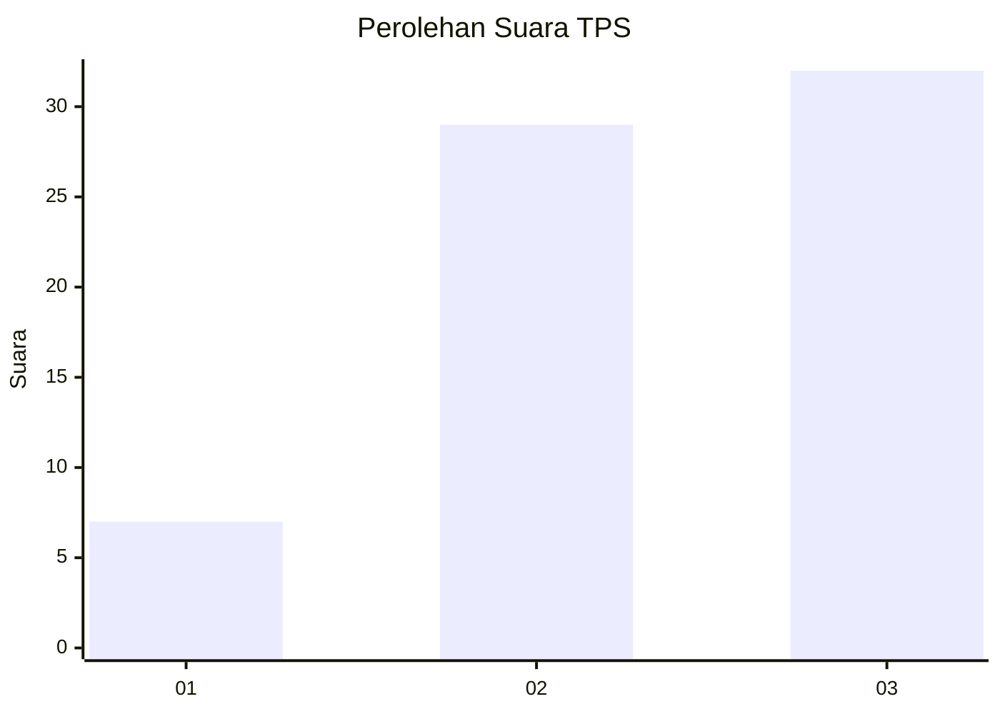
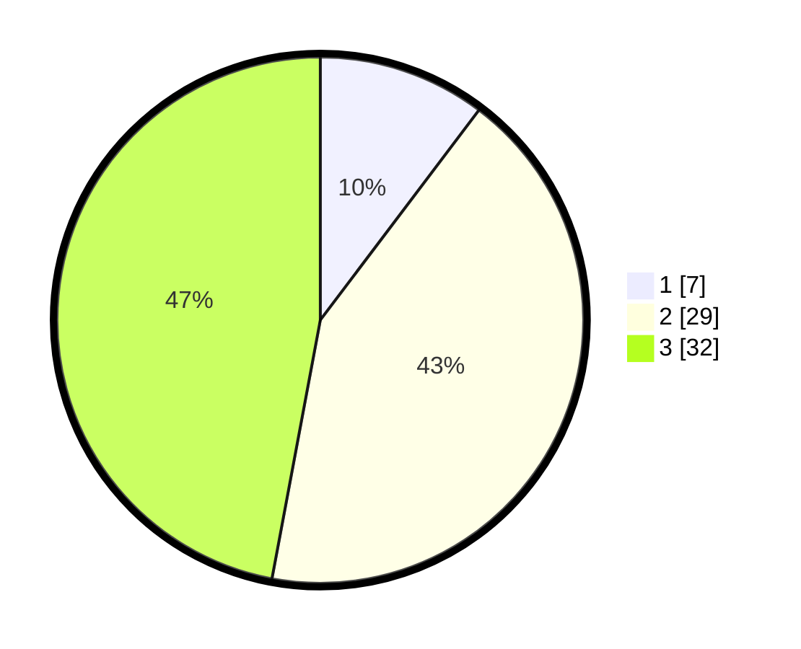

# Hasil

## Grafik

## Tabel

| No. | Nama Paslon    | Suara | Suara (raw) | Persentase |
|:--- |:-------------- | -----:| -----------:| ----------:|
| 1   | ANIES MUHAIMIN | 7     | [7][p-1]    | 10,29      |
| 2   | PRABOWO GIBRAN | 29    | [29][p-2]   | 42,65      |
| 3   | GANJAR MAHFUD  | 32    | [32][p-3]   | 47,06      |

[p-1]: https://github.com/gigit-pemilu/pemilu-2024/blob/main/pilpres/hitung-suara/sub/32-jawa-barat/sub/09-cirebon/sub/08-susukan-lebak/sub/2013-kaligawe/sub/011-tps/sub/paslon-1.txt
[p-2]: https://github.com/gigit-pemilu/pemilu-2024/blob/main/pilpres/hitung-suara/sub/32-jawa-barat/sub/09-cirebon/sub/08-susukan-lebak/sub/2013-kaligawe/sub/011-tps/sub/paslon-2.txt
[p-3]: https://github.com/gigit-pemilu/pemilu-2024/blob/main/pilpres/hitung-suara/sub/32-jawa-barat/sub/09-cirebon/sub/08-susukan-lebak/sub/2013-kaligawe/sub/011-tps/sub/paslon-3.txt

## Foto C Plano

https://sirekap-obj-formc.kpu.go.id/1938/pemilu/ppwp/32/09/08/20/13/3209082013011-20240215-175326--59338f7e-d15d-49a8-95e6-7cd0531c28c0.jpg

https://sirekap-obj-formc.kpu.go.id/1938/pemilu/ppwp/32/09/08/20/13/3209082013011-20240215-003809--8a1c9fad-1669-4fed-85fe-67a4df12bde7.jpg

https://sirekap-obj-formc.kpu.go.id/1938/pemilu/ppwp/32/09/08/20/13/3209082013011-20240215-175358--6cac9606-fb7d-4b29-b55b-e443d7b6c1fc.jpg

## Metadata

| Key        | Value               |
| ---------- | ------------------- |
| Time Stamp | 2024-02-24 22:31:28 |

