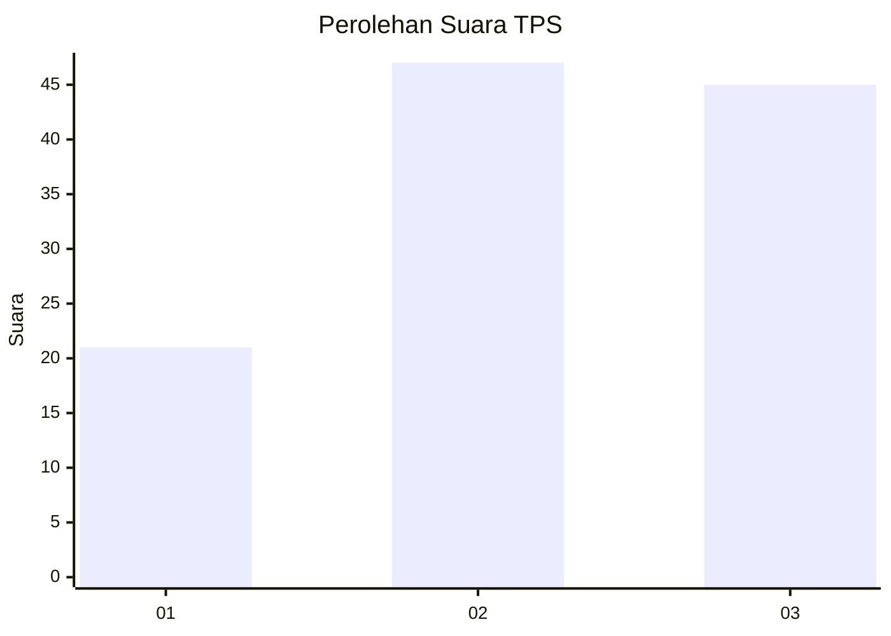
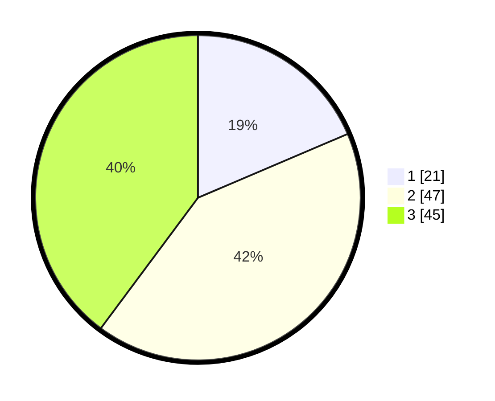

# Hasil

## Grafik

## Tabel

| No. | Nama Paslon    | Suara | Suara (raw) | Persentase |
|:--- |:-------------- | -----:| -----------:| ----------:|
| 1   | ANIES MUHAIMIN | 21    | [21][p-1]   | 18,58      |
| 2   | PRABOWO GIBRAN | 47    | [47][p-2]   | 41,59      |
| 3   | GANJAR MAHFUD  | 45    | [45][p-3]   | 39,82      |

[p-1]: https://github.com/gigit-pemilu/pemilu-2024/blob/main/pilpres/hitung-suara/sub/32-jawa-barat/sub/09-cirebon/sub/09-sedong/sub/2001-karangwuni/sub/013-tps/sub/paslon-1.txt
[p-2]: https://github.com/gigit-pemilu/pemilu-2024/blob/main/pilpres/hitung-suara/sub/32-jawa-barat/sub/09-cirebon/sub/09-sedong/sub/2001-karangwuni/sub/013-tps/sub/paslon-2.txt
[p-3]: https://github.com/gigit-pemilu/pemilu-2024/blob/main/pilpres/hitung-suara/sub/32-jawa-barat/sub/09-cirebon/sub/09-sedong/sub/2001-karangwuni/sub/013-tps/sub/paslon-3.txt

## Foto C Plano

https://sirekap-obj-formc.kpu.go.id/b50a/pemilu/ppwp/32/09/09/20/01/3209092001013-20240218-213858--40712ef2-5d78-40b4-904b-3172da40c456.jpg

https://sirekap-obj-formc.kpu.go.id/b50a/pemilu/ppwp/32/09/09/20/01/3209092001013-20240218-214253--74d9f7d7-8e29-458e-8a80-1bfa2eb0040c.jpg

https://sirekap-obj-formc.kpu.go.id/b50a/pemilu/ppwp/32/09/09/20/01/3209092001013-20240218-214351--add5eadf-18ef-435a-b9cc-a6de7d77ef9a.jpg

## Metadata

| Key        | Value               |
| ---------- | ------------------- |
| Time Stamp | 2024-02-19 12:00:00 |

