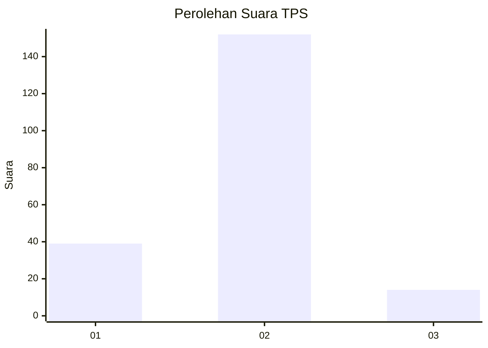
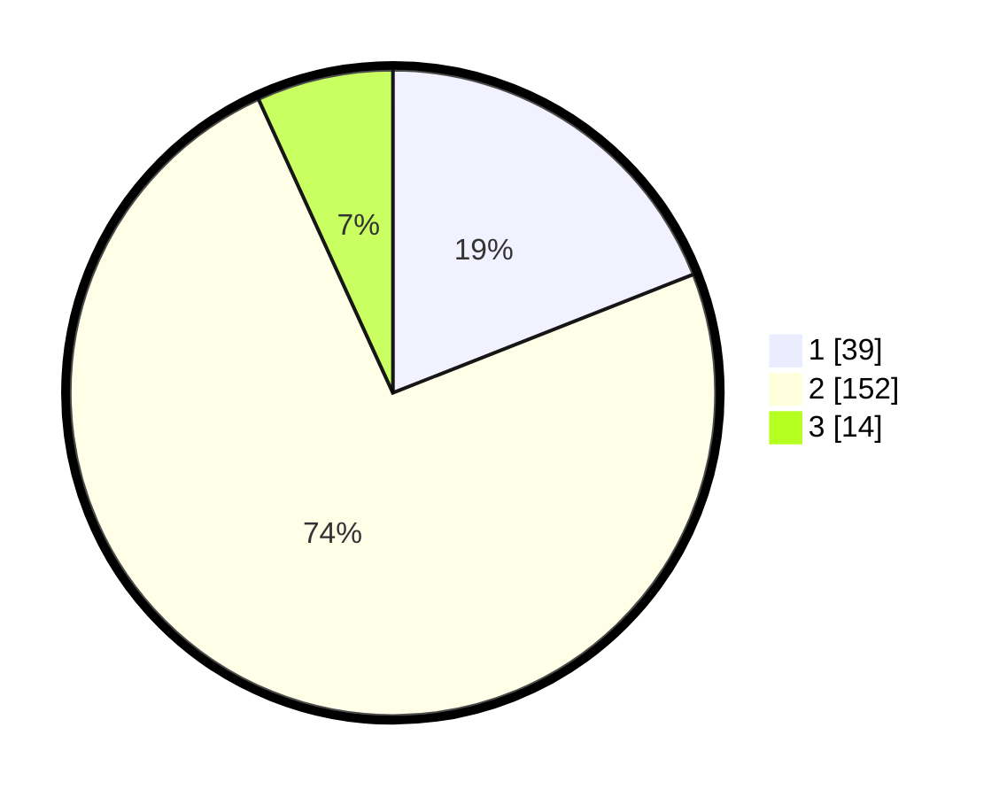

# Hasil

## Grafik

## Tabel

| No. | Nama Paslon    | Suara | Suara (raw) | Persentase |
|:--- |:-------------- | -----:| -----------:| ----------:|
| 1   | ANIES MUHAIMIN | 39    | [39][p-1]   | 19,02      |
| 2   | PRABOWO GIBRAN | 152   | [152][p-2]  | 74,15      |
| 3   | GANJAR MAHFUD  | 14    | [14][p-3]   | 6,83       |

[p-1]: https://github.com/gigit-pemilu/pemilu-2024/blob/main/pilpres/hitung-suara/sub/32-jawa-barat/sub/09-cirebon/sub/10-astanajapura/sub/2004-munjul/sub/001-tps/sub/paslon-1.txt
[p-2]: https://github.com/gigit-pemilu/pemilu-2024/blob/main/pilpres/hitung-suara/sub/32-jawa-barat/sub/09-cirebon/sub/10-astanajapura/sub/2004-munjul/sub/001-tps/sub/paslon-2.txt
[p-3]: https://github.com/gigit-pemilu/pemilu-2024/blob/main/pilpres/hitung-suara/sub/32-jawa-barat/sub/09-cirebon/sub/10-astanajapura/sub/2004-munjul/sub/001-tps/sub/paslon-3.txt

## Foto C Plano

https://sirekap-obj-formc.kpu.go.id/0c83/pemilu/ppwp/32/09/10/20/04/3209102004001-20240215-023214--4c37fdf1-b1a6-4146-b26f-b33c20d6ff36.jpg

https://sirekap-obj-formc.kpu.go.id/0c83/pemilu/ppwp/32/09/10/20/04/3209102004001-20240215-023730--5c77b7f3-a85a-48b0-b2ff-d877a24bc5e9.jpg

https://sirekap-obj-formc.kpu.go.id/0c83/pemilu/ppwp/32/09/10/20/04/3209102004001-20240215-023938--544bf28c-b62c-487d-af31-a57e041bffb0.jpg

## Metadata

| Key        | Value               |
| ---------- | ------------------- |
| Time Stamp | 2024-02-16 12:51:22 |

