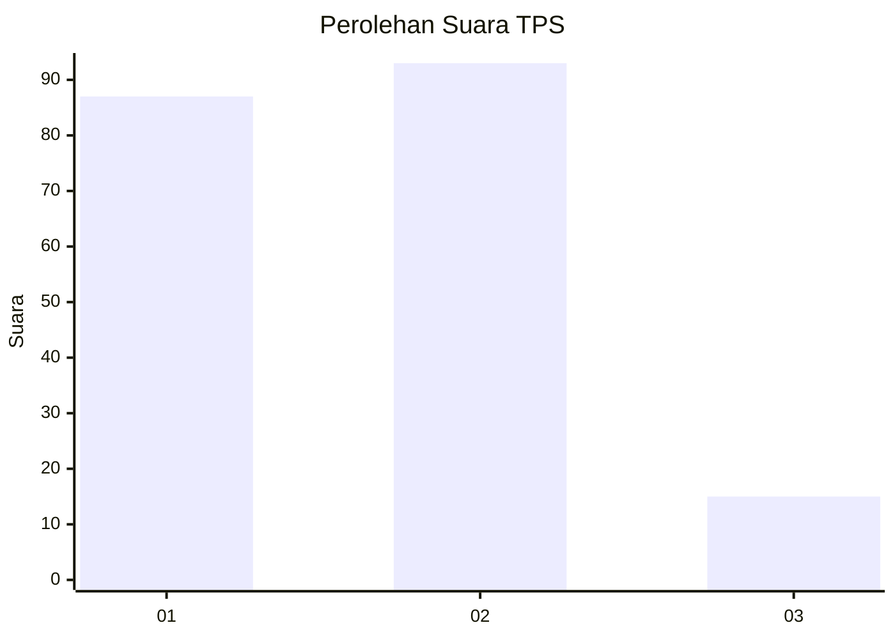
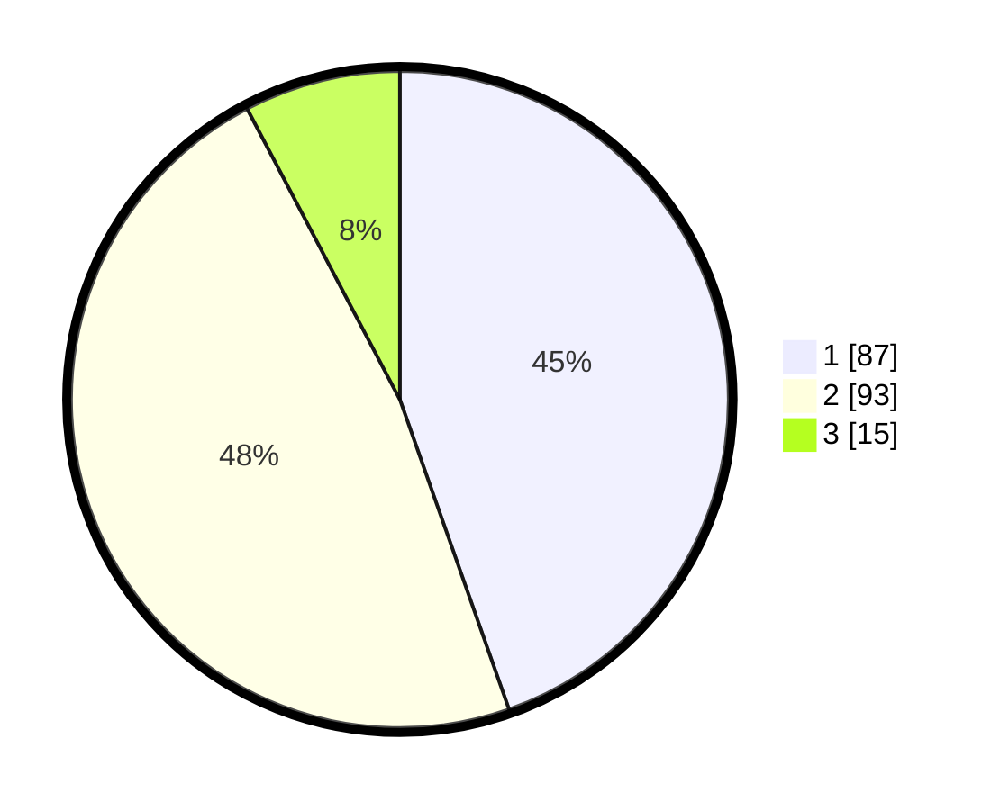

# Hasil

## Grafik

## Tabel

| No. | Nama Paslon    | Suara | Suara (raw) | Persentase |
|:--- |:-------------- | -----:| -----------:| ----------:|
| 1   | ANIES MUHAIMIN | 87    | [87][p-1]   | 44,62      |
| 2   | PRABOWO GIBRAN | 93    | [93][p-2]   | 47,69      |
| 3   | GANJAR MAHFUD  | 15    | [15][p-3]   | 7,69       |

[p-1]: https://github.com/gigit-pemilu/pemilu-2024/blob/main/pilpres/hitung-suara/sub/32-jawa-barat/sub/09-cirebon/sub/10-astanajapura/sub/2004-munjul/sub/004-tps/sub/paslon-1.txt
[p-2]: https://github.com/gigit-pemilu/pemilu-2024/blob/main/pilpres/hitung-suara/sub/32-jawa-barat/sub/09-cirebon/sub/10-astanajapura/sub/2004-munjul/sub/004-tps/sub/paslon-2.txt
[p-3]: https://github.com/gigit-pemilu/pemilu-2024/blob/main/pilpres/hitung-suara/sub/32-jawa-barat/sub/09-cirebon/sub/10-astanajapura/sub/2004-munjul/sub/004-tps/sub/paslon-3.txt

## Foto C Plano

https://sirekap-obj-formc.kpu.go.id/4f94/pemilu/ppwp/32/09/10/20/04/3209102004004-20240215-070844--703b636f-9924-4faf-b787-5c4200d96e07.jpg

https://sirekap-obj-formc.kpu.go.id/4f94/pemilu/ppwp/32/09/10/20/04/3209102004004-20240215-071056--d259606c-2292-4979-8bd5-8b5af90e7974.jpg

https://sirekap-obj-formc.kpu.go.id/4f94/pemilu/ppwp/32/09/10/20/04/3209102004004-20240215-071250--83fd9873-1618-4770-a15e-f42edcdf91a7.jpg

## Metadata

| Key        | Value               |
| ---------- | ------------------- |
| Time Stamp | 2024-02-16 12:51:22 |

