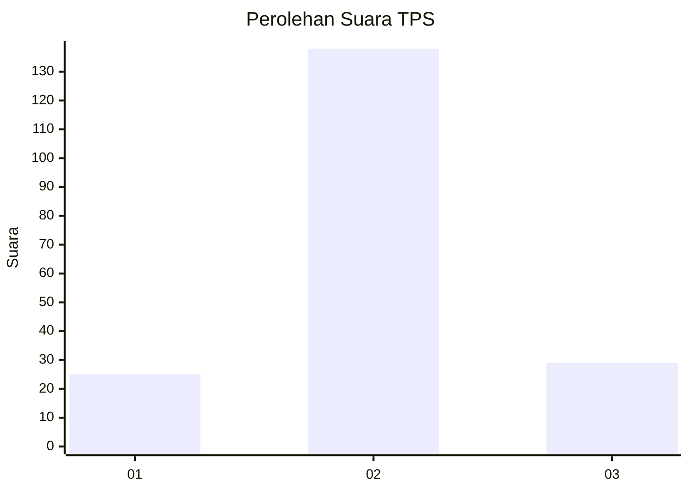

# Hasil

## Grafik

## Tabel

| No. | Nama Paslon    | Suara | Suara (raw) | Persentase |
|:--- |:-------------- | -----:| -----------:| ----------:|
| 1   | ANIES MUHAIMIN | 25    | [25][p-1]   | 13,02      |
| 2   | PRABOWO GIBRAN | 138   | [138][p-2]  | 71,88      |
| 3   | GANJAR MAHFUD  | 29    | [29][p-3]   | 15,10      |

[p-1]: https://github.com/gigit-pemilu/pemilu-2024-32-jawa-barat/blob/main/pilpres/hitung-suara/sub/32-jawa-barat/sub/09-cirebon/sub/10-astanajapura/sub/2004-munjul/sub/006-tps/sub/paslon-1.txt
[p-2]: https://github.com/gigit-pemilu/pemilu-2024-32-jawa-barat/blob/main/pilpres/hitung-suara/sub/32-jawa-barat/sub/09-cirebon/sub/10-astanajapura/sub/2004-munjul/sub/006-tps/sub/paslon-2.txt
[p-3]: https://github.com/gigit-pemilu/pemilu-2024-32-jawa-barat/blob/main/pilpres/hitung-suara/sub/32-jawa-barat/sub/09-cirebon/sub/10-astanajapura/sub/2004-munjul/sub/006-tps/sub/paslon-3.txt

## Foto C Plano

https://sirekap-obj-formc.kpu.go.id/606a/pemilu/ppwp/32/09/10/20/04/3209102004006-20240214-194509--eb29b298-db22-4392-a5fd-7b1141bd5550.jpg

https://sirekap-obj-formc.kpu.go.id/606a/pemilu/ppwp/32/09/10/20/04/3209102004006-20240214-195626--aa1c0e4c-2884-4ad4-a846-4e5914b7cb72.jpg

https://sirekap-obj-formc.kpu.go.id/606a/pemilu/ppwp/32/09/10/20/04/3209102004006-20240214-221324--12b056e7-2cee-468d-9226-87f59db7683f.jpg

## Metadata

| Key        | Value               |
| ---------- | ------------------- |
| Time Stamp | 2024-02-15 15:00:29 |

