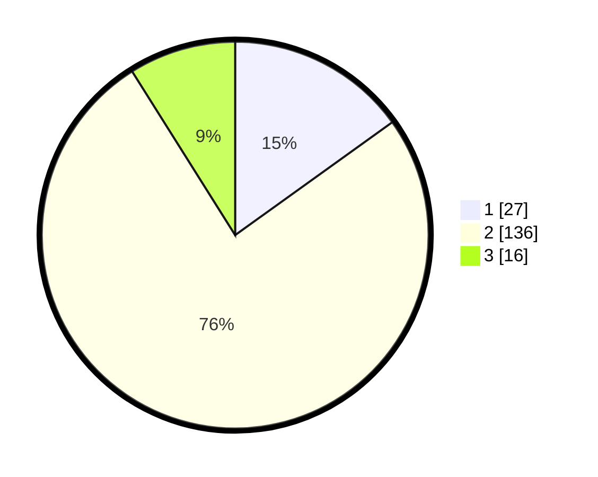

# Hasil

## Grafik

## Tabel

| No. | Nama Paslon    | Suara | Suara (raw) | Persentase |
|:--- |:-------------- | -----:| -----------:| ----------:|
| 1   | ANIES MUHAIMIN | 27    | [27][p-1]   | 15,08      |
| 2   | PRABOWO GIBRAN | 136   | [136][p-2]  | 75,98      |
| 3   | GANJAR MAHFUD  | 16    | [16][p-3]   | 8,94       |

[p-1]: https://github.com/gigit-pemilu/pemilu-2024/blob/main/pilpres/hitung-suara/sub/32-jawa-barat/sub/09-cirebon/sub/10-astanajapura/sub/2004-munjul/sub/007-tps/sub/paslon-1.txt
[p-2]: https://github.com/gigit-pemilu/pemilu-2024/blob/main/pilpres/hitung-suara/sub/32-jawa-barat/sub/09-cirebon/sub/10-astanajapura/sub/2004-munjul/sub/007-tps/sub/paslon-2.txt
[p-3]: https://github.com/gigit-pemilu/pemilu-2024/blob/main/pilpres/hitung-suara/sub/32-jawa-barat/sub/09-cirebon/sub/10-astanajapura/sub/2004-munjul/sub/007-tps/sub/paslon-3.txt

## Foto C Plano

https://sirekap-obj-formc.kpu.go.id/f972/pemilu/ppwp/32/09/10/20/04/3209102004007-20240214-195014--1a17ca09-db6b-4f53-b62a-c46455d44b6e.jpg

https://sirekap-obj-formc.kpu.go.id/f972/pemilu/ppwp/32/09/10/20/04/3209102004007-20240214-195049--8c33435f-1e23-487c-8e98-79a6a6105d1c.jpg

https://sirekap-obj-formc.kpu.go.id/f972/pemilu/ppwp/32/09/10/20/04/3209102004007-20240214-195119--485a3949-1faa-4e70-997a-d1152f5a9b2d.jpg

## Metadata

| Key        | Value               |
| ---------- | ------------------- |
| Time Stamp | 2024-02-16 13:00:29 |

