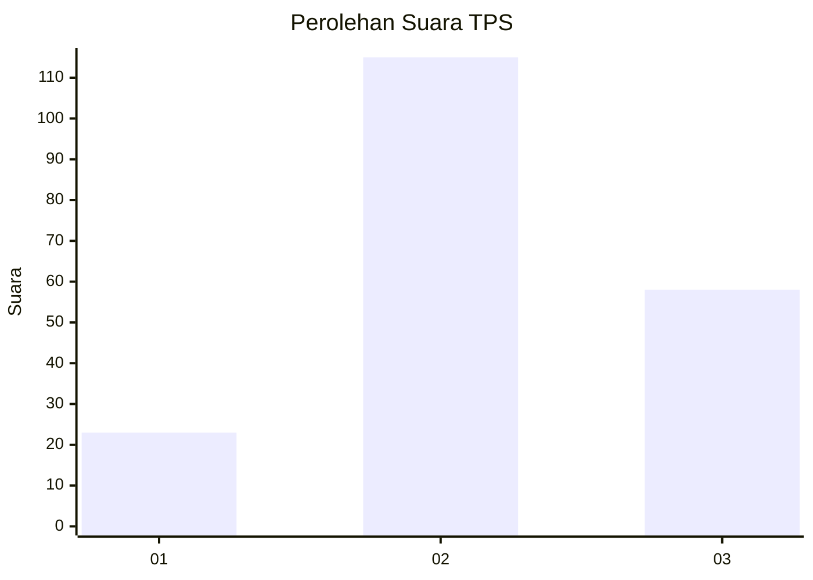
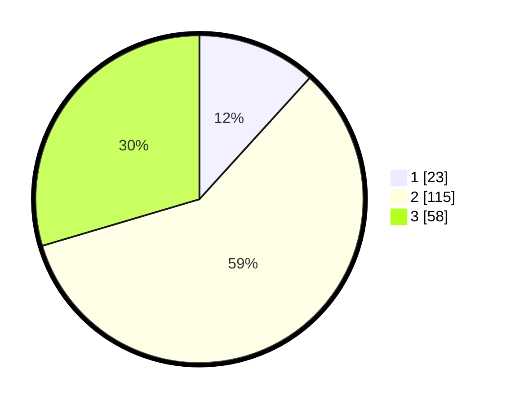

# Hasil

## Grafik

## Tabel

| No. | Nama Paslon    | Suara | Suara (raw) | Persentase |
|:--- |:-------------- | -----:| -----------:| ----------:|
| 1   | ANIES MUHAIMIN | 23    | [23][p-1]   | 11,73      |
| 2   | PRABOWO GIBRAN | 115   | [115][p-2]  | 58,67      |
| 3   | GANJAR MAHFUD  | 58    | [58][p-3]   | 29,59      |

[p-1]: https://github.com/gigit-pemilu/pemilu-2024/blob/main/pilpres/hitung-suara/sub/32-jawa-barat/sub/09-cirebon/sub/11-pangenan/sub/2001-getrakmoyan/sub/006-tps/sub/paslon-1.txt
[p-2]: https://github.com/gigit-pemilu/pemilu-2024/blob/main/pilpres/hitung-suara/sub/32-jawa-barat/sub/09-cirebon/sub/11-pangenan/sub/2001-getrakmoyan/sub/006-tps/sub/paslon-2.txt
[p-3]: https://github.com/gigit-pemilu/pemilu-2024/blob/main/pilpres/hitung-suara/sub/32-jawa-barat/sub/09-cirebon/sub/11-pangenan/sub/2001-getrakmoyan/sub/006-tps/sub/paslon-3.txt

## Foto C Plano

https://sirekap-obj-formc.kpu.go.id/cc72/pemilu/ppwp/32/09/11/20/01/3209112001006-20240215-010529--2c73ff8b-01b5-45b5-a226-7d7ee7abab60.jpg

https://sirekap-obj-formc.kpu.go.id/cc72/pemilu/ppwp/32/09/11/20/01/3209112001006-20240215-010653--446a89c6-0441-4485-99a5-0020447c37df.jpg

https://sirekap-obj-formc.kpu.go.id/cc72/pemilu/ppwp/32/09/11/20/01/3209112001006-20240215-010800--da62c217-a500-4d90-b15e-46d68590e7a2.jpg

## Metadata

| Key        | Value               |
| ---------- | ------------------- |
| Time Stamp | 2024-02-25 14:00:00 |

