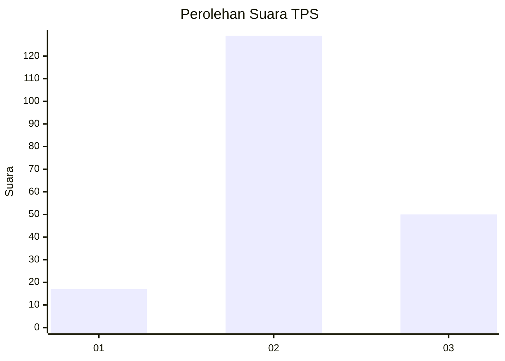
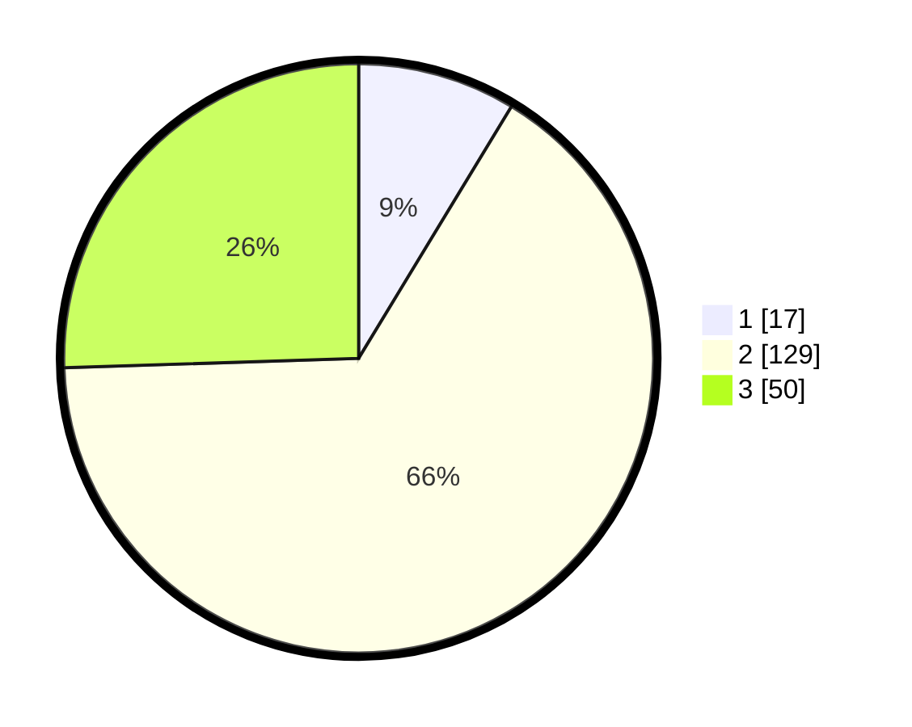

# Hasil

## Grafik

## Tabel

| No. | Nama Paslon    | Suara | Suara (raw) | Persentase |
|:--- |:-------------- | -----:| -----------:| ----------:|
| 1   | ANIES MUHAIMIN | 17    | [17][p-1]   | 8,67       |
| 2   | PRABOWO GIBRAN | 129   | [129][p-2]  | 65,82      |
| 3   | GANJAR MAHFUD  | 50    | [50][p-3]   | 25,51      |

[p-1]: https://github.com/gigit-pemilu/pemilu-2024/blob/main/pilpres/hitung-suara/sub/32-jawa-barat/sub/09-cirebon/sub/11-pangenan/sub/2001-getrakmoyan/sub/016-tps/sub/paslon-1.txt
[p-2]: https://github.com/gigit-pemilu/pemilu-2024/blob/main/pilpres/hitung-suara/sub/32-jawa-barat/sub/09-cirebon/sub/11-pangenan/sub/2001-getrakmoyan/sub/016-tps/sub/paslon-2.txt
[p-3]: https://github.com/gigit-pemilu/pemilu-2024/blob/main/pilpres/hitung-suara/sub/32-jawa-barat/sub/09-cirebon/sub/11-pangenan/sub/2001-getrakmoyan/sub/016-tps/sub/paslon-3.txt

## Foto C Plano

https://sirekap-obj-formc.kpu.go.id/6ffb/pemilu/ppwp/32/09/11/20/01/3209112001016-20240214-232541--b8b4f634-e4af-4b0f-b375-b601833b6f4e.jpg

https://sirekap-obj-formc.kpu.go.id/6ffb/pemilu/ppwp/32/09/11/20/01/3209112001016-20240214-232723--530d2740-45b6-4574-9d7e-d805c317fa15.jpg

https://sirekap-obj-formc.kpu.go.id/6ffb/pemilu/ppwp/32/09/11/20/01/3209112001016-20240214-232831--8f454364-a8bd-47e2-9b33-ec4791bbe3c7.jpg

## Metadata

| Key        | Value               |
| ---------- | ------------------- |
| Time Stamp | 2024-02-25 12:00:00 |

