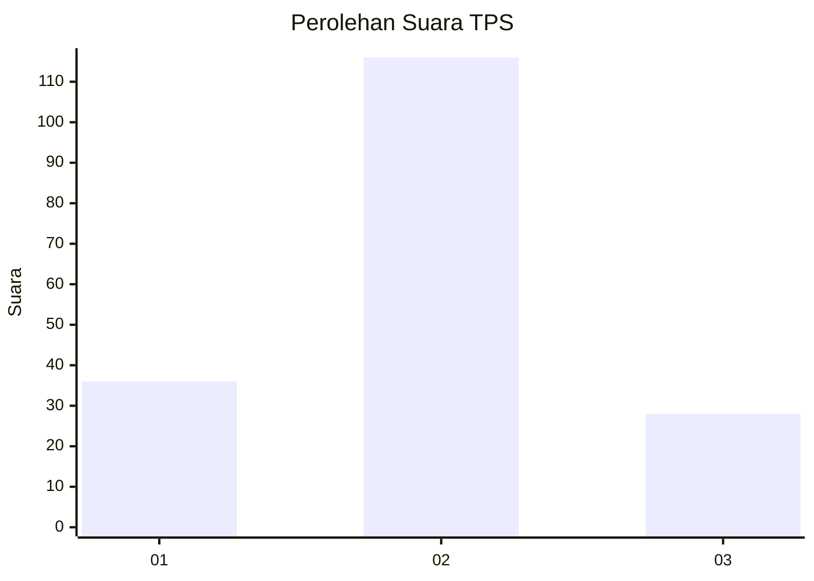
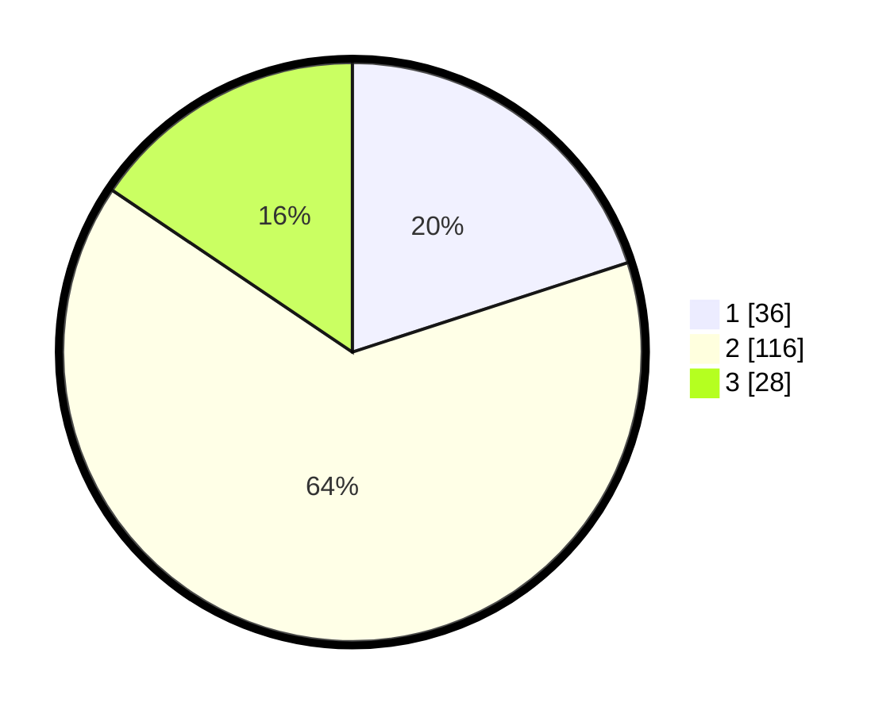

# Hasil

## Grafik

## Tabel

| No. | Nama Paslon    | Suara | Suara (raw) | Persentase |
|:--- |:-------------- | -----:| -----------:| ----------:|
| 1   | ANIES MUHAIMIN | 36    | [36][p-1]   | 20,00      |
| 2   | PRABOWO GIBRAN | 116   | [116][p-2]  | 64,44      |
| 3   | GANJAR MAHFUD  | 28    | [28][p-3]   | 15,56      |

[p-1]: https://github.com/gigit-pemilu/pemilu-2024/blob/main/pilpres/hitung-suara/sub/32-jawa-barat/sub/09-cirebon/sub/11-pangenan/sub/2002-ender/sub/014-tps/sub/paslon-1.txt
[p-2]: https://github.com/gigit-pemilu/pemilu-2024/blob/main/pilpres/hitung-suara/sub/32-jawa-barat/sub/09-cirebon/sub/11-pangenan/sub/2002-ender/sub/014-tps/sub/paslon-2.txt
[p-3]: https://github.com/gigit-pemilu/pemilu-2024/blob/main/pilpres/hitung-suara/sub/32-jawa-barat/sub/09-cirebon/sub/11-pangenan/sub/2002-ender/sub/014-tps/sub/paslon-3.txt

## Foto C Plano

https://sirekap-obj-formc.kpu.go.id/7a8e/pemilu/ppwp/32/09/11/20/02/3209112002014-20240216-001730--4bfb84fc-6a6c-4e83-ad49-d79c835f48bb.jpg

https://sirekap-obj-formc.kpu.go.id/7a8e/pemilu/ppwp/32/09/11/20/02/3209112002014-20240216-001848--38d81da3-2fb4-4bd7-a431-00d1db88a4c7.jpg

https://sirekap-obj-formc.kpu.go.id/7a8e/pemilu/ppwp/32/09/11/20/02/3209112002014-20240216-002050--d30b5c3e-f9f8-447b-bc5f-c409748f9920.jpg

## Metadata

| Key        | Value               |
| ---------- | ------------------- |
| Time Stamp | 2024-02-24 22:31:28 |

