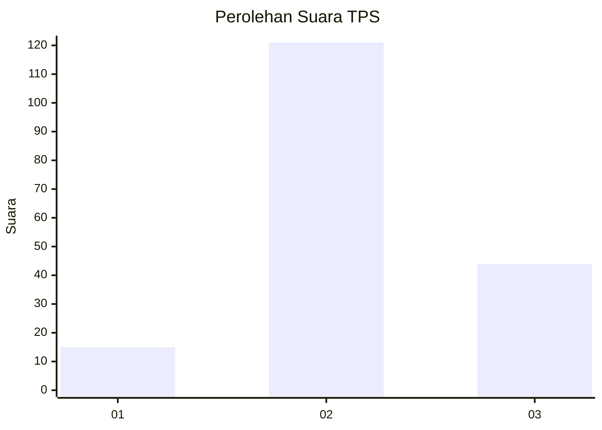
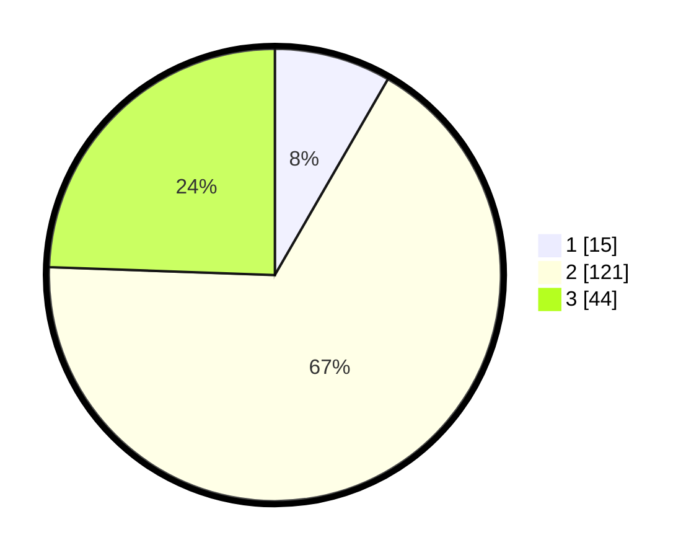

# Hasil

## Grafik

## Tabel

| No. | Nama Paslon    | Suara | Suara (raw) | Persentase |
|:--- |:-------------- | -----:| -----------:| ----------:|
| 1   | ANIES MUHAIMIN | 15    | [15][p-1]   | 8,33       |
| 2   | PRABOWO GIBRAN | 121   | [121][p-2]  | 67,22      |
| 3   | GANJAR MAHFUD  | 44    | [44][p-3]   | 24,44      |

[p-1]: https://github.com/gigit-pemilu/pemilu-2024/blob/main/pilpres/hitung-suara/sub/32-jawa-barat/sub/09-cirebon/sub/12-mundu/sub/2008-mundu-pesisir/sub/006-tps/sub/paslon-1.txt
[p-2]: https://github.com/gigit-pemilu/pemilu-2024/blob/main/pilpres/hitung-suara/sub/32-jawa-barat/sub/09-cirebon/sub/12-mundu/sub/2008-mundu-pesisir/sub/006-tps/sub/paslon-2.txt
[p-3]: https://github.com/gigit-pemilu/pemilu-2024/blob/main/pilpres/hitung-suara/sub/32-jawa-barat/sub/09-cirebon/sub/12-mundu/sub/2008-mundu-pesisir/sub/006-tps/sub/paslon-3.txt

## Foto C Plano

https://sirekap-obj-formc.kpu.go.id/4764/pemilu/ppwp/32/09/12/20/08/3209122008006-20240215-031341--7ebae1d8-61b4-40a9-aba4-0263f402370a.jpg

https://sirekap-obj-formc.kpu.go.id/4764/pemilu/ppwp/32/09/12/20/08/3209122008006-20240215-025452--c1ae6b6e-9484-4222-a52f-dc376df40866.jpg

https://sirekap-obj-formc.kpu.go.id/4764/pemilu/ppwp/32/09/12/20/08/3209122008006-20240215-031143--9fec00d5-7524-45b9-96be-7f2cc397a940.jpg

## Metadata

| Key        | Value               |
| ---------- | ------------------- |
| Time Stamp | 2024-02-20 14:00:00 |

