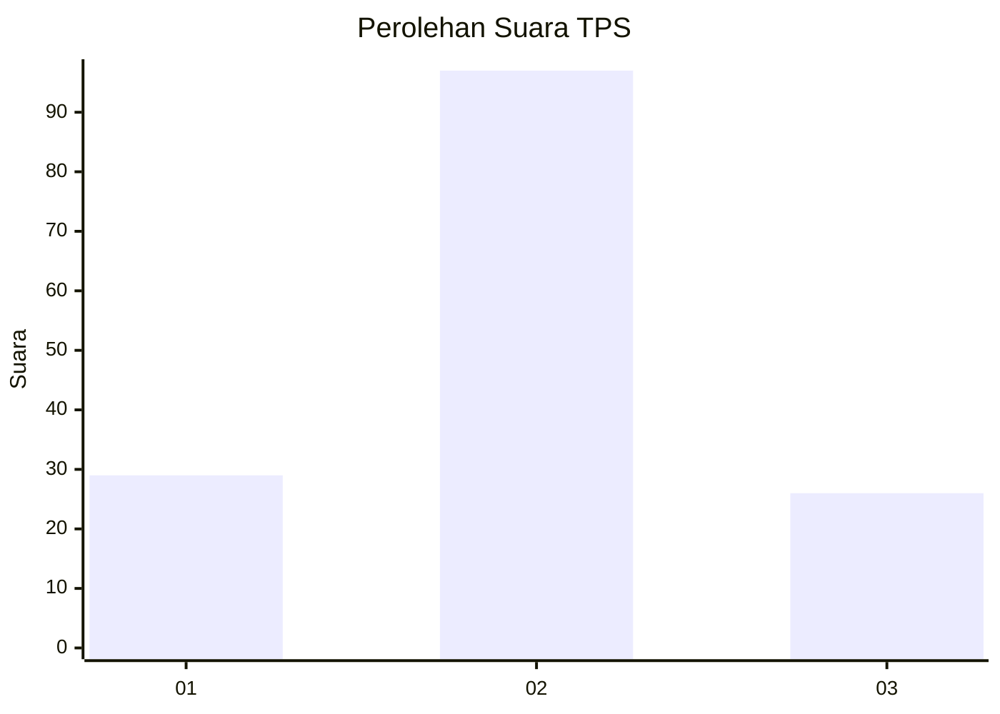
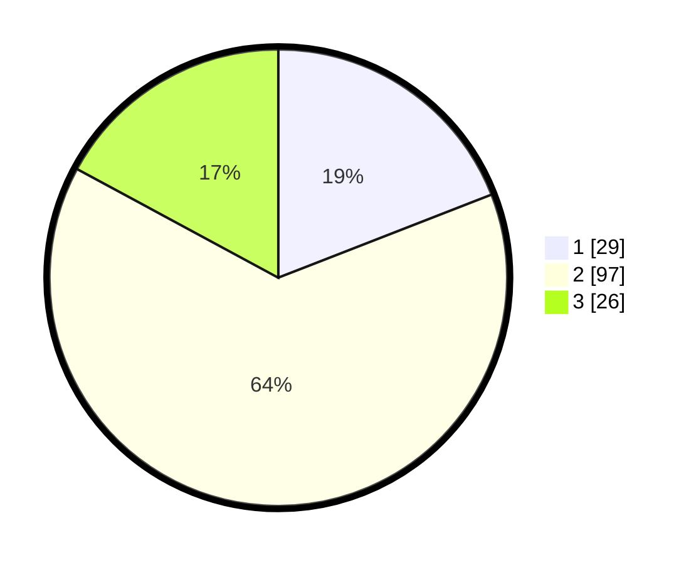

# Hasil

## Grafik

## Tabel

| No. | Nama Paslon    | Suara | Suara (raw) | Persentase |
|:--- |:-------------- | -----:| -----------:| ----------:|
| 1   | ANIES MUHAIMIN | 29    | [29][p-1]   | 19,08      |
| 2   | PRABOWO GIBRAN | 97    | [97][p-2]   | 63,82      |
| 3   | GANJAR MAHFUD  | 26    | [26][p-3]   | 17,11      |

[p-1]: https://github.com/gigit-pemilu/pemilu-2024-32-jawa-barat/blob/main/pilpres/hitung-suara/sub/32-jawa-barat/sub/09-cirebon/sub/12-mundu/sub/2008-mundu-pesisir/sub/013-tps/sub/paslon-1.txt
[p-2]: https://github.com/gigit-pemilu/pemilu-2024-32-jawa-barat/blob/main/pilpres/hitung-suara/sub/32-jawa-barat/sub/09-cirebon/sub/12-mundu/sub/2008-mundu-pesisir/sub/013-tps/sub/paslon-2.txt
[p-3]: https://github.com/gigit-pemilu/pemilu-2024-32-jawa-barat/blob/main/pilpres/hitung-suara/sub/32-jawa-barat/sub/09-cirebon/sub/12-mundu/sub/2008-mundu-pesisir/sub/013-tps/sub/paslon-3.txt

## Foto C Plano

https://sirekap-obj-formc.kpu.go.id/6a90/pemilu/ppwp/32/09/12/20/08/3209122008013-20240215-124920--ea7c576c-fb54-4012-80eb-a40e7aaec9f9.jpg

https://sirekap-obj-formc.kpu.go.id/6a90/pemilu/ppwp/32/09/12/20/08/3209122008013-20240215-125036--95360c92-d00f-4654-bb6b-b677ac2bbf98.jpg

https://sirekap-obj-formc.kpu.go.id/6a90/pemilu/ppwp/32/09/12/20/08/3209122008013-20240215-125158--3f67b95c-c701-4d07-ad93-ed2a7027681a.jpg

## Metadata

| Key        | Value               |
| ---------- | ------------------- |
| Time Stamp | 2024-02-20 15:00:00 |

