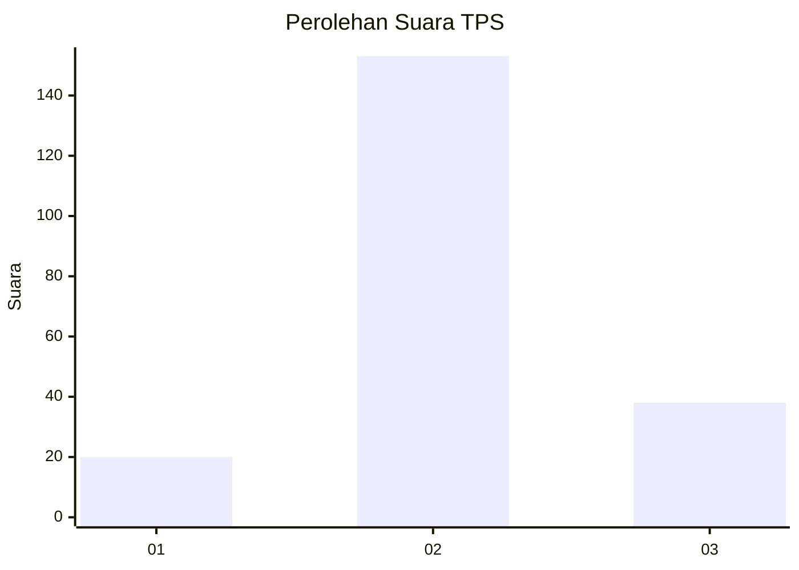
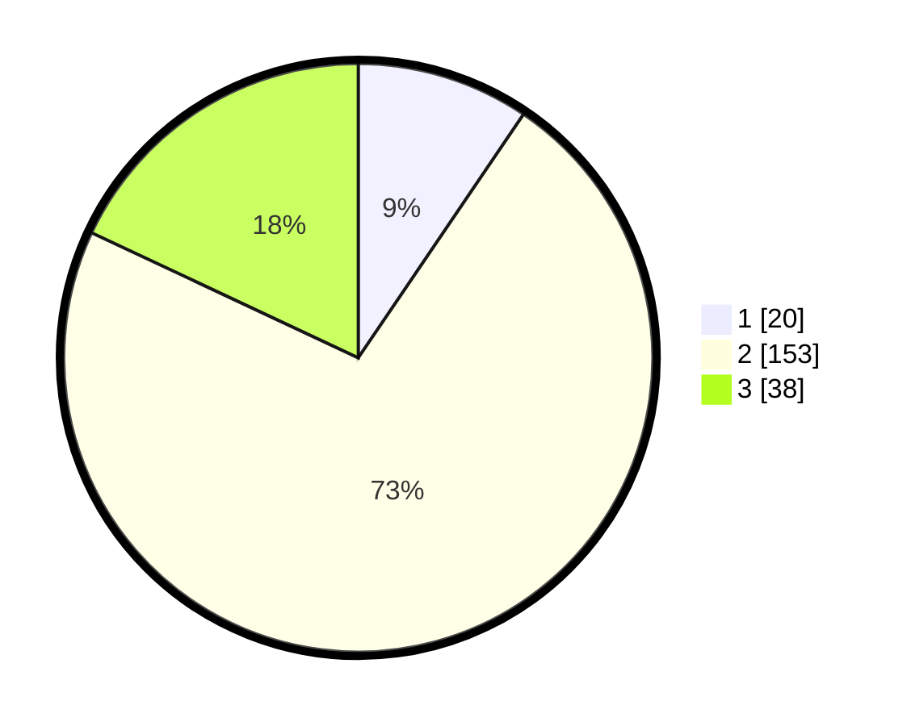

# Hasil

## Grafik

## Tabel

| No. | Nama Paslon    | Suara | Suara (raw) | Persentase |
|:--- |:-------------- | -----:| -----------:| ----------:|
| 1   | ANIES MUHAIMIN | 20    | [20][p-1]   | 9,48       |
| 2   | PRABOWO GIBRAN | 153   | [153][p-2]  | 72,51      |
| 3   | GANJAR MAHFUD  | 38    | [38][p-3]   | 18,01      |

[p-1]: https://github.com/gigit-pemilu/pemilu-2024/blob/main/pilpres/hitung-suara/sub/32-jawa-barat/sub/09-cirebon/sub/12-mundu/sub/2010-banjarwangunan/sub/017-tps/sub/paslon-1.txt
[p-2]: https://github.com/gigit-pemilu/pemilu-2024/blob/main/pilpres/hitung-suara/sub/32-jawa-barat/sub/09-cirebon/sub/12-mundu/sub/2010-banjarwangunan/sub/017-tps/sub/paslon-2.txt
[p-3]: https://github.com/gigit-pemilu/pemilu-2024/blob/main/pilpres/hitung-suara/sub/32-jawa-barat/sub/09-cirebon/sub/12-mundu/sub/2010-banjarwangunan/sub/017-tps/sub/paslon-3.txt

## Foto C Plano

https://sirekap-obj-formc.kpu.go.id/e352/pemilu/ppwp/32/09/12/20/10/3209122010017-20240218-104836--f026b5d6-6a25-4821-b28f-88fcbd1d7aa3.jpg

https://sirekap-obj-formc.kpu.go.id/e352/pemilu/ppwp/32/09/12/20/10/3209122010017-20240218-105352--56c16663-2e0e-4718-87f1-0990ccf6c3bb.jpg

https://sirekap-obj-formc.kpu.go.id/e352/pemilu/ppwp/32/09/12/20/10/3209122010017-20240218-105555--2c092627-7d43-463a-83c9-cc0b58b57769.jpg

## Metadata

| Key        | Value               |
| ---------- | ------------------- |
| Time Stamp | 2024-02-20 15:00:00 |

## DATA PEMILIH TETAP

Jumlah pemilih dalam DPT: **249**.
 * L: **334**.
 * P: **715**.

## DATA PENGGUNA HAK PILIH

Jumlah pengguna hak pilih dalam DPT: **279**.
 * L: **534**.
 * P: **105**.

Jumlah pengguna hak pilih dalam DPTb: **881**.
 * L: **851**.
 * P: **504**.

Jumlah pengguna hak pilih dalam DPK: **8**.
 * L: **888**.
 * P: **88**.

Jumlah pengguna hak pilih: **220**.
 * L: **175**.
 * P: **895**.

## JUMLAH SUARA SAH DAN TIDAK SAH

JUMLAH SELURUH SUARA SAH: **211**.

JUMLAH SUARA TIDAK SAH: **8**.

JUMLAH SELURUH SUARA SAH DAN SUARA TIDAK SAH: **219**.

