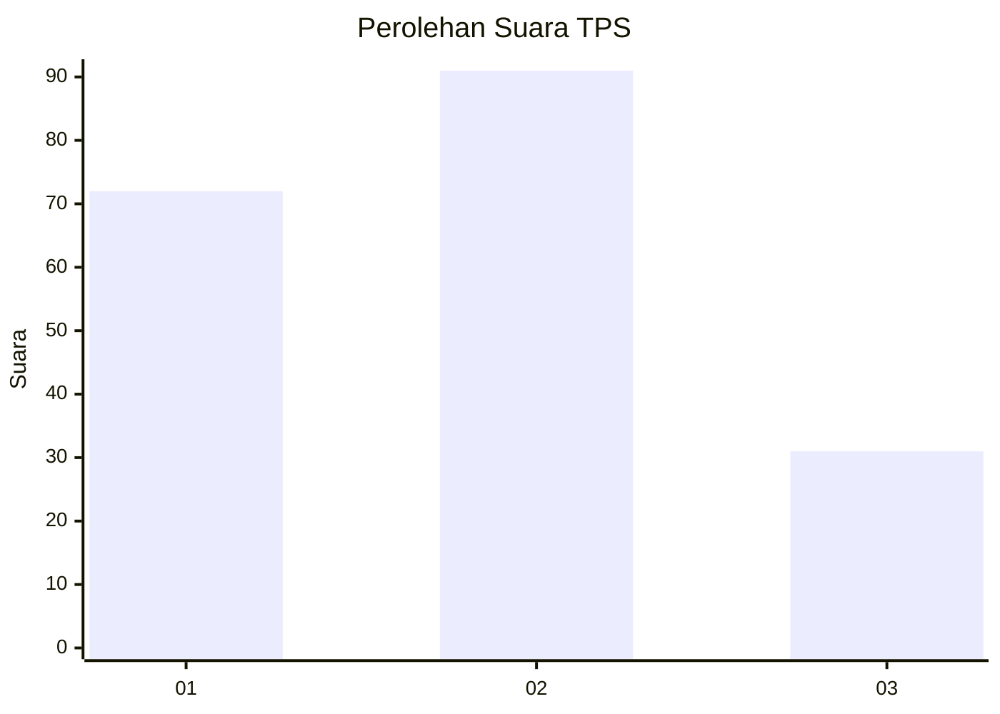
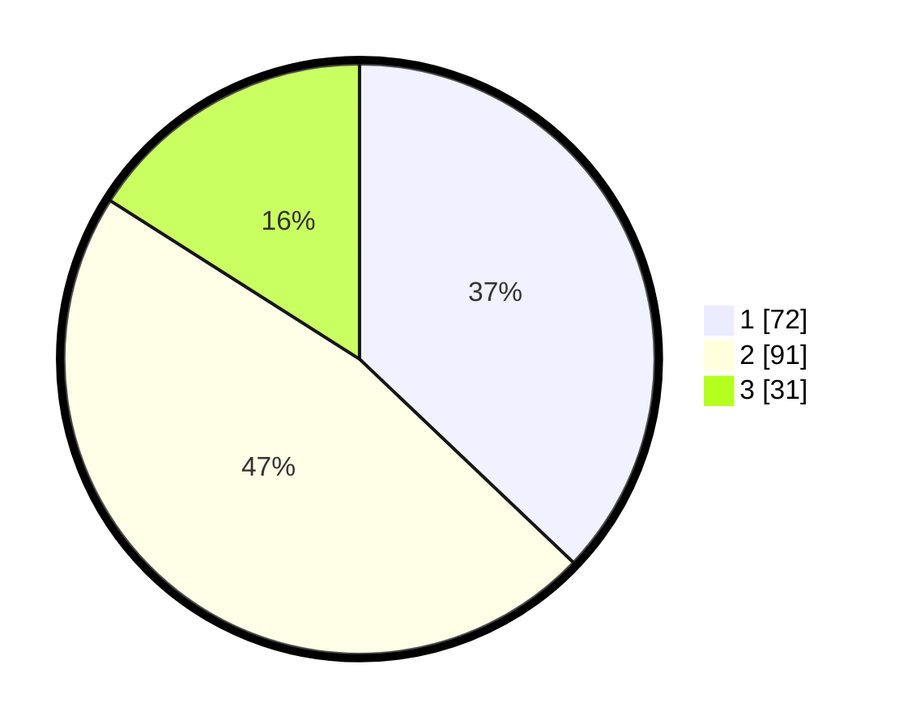

# Hasil

## Grafik

## Tabel

| No. | Nama Paslon    | Suara | Suara (raw) | Persentase |
|:--- |:-------------- | -----:| -----------:| ----------:|
| 1   | ANIES MUHAIMIN | 72    | [72][p-1]   | 37,11      |
| 2   | PRABOWO GIBRAN | 91    | [91][p-2]   | 46,91      |
| 3   | GANJAR MAHFUD  | 31    | [31][p-3]   | 15,98      |

[p-1]: https://github.com/gigit-pemilu/pemilu-2024-32-jawa-barat/blob/main/pilpres/hitung-suara/sub/32-jawa-barat/sub/09-cirebon/sub/13-beber/sub/2001-wanayasa/sub/005-tps/sub/paslon-1.txt
[p-2]: https://github.com/gigit-pemilu/pemilu-2024-32-jawa-barat/blob/main/pilpres/hitung-suara/sub/32-jawa-barat/sub/09-cirebon/sub/13-beber/sub/2001-wanayasa/sub/005-tps/sub/paslon-2.txt
[p-3]: https://github.com/gigit-pemilu/pemilu-2024-32-jawa-barat/blob/main/pilpres/hitung-suara/sub/32-jawa-barat/sub/09-cirebon/sub/13-beber/sub/2001-wanayasa/sub/005-tps/sub/paslon-3.txt

## Foto C Plano

https://sirekap-obj-formc.kpu.go.id/7b86/pemilu/ppwp/32/09/13/20/01/3209132001005-20240214-213422--b420eb81-d735-42ff-947b-1debdbde9002.jpg

https://sirekap-obj-formc.kpu.go.id/7b86/pemilu/ppwp/32/09/13/20/01/3209132001005-20240219-120610--7b7a4b9b-72a8-44dd-ad8a-3a945957fa30.jpg

https://sirekap-obj-formc.kpu.go.id/7b86/pemilu/ppwp/32/09/13/20/01/3209132001005-20240214-232436--b010b063-7889-4ebe-b18a-ede500462fde.jpg

## Metadata

| Key        | Value               |
| ---------- | ------------------- |
| Time Stamp | 2024-02-24 22:31:28 |

