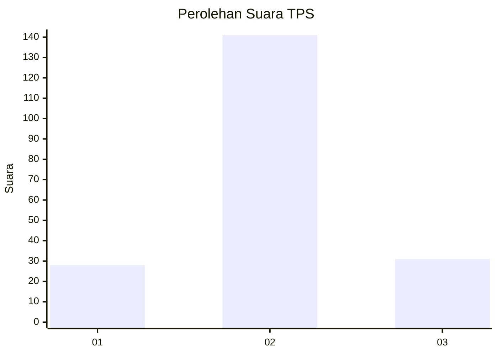

# Hasil

## Grafik

## Tabel

| No. | Nama Paslon    | Suara | Suara (raw) | Persentase |
|:--- |:-------------- | -----:| -----------:| ----------:|
| 1   | ANIES MUHAIMIN | 28    | [28][p-1]   | 14,00      |
| 2   | PRABOWO GIBRAN | 141   | [141][p-2]  | 70,50      |
| 3   | GANJAR MAHFUD  | 31    | [31][p-3]   | 15,50      |

[p-1]: https://github.com/gigit-pemilu/pemilu-2024/blob/main/pilpres/hitung-suara/sub/32-jawa-barat/sub/09-cirebon/sub/14-talun/sub/2001-sampiran/sub/003-tps/sub/paslon-1.txt
[p-2]: https://github.com/gigit-pemilu/pemilu-2024/blob/main/pilpres/hitung-suara/sub/32-jawa-barat/sub/09-cirebon/sub/14-talun/sub/2001-sampiran/sub/003-tps/sub/paslon-2.txt
[p-3]: https://github.com/gigit-pemilu/pemilu-2024/blob/main/pilpres/hitung-suara/sub/32-jawa-barat/sub/09-cirebon/sub/14-talun/sub/2001-sampiran/sub/003-tps/sub/paslon-3.txt

## Foto C Plano

https://sirekap-obj-formc.kpu.go.id/4563/pemilu/ppwp/32/09/14/20/01/3209142001003-20240215-194013--e3e3aa8c-a3b0-4e19-9043-8dae61441e8a.jpg

https://sirekap-obj-formc.kpu.go.id/4563/pemilu/ppwp/32/09/14/20/01/3209142001003-20240215-194416--7de5bc29-2e2f-4bfe-97a7-93c5538a9504.jpg

https://sirekap-obj-formc.kpu.go.id/4563/pemilu/ppwp/32/09/14/20/01/3209142001003-20240215-194238--54f519cc-f243-4b56-9c84-b10afb886e9a.jpg

## Metadata

| Key        | Value               |
| ---------- | ------------------- |
| Time Stamp | 2024-02-16 21:01:00 |

