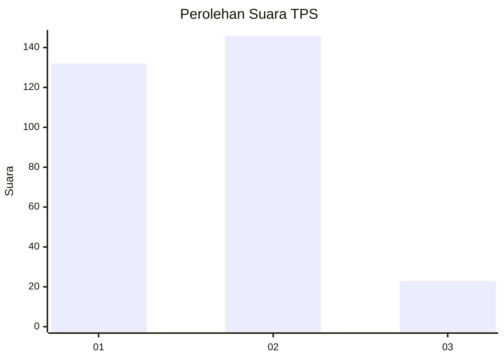
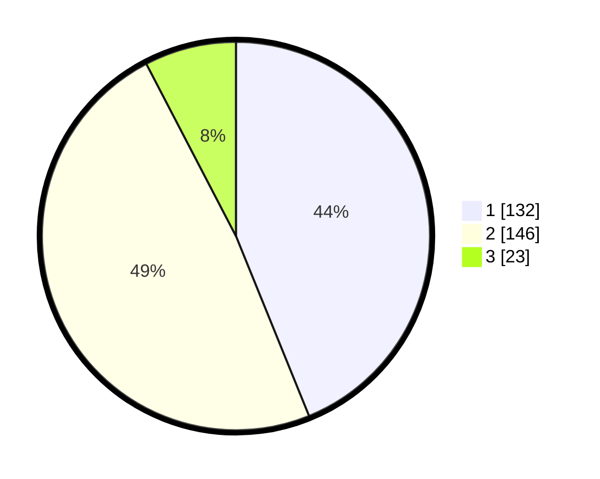

# Hasil

## Grafik

## Tabel

| No. | Nama Paslon    | Suara | Suara (raw) | Persentase |
|:--- |:-------------- | -----:| -----------:| ----------:|
| 1   | ANIES MUHAIMIN | 132   | [132][p-1]  | 43,85      |
| 2   | PRABOWO GIBRAN | 146   | [146][p-2]  | 48,50      |
| 3   | GANJAR MAHFUD  | 23    | [23][p-3]   | 7,64       |

[p-1]: https://github.com/gigit-pemilu/pemilu-2024/blob/main/pilpres/hitung-suara/sub/32-jawa-barat/sub/09-cirebon/sub/14-talun/sub/2004-cirebon-girang/sub/017-tps/sub/paslon-1.txt
[p-2]: https://github.com/gigit-pemilu/pemilu-2024/blob/main/pilpres/hitung-suara/sub/32-jawa-barat/sub/09-cirebon/sub/14-talun/sub/2004-cirebon-girang/sub/017-tps/sub/paslon-2.txt
[p-3]: https://github.com/gigit-pemilu/pemilu-2024/blob/main/pilpres/hitung-suara/sub/32-jawa-barat/sub/09-cirebon/sub/14-talun/sub/2004-cirebon-girang/sub/017-tps/sub/paslon-3.txt

## Foto C Plano

https://sirekap-obj-formc.kpu.go.id/465f/pemilu/ppwp/32/09/14/20/04/3209142004017-20240215-001938--d5ad67de-2804-46a5-937b-68a8cc78f6aa.jpg

https://sirekap-obj-formc.kpu.go.id/465f/pemilu/ppwp/32/09/14/20/04/3209142004017-20240215-002047--7cbca247-6d03-4d57-b2e2-3b13d683ce02.jpg

https://sirekap-obj-formc.kpu.go.id/465f/pemilu/ppwp/32/09/14/20/04/3209142004017-20240215-002135--26d72ea7-7f77-494f-ae2a-24475c8f4597.jpg

## Metadata

| Key        | Value               |
| ---------- | ------------------- |
| Time Stamp | 2024-02-17 02:30:03 |

