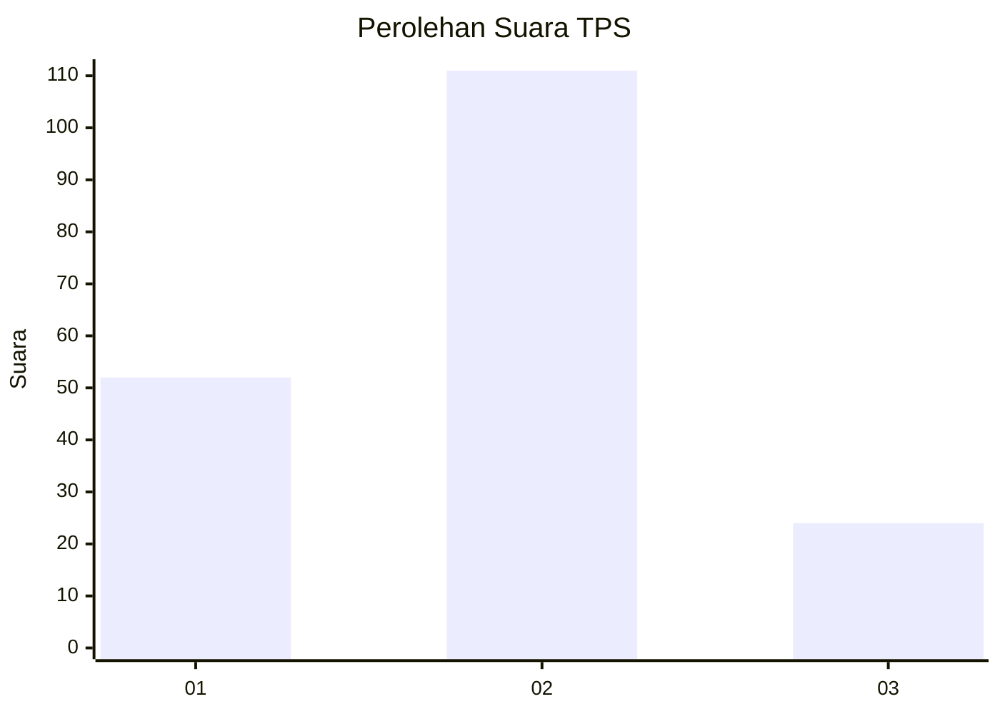
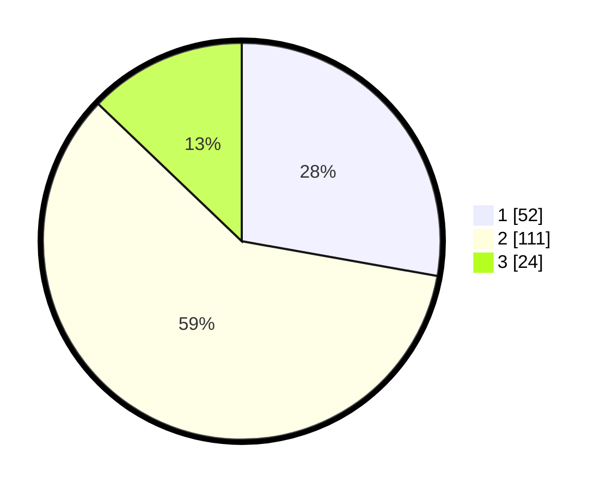

# Hasil

## Grafik

## Tabel

| No. | Nama Paslon    | Suara | Suara (raw) | Persentase |
|:--- |:-------------- | -----:| -----------:| ----------:|
| 1   | ANIES MUHAIMIN | 52    | [52][p-1]   | 27,81      |
| 2   | PRABOWO GIBRAN | 111   | [111][p-2]  | 59,36      |
| 3   | GANJAR MAHFUD  | 24    | [24][p-3]   | 12,83      |

[p-1]: https://github.com/gigit-pemilu/pemilu-2024/blob/main/pilpres/hitung-suara/sub/32-jawa-barat/sub/09-cirebon/sub/15-sumber/sub/1007-pasalakan/sub/003-tps/sub/paslon-1.txt
[p-2]: https://github.com/gigit-pemilu/pemilu-2024/blob/main/pilpres/hitung-suara/sub/32-jawa-barat/sub/09-cirebon/sub/15-sumber/sub/1007-pasalakan/sub/003-tps/sub/paslon-2.txt
[p-3]: https://github.com/gigit-pemilu/pemilu-2024/blob/main/pilpres/hitung-suara/sub/32-jawa-barat/sub/09-cirebon/sub/15-sumber/sub/1007-pasalakan/sub/003-tps/sub/paslon-3.txt

## Foto C Plano

https://sirekap-obj-formc.kpu.go.id/27df/pemilu/ppwp/32/09/15/10/07/3209151007003-20240220-153333--ea6e6719-44e7-4b11-a99f-cc0616be395e.jpg

https://sirekap-obj-formc.kpu.go.id/27df/pemilu/ppwp/32/09/15/10/07/3209151007003-20240220-153155--fe1dbd22-99b9-4c04-836f-7cb60c183f08.jpg

https://sirekap-obj-formc.kpu.go.id/27df/pemilu/ppwp/32/09/15/10/07/3209151007003-20240220-153240--15ca0ea3-fb50-4522-a2b9-c28841fab7a6.jpg

## Metadata

| Key        | Value               |
| ---------- | ------------------- |
| Time Stamp | 2024-02-20 16:00:00 |

## DATA PEMILIH TETAP

Jumlah pemilih dalam DPT: **238**.
 * L: **121**.
 * P: **117**.

## DATA PENGGUNA HAK PILIH

Jumlah pengguna hak pilih dalam DPT: **432**.
 * L: **484**.
 * P: **495**.

Jumlah pengguna hak pilih dalam DPTb: **884**.
 * L: **0**.
 * P: **808**.

Jumlah pengguna hak pilih dalam DPK: **9**.
 * L: **3**.
 * P: **85**.

Jumlah pengguna hak pilih: **191**.
 * L: **890**.
 * P: **101**.

## JUMLAH SUARA SAH DAN TIDAK SAH

JUMLAH SELURUH SUARA SAH: **191**.

JUMLAH SUARA TIDAK SAH: **0**.

JUMLAH SELURUH SUARA SAH DAN SUARA TIDAK SAH: **191**.

