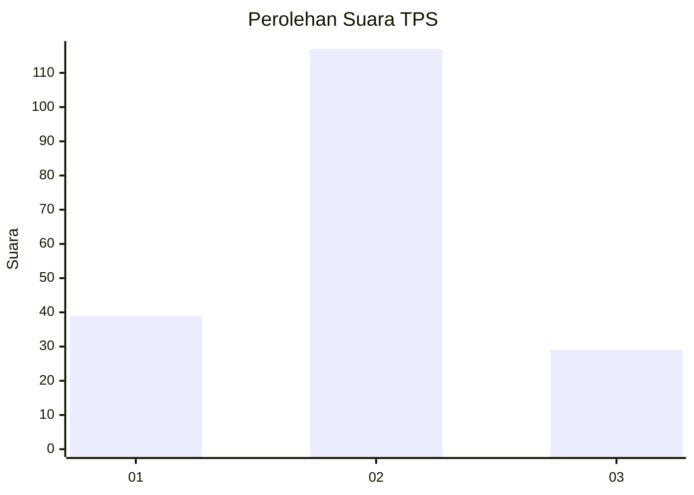
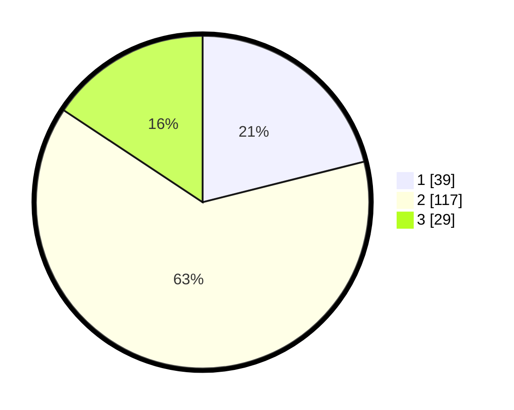

# Hasil

## Grafik

## Tabel

| No. | Nama Paslon    | Suara | Suara (raw) | Persentase |
|:--- |:-------------- | -----:| -----------:| ----------:|
| 1   | ANIES MUHAIMIN | 39    | [39][p-1]   | 21,08      |
| 2   | PRABOWO GIBRAN | 117   | [117][p-2]  | 63,24      |
| 3   | GANJAR MAHFUD  | 29    | [29][p-3]   | 15,68      |

[p-1]: https://github.com/gigit-pemilu/pemilu-2024/blob/main/pilpres/hitung-suara/sub/32-jawa-barat/sub/09-cirebon/sub/15-sumber/sub/1008-watubelah/sub/012-tps/sub/paslon-1.txt
[p-2]: https://github.com/gigit-pemilu/pemilu-2024/blob/main/pilpres/hitung-suara/sub/32-jawa-barat/sub/09-cirebon/sub/15-sumber/sub/1008-watubelah/sub/012-tps/sub/paslon-2.txt
[p-3]: https://github.com/gigit-pemilu/pemilu-2024/blob/main/pilpres/hitung-suara/sub/32-jawa-barat/sub/09-cirebon/sub/15-sumber/sub/1008-watubelah/sub/012-tps/sub/paslon-3.txt

## Foto C Plano

https://sirekap-obj-formc.kpu.go.id/5f12/pemilu/ppwp/32/09/15/10/08/3209151008012-20240216-183146--b49f222a-cbac-49a3-9719-79b0e3f61948.jpg

https://sirekap-obj-formc.kpu.go.id/5f12/pemilu/ppwp/32/09/15/10/08/3209151008012-20240215-214932--60e460d5-7ced-4736-9f57-b776c119504a.jpg

https://sirekap-obj-formc.kpu.go.id/5f12/pemilu/ppwp/32/09/15/10/08/3209151008012-20240217-173656--0c87cb62-93b2-42e4-8cbf-3996bc3d9504.jpg

## Metadata

| Key        | Value               |
| ---------- | ------------------- |
| Time Stamp | 2024-02-24 22:31:28 |

## DATA PEMILIH TETAP

Jumlah pemilih dalam DPT: **229**.
 * L: **122**.
 * P: **107**.

## DATA PENGGUNA HAK PILIH

Jumlah pengguna hak pilih dalam DPT: **191**.
 * L: **895**.
 * P: **896**.

Jumlah pengguna hak pilih dalam DPTb: **686**.
 * L: **712**.
 * P: **227**.

Jumlah pengguna hak pilih dalam DPK: **261**.
 * L: **622**.
 * P: **721**.

Jumlah pengguna hak pilih: **192**.
 * L: **295**.
 * P: **697**.

## JUMLAH SUARA SAH DAN TIDAK SAH

JUMLAH SELURUH SUARA SAH: **185**.

JUMLAH SUARA TIDAK SAH: **0**.

JUMLAH SELURUH SUARA SAH DAN SUARA TIDAK SAH: **192**.

