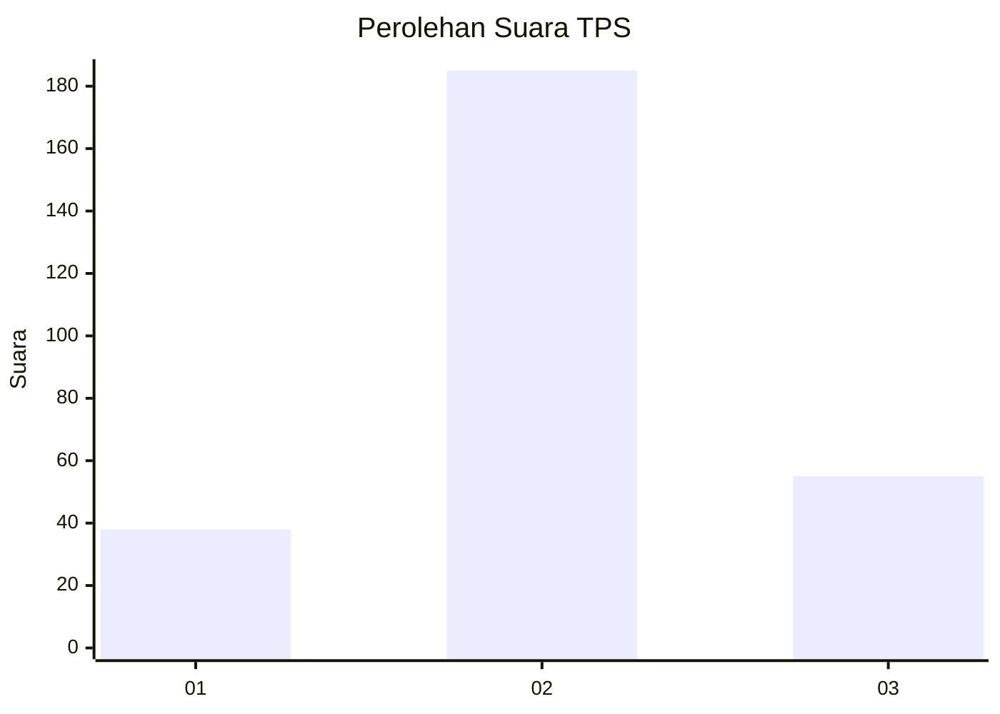
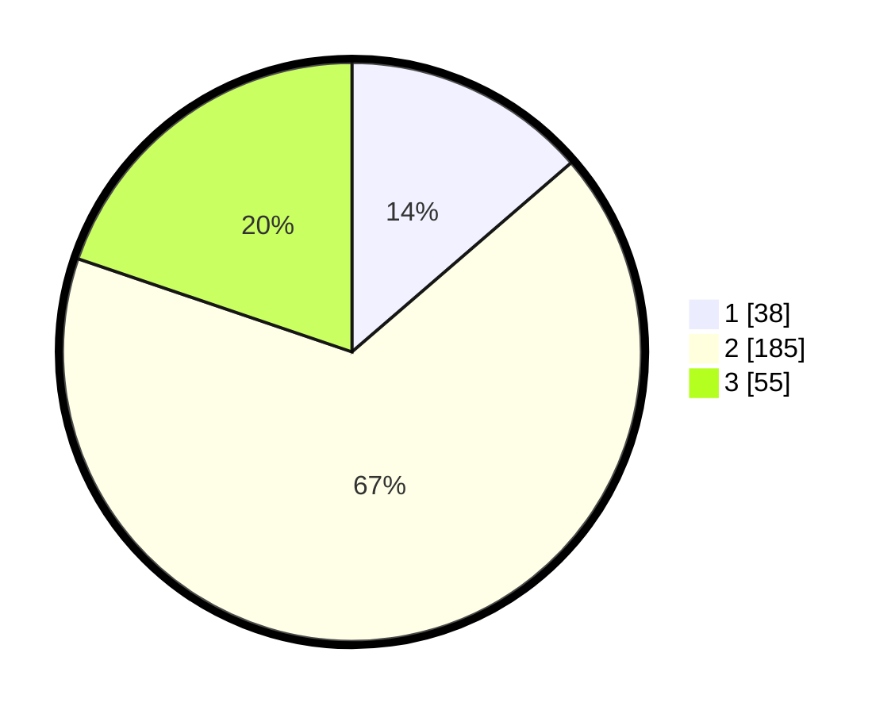

# Hasil

## Grafik

## Tabel

| No. | Nama Paslon    | Suara | Suara (raw) | Persentase |
|:--- |:-------------- | -----:| -----------:| ----------:|
| 1   | ANIES MUHAIMIN | 38    | [38][p-1]   | 13,67      |
| 2   | PRABOWO GIBRAN | 185   | [185][p-2]  | 66,55      |
| 3   | GANJAR MAHFUD  | 55    | [55][p-3]   | 19,78      |

[p-1]: https://github.com/gigit-pemilu/pemilu-2024-32-jawa-barat/blob/main/pilpres/hitung-suara/sub/32-jawa-barat/sub/09-cirebon/sub/15-sumber/sub/1010-gegunung/sub/005-tps/sub/paslon-1.txt
[p-2]: https://github.com/gigit-pemilu/pemilu-2024-32-jawa-barat/blob/main/pilpres/hitung-suara/sub/32-jawa-barat/sub/09-cirebon/sub/15-sumber/sub/1010-gegunung/sub/005-tps/sub/paslon-2.txt
[p-3]: https://github.com/gigit-pemilu/pemilu-2024-32-jawa-barat/blob/main/pilpres/hitung-suara/sub/32-jawa-barat/sub/09-cirebon/sub/15-sumber/sub/1010-gegunung/sub/005-tps/sub/paslon-3.txt

## Foto C Plano

https://sirekap-obj-formc.kpu.go.id/befd/pemilu/ppwp/32/09/15/10/10/3209151010005-20240217-201607--c1601a17-be43-4088-860e-387a80d0b067.jpg

https://sirekap-obj-formc.kpu.go.id/befd/pemilu/ppwp/32/09/15/10/10/3209151010005-20240215-021408--2dfd5c09-e3a7-4825-a6f1-da83804d0827.jpg

https://sirekap-obj-formc.kpu.go.id/befd/pemilu/ppwp/32/09/15/10/10/3209151010005-20240217-201718--ddd4790a-1ae7-4d38-b7aa-3a78204a48a4.jpg

## Metadata

| Key        | Value               |
| ---------- | ------------------- |
| Time Stamp | 2024-02-24 22:31:28 |

