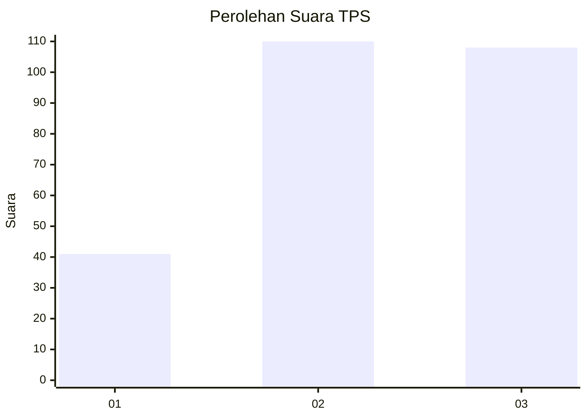
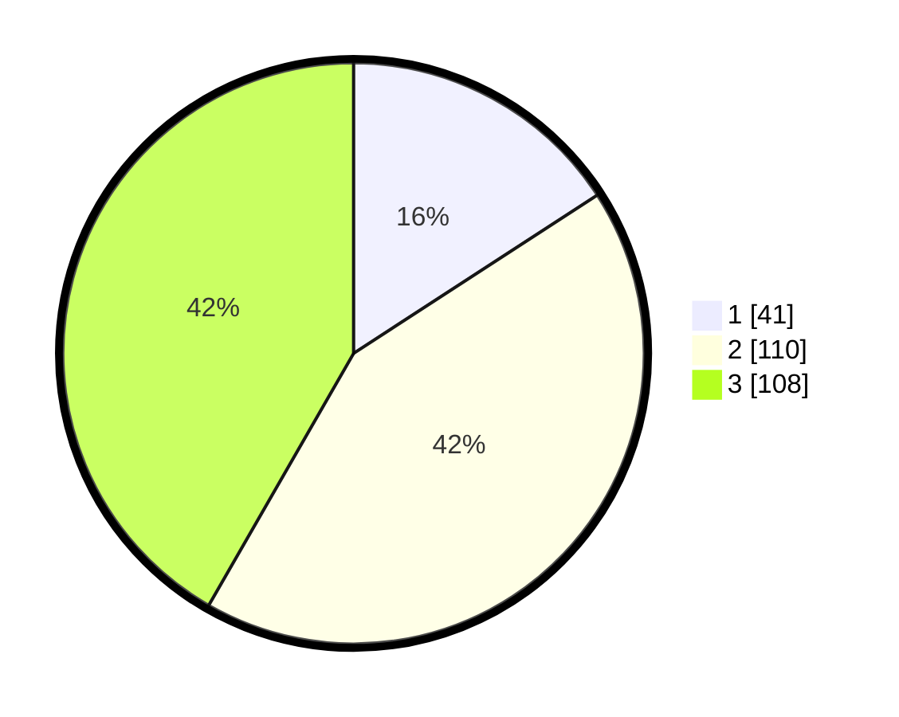

# Hasil

## Grafik

## Tabel

| No. | Nama Paslon    | Suara | Suara (raw) | Persentase |
|:--- |:-------------- | -----:| -----------:| ----------:|
| 1   | ANIES MUHAIMIN | 41    | [41][p-1]   | 15,83      |
| 2   | PRABOWO GIBRAN | 110   | [110][p-2]  | 42,47      |
| 3   | GANJAR MAHFUD  | 108   | [108][p-3]  | 41,70      |

[p-1]: https://github.com/gigit-pemilu/pemilu-2024/blob/main/pilpres/hitung-suara/sub/32-jawa-barat/sub/09-cirebon/sub/17-palimanan/sub/2004-balerante/sub/007-tps/sub/paslon-1.txt
[p-2]: https://github.com/gigit-pemilu/pemilu-2024/blob/main/pilpres/hitung-suara/sub/32-jawa-barat/sub/09-cirebon/sub/17-palimanan/sub/2004-balerante/sub/007-tps/sub/paslon-2.txt
[p-3]: https://github.com/gigit-pemilu/pemilu-2024/blob/main/pilpres/hitung-suara/sub/32-jawa-barat/sub/09-cirebon/sub/17-palimanan/sub/2004-balerante/sub/007-tps/sub/paslon-3.txt

## Foto C Plano

https://sirekap-obj-formc.kpu.go.id/ec29/pemilu/ppwp/32/09/17/20/04/3209172004007-20240214-223653--d3c12cd0-b722-4b02-b39d-d2be570f0a58.jpg

https://sirekap-obj-formc.kpu.go.id/ec29/pemilu/ppwp/32/09/17/20/04/3209172004007-20240214-224049--49322e77-fe84-4be7-b08b-6f7d75fed74f.jpg

https://sirekap-obj-formc.kpu.go.id/ec29/pemilu/ppwp/32/09/17/20/04/3209172004007-20240214-224234--83aae48a-e93f-4ec3-b728-407f6c3a42ad.jpg

## Metadata

| Key        | Value               |
| ---------- | ------------------- |
| Time Stamp | 2024-02-19 06:16:00 |

