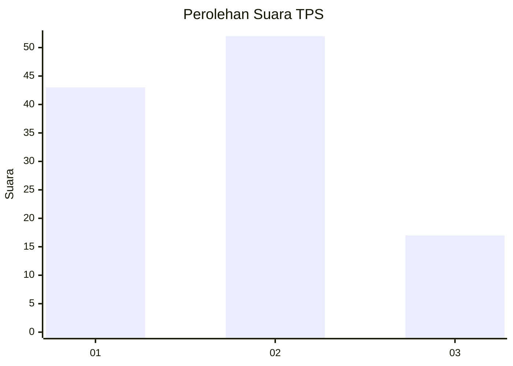
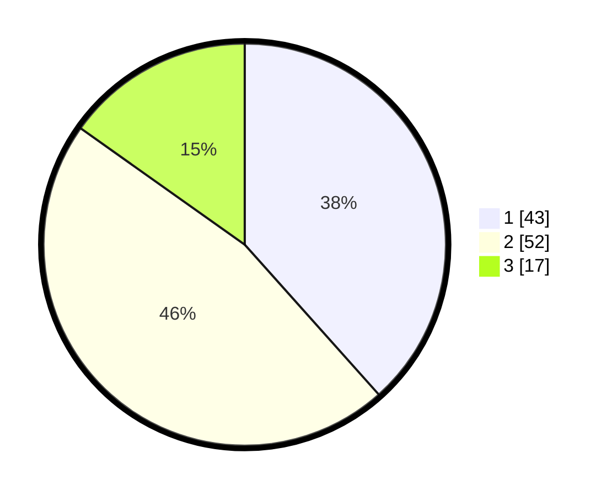

# Hasil

## Grafik

## Tabel

| No. | Nama Paslon    | Suara | Suara (raw) | Persentase |
|:--- |:-------------- | -----:| -----------:| ----------:|
| 1   | ANIES MUHAIMIN | 43    | [43][p-1]   | 38,39      |
| 2   | PRABOWO GIBRAN | 52    | [52][p-2]   | 46,43      |
| 3   | GANJAR MAHFUD  | 17    | [17][p-3]   | 15,18      |

[p-1]: https://github.com/gigit-pemilu/pemilu-2024/blob/main/pilpres/hitung-suara/sub/32-jawa-barat/sub/09-cirebon/sub/18-plumbon/sub/2010-plumbon/sub/003-tps/sub/paslon-1.txt
[p-2]: https://github.com/gigit-pemilu/pemilu-2024/blob/main/pilpres/hitung-suara/sub/32-jawa-barat/sub/09-cirebon/sub/18-plumbon/sub/2010-plumbon/sub/003-tps/sub/paslon-2.txt
[p-3]: https://github.com/gigit-pemilu/pemilu-2024/blob/main/pilpres/hitung-suara/sub/32-jawa-barat/sub/09-cirebon/sub/18-plumbon/sub/2010-plumbon/sub/003-tps/sub/paslon-3.txt

## Foto C Plano

https://sirekap-obj-formc.kpu.go.id/a9bf/pemilu/ppwp/32/09/18/20/10/3209182010003-20240215-025704--f11aff6c-9bf6-4551-937b-68e15de5ea03.jpg

https://sirekap-obj-formc.kpu.go.id/a9bf/pemilu/ppwp/32/09/18/20/10/3209182010003-20240214-155124--10aca9e5-fb5c-4c0c-b02f-1ce96f9c976c.jpg

https://sirekap-obj-formc.kpu.go.id/a9bf/pemilu/ppwp/32/09/18/20/10/3209182010003-20240214-155308--61c570d3-2391-4cb8-8199-c94b5c604277.jpg

## Metadata

| Key        | Value               |
| ---------- | ------------------- |
| Time Stamp | 2024-02-19 06:16:00 |

